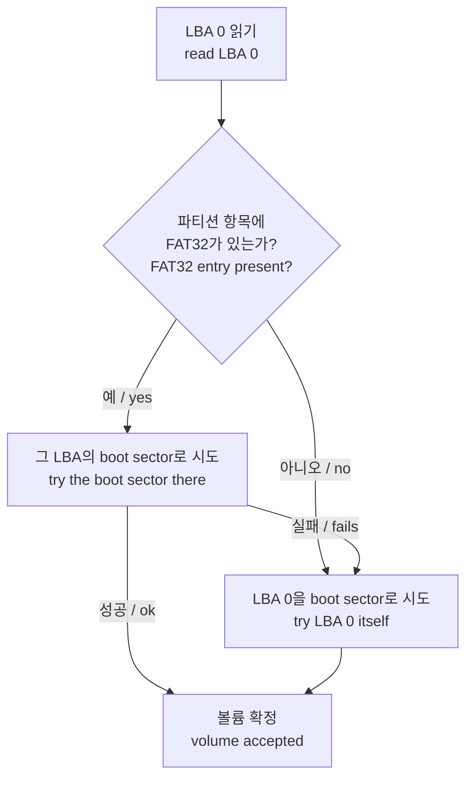

# 파티션 테이블 없는 FAT32 볼륨 지원 설계

## 한국어

### 목적

`ez2dj5th`의 CHD를 마운트합니다. 지금은 `re2dj ez2dj5th`가 `CHD MBR has no in-range FAT32 partition`으로 실패해 이 target을 CHD로 실행할 수 없습니다.

### 관측된 사실

CHD probe가 이미지의 첫 섹터를 보여 줍니다.

```
logical_bytes=20842827264 hunk_bytes=4096 unit_bytes=512
metadata tag=GDDD value=CYLS:646169,HEADS:3,SECS:21,BPS:512
lba0_prefix=eb 58 90 4d 53 57 49 4e 34 2e 31 00 02 20 24 00 signature=55aa
filesystem=unrecognized reason=CHD MBR has no in-range FAT32 partition
```

앞 16바이트를 BPB 배치로 읽으면 다음과 같습니다.

| 오프셋 | 값 | 뜻 |
| --- | --- | --- |
| 0–2 | `eb 58 90` | short jump. boot sector의 시작 형태 |
| 3–10 | `MSWIN4.1` | OEM 이름 |
| 11–12 | `00 02` | bytes per sector = 512 |
| 13 | `20` | sectors per cluster = 32 |
| 14–15 | `24 00` | reserved sectors = 36 |

**확인됨.** LBA 0은 파티션 부트 레코드가 아니라 **FAT32 boot sector 자체**입니다. 이 이미지는 파티션 테이블 없는 whole-disk 볼륨입니다. `55aa` 서명이 있어 현재 코드의 MBR 서명 검사는 통과하지만, 파티션 항목 자리(446부터)에 FAT32 형식이 없으므로 그 다음 검사에서 거절됩니다.

### 현재 동작

`Fat32Volume::Open`은 LBA 0을 MBR로만 읽습니다.

1. LBA 0을 읽고 `55aa`를 확인한다
2. 파티션 항목 4개에서 FAT32 형식을 찾는다
3. 찾은 LBA에서 boot sector를 읽고 BPB를 검증한다

2단계에서 실패하면 그것으로 끝입니다. LBA 0 자체가 볼륨일 가능성을 보지 않습니다.

### 설계

BPB 해석과 검증을 한 곳으로 모으고, 볼륨 위치를 정하는 단계를 두 갈래로 만듭니다.



1. BPB를 읽어 `Fat32VolumeInfo`를 만드는 helper를 뺍니다. 인자는 boot sector 바이트, 볼륨 시작 LBA, 볼륨 섹터 수입니다. 검증 기준은 지금과 같습니다.
2. 파티션 항목에서 FAT32를 찾으면 그 위치로 helper를 부릅니다.
3. 그것이 없거나 실패하면 LBA 0을 볼륨 시작으로, 이미지 전체를 볼륨 크기로 삼아 helper를 다시 부릅니다.
4. 둘 다 실패하면 두 시도를 모두 언급하는 메시지로 거절합니다.

**받아들임의 기준은 기존 BPB 검증 그 자체입니다.** 별도의 형식 추정(예: OEM 문자열 대조)을 두지 않습니다. 검증은 sector 크기, 클러스터 크기의 2의 거듭제곱 여부, 예약 섹터, FAT 개수, 총 섹터 수가 볼륨 안에 들어오는지, FAT이 선언된 데이터 영역을 덮는지를 이미 확인합니다. MBR이 이 검사를 우연히 통과할 수는 없습니다.

`Fat32VolumeInfo`에 볼륨이 파티션에서 왔는지 여부를 남깁니다. 진단이 두 경우를 구분해 보고할 수 있어야 하고, `partition_index`를 0으로 두면 첫 번째 파티션과 구분되지 않기 때문입니다.

### 이 설계가 다루지 않는 것

- FAT12·FAT16·exFAT
- 확장 파티션과 GPT
- 파티션이 여러 개일 때 어느 것을 고를지에 대한 정책 변경. 지금처럼 첫 FAT32 항목을 씁니다.
- 쓰기. 볼륨은 계속 읽기 전용입니다.

### 성공 기준

- `ez2dj5th`의 CHD가 마운트되고 파일이 열립니다.
- 파티션이 있는 3rd·4th·6th·1st SE 이미지의 마운트 결과가 변하지 않습니다.
- 단위 시험이 두 배치를 모두 덮습니다.

## English

### Purpose

Mount the `ez2dj5th` CHD. `re2dj ez2dj5th` currently fails with `CHD MBR has no in-range FAT32 partition`, so the target cannot run from its CHD at all.

### Observed facts

The CHD probe reports the image's first sector as `lba0_prefix=eb 58 90 4d 53 57 49 4e 34 2e 31 00 02 20 24 00` with a `55aa` signature. Read as a BPB, that is a short jump at bytes 0 to 2, the OEM name `MSWIN4.1` at 3 to 10, 512 bytes per sector at 11, 32 sectors per cluster at 13, and 36 reserved sectors at 14.

**Confirmed.** LBA 0 is not a partition boot record but **the FAT32 boot sector itself**: the image is a whole-disk volume with no partition table. The `55aa` signature lets it pass the current MBR signature check, but the partition entry area at offset 446 holds no FAT32 type, so the next check rejects it.

### Current behaviour

`Fat32Volume::Open` reads LBA 0 only as an MBR: it checks the signature, looks for a FAT32 type among the four partition entries, then reads and validates the BPB at the LBA it found. Failing the second step ends the attempt; the possibility that LBA 0 is itself the volume is never considered.

### Design

Gather the BPB parse and validation into one place and make locating the volume a two-branch step.

A helper takes the boot sector's bytes, the volume's start LBA and its sector count, and produces a `Fat32VolumeInfo` under exactly the validation used today. When a partition entry names FAT32, the helper is called at that location. When there is none, or that attempt fails, the helper is called again with LBA 0 as the start and the whole image as the size. If both fail, the rejection message names both attempts.

**Acceptance is the existing BPB validation itself** — no separate format guess such as matching the OEM string. That validation already checks the sector size, that the cluster size is a power of two, the reserved sectors, the FAT count, that the declared total fits inside the volume, and that the FAT covers the declared data region. An MBR cannot pass it by accident.

`Fat32VolumeInfo` gains a record of whether the volume came from a partition: diagnostics have to tell the two cases apart, and leaving `partition_index` at zero would make a whole-disk volume indistinguishable from the first partition.

### What this design does not cover

FAT12, FAT16 and exFAT. Extended partitions and GPT. Any change to which partition is chosen when several exist — the first FAT32 entry is still used. Writing; the volume stays read-only.

### Success criteria

- The `ez2dj5th` CHD mounts and its files open.
- Mounting the partitioned 3rd, 4th, 6th and 1st SE images is unchanged.
- Unit tests cover both layouts.
