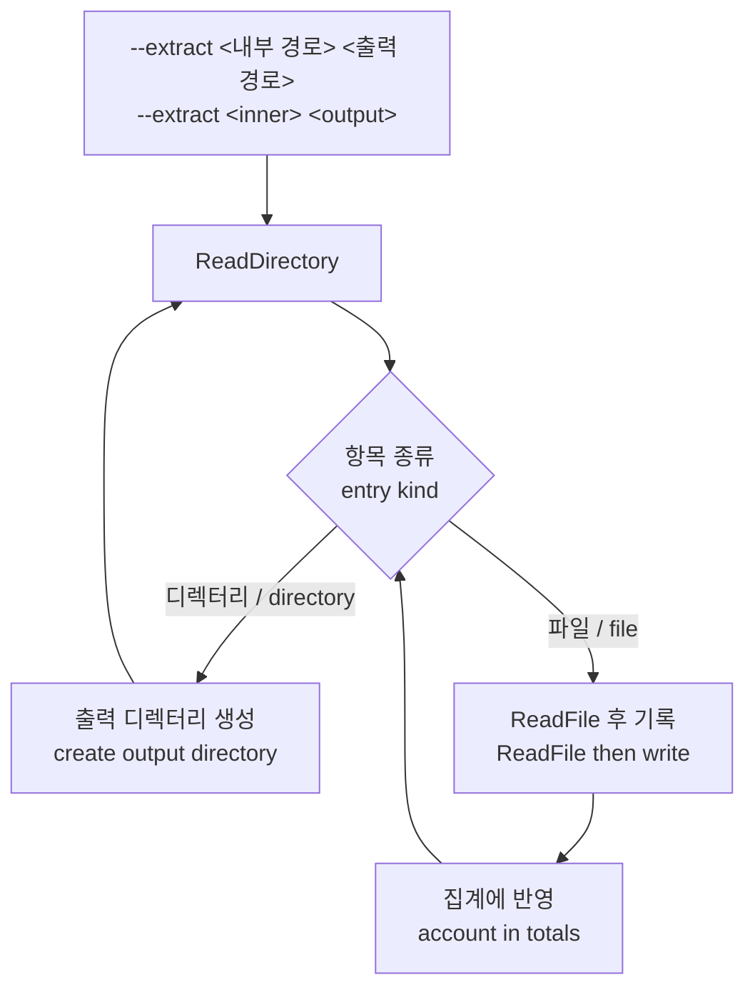

# ez2d2m target 추가와 CHD 재귀 추출 설계

## 한국어

### 목적

두 가지를 다룹니다.

1. `ez2d2m` target을 추가합니다. 이 target은 EZ2DJ가 아니라 **EZ2Dancer 2nd MOVE**이며, 사용자가 제공한 `roms/ez2d2m/ez2d2m.chd`에서 실행 파일을 찾습니다.
2. `re2dj_chd_probe`에 재귀 추출 경로를 추가합니다. 지금은 파일 하나씩만 꺼낼 수 있어서, 새 제품의 자산 배치를 파악하려면 디렉터리마다 별도 호출이 필요합니다.

두 번째는 첫 번째의 전제입니다. EZ2Dancer는 이 저장소가 지금까지 다룬 적 없는 제품이므로, 자산 트리를 호스트 파일 시스템에 펼쳐 두어야 이후 분석이 가능합니다.

### 관측된 사실

`re2dj_chd_probe roms/ez2d2m/ez2d2m.chd`의 결과입니다.

```
version=5 logical_bytes=134754762240 hunk_bytes=4096 unit_bytes=512
codecs=lzma,zlib,huff,flac
metadata tag=GDDD value=CYLS:16383,HEADS:255,SECS:63,BPS:512
filesystem=fat32 partition=0 partition_lba=63 sectors_per_cluster=16
label=EZ2DANCER type=FAT32
```

**확인됨.** 이 이미지는 파티션 0에 FAT32 볼륨을 가진 Windows 98 SE 부팅 디스크이며, 게임은 `ez2dancer/EZ2Dancer.exe`에 있습니다. 세부 관찰은 [ez2d2m CHD 파일시스템 관찰](../analysis/ez2d2m-chd-filesystem.md)에 있습니다.

이 설계에 직접 영향을 주는 사실은 다음 세 가지입니다.

**확인됨 — 보호 계층은 EZ2DJ와 같은 계열입니다.** `EZ2Dancer.exe`는 `.text`, `.rdata`, `.data`, `.protect` 네 섹션을 가지고 entry point가 `.protect` 안(RVA `0x00401240`)에 있습니다. 문자열에 `\\.\FEnteDev`, `\\.\HARDLOCK.VXD`, `HLW32Proc`, `API_1LNM.DLL`, `WTSQuerySessionInformationA`가 모두 있습니다. 이는 1st, 1st SE, 3rd, 4th, 5th가 쓰는 Hardlock envelope와 같은 구성입니다.

**확인됨 — 그래픽 진입점이 다릅니다.** packed import directory가 `DDRAW.dll`에서 가져오는 것은 `DirectDrawCreate`가 아니라 `DirectDrawCreateEx`입니다. 즉 DirectDraw 7 경로입니다. 이미지의 `Install` 디렉터리에 `DirectX 7.0a Korean`이 있어 설치본과도 맞습니다.

**확인됨 — I/O 보드 계약이 EZ2DJ와 다릅니다.** 공개 구현 [2EZConfig-V2 `ez2dancer-io`](https://github.com/ben-rnd/2EZConfig-V2/tree/master/src/2ez-dll/ez2dancer-io)는 EZ2Dancer를 **16비트 폭** port 접근(`IN AX,DX` = `0xed`, `OUT DX,AX` = `0xef`, 선택적 `0x66` prefix)으로 다루며, port 범위도 입력 `0x300`~`0x306`, 출력 `0x308`~`0x30c`입니다. 현재 re2DJ의 `LegacyIoPortBus`는 byte 폭(`0xec`/`0xee`)이고 범위가 `0x100`~`0x106`입니다. 자세한 내용은 [EZ2Dancer I/O 포트 맵](../analysis/ez2dancer-io-map.md)에 있습니다.

### 설계

#### 1. `ez2d2m` 프로파일

`GetBuiltInTargetProfiles()`에 CHD shortcut 항목을 하나 추가합니다. `MakeChdCompatibilityProfile()`은 쓰지 않습니다. 그 helper는 EZ2DJ 4th의 실행 파일 이름·sibling·raw I/O RVA를 그대로 심는데, 여기서는 그 중 어느 것도 맞지 않기 때문입니다.

각 항목이 켜지고 꺼지는 근거는 이 실행 파일의 packed import directory와 문자열입니다.

| 항목 | 값 | 근거 |
| --- | --- | --- |
| `hdd_input_kind` | `kMameChd` | 사용자가 CHD로 제공 |
| `executable_relative_path` | `ez2dancer/EZ2Dancer.exe` | 이미지에서 확인 |
| `guest_drive_letter` / `guest_directory` | `C` / `\ez2dancer` | `MSDOS.SYS`가 `HostWinBootDrv=C`이고 게임이 그 볼륨 루트에 있음 |
| `hle_vfs`, `hle_dynamic_vfs` | true | 같은 `.protect` 계열이 `GetProcAddress`로 `CreateFileA`를 얻음 |
| `hle_d3d3` | true | `DirectDrawCreateEx` slot이 있고 launcher가 이미 그 slot을 patch함 |
| `hle_directsound` | true | `DSOUND.dll` ordinal 1이 있음 |
| `hle_command_line` | false | packed table에 `GetCommandLineA`가 없음 |
| `hle_windows_directory` | false | packed table에 `GetWindowsDirectoryA`가 없음 |
| `demo_volume` | 미설정 | packed table에 `GetPrivateProfileIntA`가 없음 |
| `device_mock_path_prefix` | `\\.\FEnteDev` | 문자열에서 확인 |
| `hle_wts_active_console` | true | 같은 envelope의 `WTSQuerySessionInformationA` 경로 |
| `legacy_io_ports` | **false** | 아래 참조 |

**raw I/O는 꺼 둡니다.** 이것이 이 설계의 유일한 판단다운 판단입니다. 켜 두면 privileged fault handler가 이 게스트의 `IN AX,DX`를 byte helper로 오인하고, port `0x300`을 지원하지 않는 bus에 넘긴 뒤, `EIP`를 1만 증가시켜 명령 중간으로 복귀시킵니다. 잘못된 값을 주는 것보다 처리하지 않는 쪽이 낫습니다. 6th가 같은 이유로 이미 이렇게 되어 있습니다.

fingerprint에는 확인된 PE 신원(`entry_point_rva` `0x00401240`, `size_of_image` `0x0043b000`)과 실행 파일 옆에 반드시 있는 항목을 넣습니다. 이름만으로는 EZ2DJ 프로파일과 구분되지만, PE 신원은 이후 다른 EZ2Dancer 판본이 들어왔을 때 이 항목이 그것을 잘못 주장하지 않게 합니다.

#### 2. `re2dj_chd_probe --extract`



인자는 이미지 내부의 시작 경로와 호스트 출력 디렉터리입니다. 빈 시작 경로는 볼륨 루트를 뜻하며, 기존 `--list`와 같은 규칙입니다.

동작 규칙은 다음과 같습니다.

- 재귀는 `Fat32Volume::ReadDirectory` 위에서 돕니다. 이 함수는 `.`, `..`, volume label 항목을 이미 걸러 냅니다.
- 파일 하나를 읽지 못해도 추출을 멈추지 않습니다. 실패를 세고 경로를 보고한 뒤 계속합니다. 원본 이미지는 손상된 항목을 포함할 수 있고(6th의 `FONTKR.DAT`가 그 예), 한 항목 때문에 나머지 수천 개를 잃는 것은 이 도구의 목적에 반합니다. 대신 종료 코드로 실패 여부를 알립니다.
- 출력 디렉터리 안에 이미 있는 파일은 덮어씁니다. 추출은 반복 가능해야 합니다.
- **이름은 UTF-8로 다룹니다.** `Fat32Entry::name`은 long-name decoder가 UTF-8로 만든 값입니다. 이것을 `std::string` 그대로 `std::filesystem::path`에 넘기면 호스트의 narrow 인코딩으로 읽히고, Windows에서는 그것이 ANSI 코드 페이지입니다. 이 이미지의 한국어 이름 디렉터리가 그 경계를 실제로 넘었으므로, 호스트 경로는 `std::u8string`을 거쳐 만들고 파일도 `std::ofstream`에 경로 객체를 그대로 넘겨 엽니다.
- 진행 상황은 디렉터리 단위로 보고합니다. 수천 개 파일마다 한 줄씩 찍으면 읽을 수 없습니다.

이 경로는 진단 도구에만 들어갑니다. 런타임은 계속 CHD를 직접 읽습니다. 추출본은 사람이 자산 배치를 보기 위한 것이지 실행 입력이 아닙니다.

### 이 설계가 다루지 않는 것

- **16비트 폭 legacy I/O.** `LegacyIoPortBus`와 privileged fault handler를 word 폭과 `0x300` 대역으로 넓히는 일은 별도 작업입니다. 그 전까지 `ez2d2m`은 raw I/O 없이 남습니다.
- **EZ2Dancer 실행 성공.** 이 작업은 프로파일 등록과 분석까지입니다. Hardlock 응답, descriptor, 실제 렌더링은 확인하지 않습니다.
- **암호화된 INI.** `EZ2DANCER.ini`, `upgrade.ini`, `song.ini`는 평문이 아닙니다. 형식 해석은 별도 주제입니다.
- **쓰기.** CHD 볼륨은 계속 읽기 전용입니다.

### 성공 기준

- `re2dj_chd_probe roms/ez2d2m/ez2d2m.chd --extract "" roms/ez2d2m/extracted`가 이미지 전체를 펼치고, 실패 항목이 있으면 그 경로를 보고합니다.
- `FindBuiltInTargetProfileById("ez2d2m")`가 위 표대로의 프로파일을 돌려주고 단위 시험이 그것을 확인합니다.
- 기존 6개 프로파일의 값이 변하지 않습니다.
- Windows x86 build와 CTest가 통과합니다.

## English

### Purpose

Two things.

1. Add the `ez2d2m` target. It is not an EZ2DJ release but **EZ2Dancer 2nd MOVE**, and it finds its executable in the user-supplied `roms/ez2d2m/ez2d2m.chd`.
2. Add a recursive extraction path to `re2dj_chd_probe`. Today it can only pull one file at a time, so learning a new product's asset layout takes a separate invocation per directory.

The second is a precondition for the first. EZ2Dancer is a product this repository has never handled, so its asset tree has to be laid out on the host filesystem before any further analysis is practical.

### Observed facts

`re2dj_chd_probe roms/ez2d2m/ez2d2m.chd` reports a CHD v5 image of `134,754,762,240` logical bytes with 4096-byte hunks, whose partition 0 holds a FAT32 volume labelled `EZ2DANCER` with 16 sectors per cluster.

**Confirmed.** The image is a Windows 98 SE boot disk whose game lives at `ez2dancer/EZ2Dancer.exe`. The detailed observations are in [ez2d2m CHD filesystem observations](../analysis/ez2d2m-chd-filesystem.md).

Three facts drive this design.

**Confirmed — the protection is the same family as EZ2DJ.** `EZ2Dancer.exe` has four sections, `.text`, `.rdata`, `.data` and `.protect`, with its entry point inside `.protect` at RVA `0x00401240`. Its strings carry `\\.\FEnteDev`, `\\.\HARDLOCK.VXD`, `HLW32Proc`, `API_1LNM.DLL` and `WTSQuerySessionInformationA` — the same Hardlock envelope 1st, 1st SE, 3rd, 4th and 5th use.

**Confirmed — the graphics entry point differs.** The packed import directory imports `DirectDrawCreateEx` from `DDRAW.dll`, not `DirectDrawCreate`, so this is the DirectDraw 7 path. The image's `Install` directory holds `DirectX 7.0a Korean`, which agrees.

**Confirmed — the I/O board contract differs from EZ2DJ.** The public [2EZConfig-V2 `ez2dancer-io`](https://github.com/ben-rnd/2EZConfig-V2/tree/master/src/2ez-dll/ez2dancer-io) implementation treats EZ2Dancer as **16-bit-wide** port access (`IN AX,DX` = `0xed`, `OUT DX,AX` = `0xef`, with an optional `0x66` prefix) over inputs `0x300` to `0x306` and outputs `0x308` to `0x30c`. re2DJ's current `LegacyIoPortBus` is byte-wide (`0xec` / `0xee`) over `0x100` to `0x106`. See [the EZ2Dancer I/O port map](../analysis/ez2dancer-io-map.md).

### Design

#### 1. The `ez2d2m` profile

Add one CHD shortcut entry to `GetBuiltInTargetProfiles()`, written out rather than built from `MakeChdCompatibilityProfile()`: that helper hard-codes EZ2DJ 4th's executable name, siblings and raw-I/O RVAs, and none of them apply here.

Each setting follows this executable's own packed import directory and strings: `kMameChd` input because the user supplied a CHD; `ez2dancer/EZ2Dancer.exe` as the confirmed internal path; guest drive `C` and guest directory `\ez2dancer` because `MSDOS.SYS` reads `HostWinBootDrv=C` and the game sits at that volume's root; `hle_vfs` and `hle_dynamic_vfs` on because the same `.protect` family reaches `CreateFileA` through `GetProcAddress`; `hle_d3d3` on because the `DirectDrawCreateEx` slot exists and the launcher already patches it; `hle_directsound` on for `DSOUND.dll` ordinal 1; `hle_command_line`, `hle_windows_directory` and `demo_volume` off or unset because `GetCommandLineA`, `GetWindowsDirectoryA` and `GetPrivateProfileIntA` are absent from the packed table; `\\.\FEnteDev` as the device prefix; and `hle_wts_active_console` on for the same envelope's `WTSQuerySessionInformationA` path.

**Raw I/O stays off.** This is the one real judgement in the design. Left on, the privileged-fault handler would mistake this guest's `IN AX,DX` for the byte helper, hand port `0x300` to a bus that does not serve it, and advance `EIP` by one into the middle of an instruction. Serving nothing beats serving a wrong value, and 6th is already set this way for the same reason.

The fingerprint carries the confirmed PE identity — `entry_point_rva` `0x00401240` and `size_of_image` `0x0043b000` — alongside the entries that must sit beside the executable. The name alone already separates it from every EZ2DJ profile, but the PE identity keeps this entry from claiming a different EZ2Dancer revision later.

#### 2. `re2dj_chd_probe --extract`

The arguments are a starting path inside the image and a host output directory. An empty starting path means the volume root, matching the existing `--list` rule. The walk recurses over `Fat32Volume::ReadDirectory`, which already filters `.`, `..` and volume-label entries: directories become host directories, files are read and written.

The behaviour rules are:

- A file that cannot be read does not stop the extraction. The failure is counted, its path reported, and the walk continues. Original images can contain damaged entries — 6th's `FONTKR.DAT` is one — and losing thousands of remaining files to one of them defeats the tool's purpose. The exit code reports whether anything failed.
- Existing output files are overwritten, so an extraction is repeatable.
- **Names are handled as UTF-8.** `Fat32Entry::name` is what the long-name decoder produced, which is UTF-8. Passing that `std::string` straight to `std::filesystem::path` would have it read as the host's narrow encoding, which on Windows is an ANSI code page — and this image's Korean-named directory really does cross that boundary. Host paths are therefore built through a `std::u8string`, and files are opened by handing the path object itself to `std::ofstream`.
- Progress is reported per directory. A line per file across thousands of files is unreadable.

This path goes only into the diagnostic tool. The runtime keeps reading the CHD directly; an extraction is for a person looking at the asset layout, not an execution input.

### What this design does not cover

- **16-bit-wide legacy I/O.** Widening `LegacyIoPortBus` and the privileged-fault handler to word width and the `0x300` band is separate work. Until then `ez2d2m` stays without raw I/O.
- **Running EZ2Dancer.** This task ends at profile registration and analysis. The Hardlock response, the descriptor and actual rendering are not established.
- **The encrypted INI files.** `EZ2DANCER.ini`, `upgrade.ini` and `song.ini` are not plaintext; their format is its own topic.
- **Writing.** The CHD volume stays read-only.

### Success criteria

- `re2dj_chd_probe roms/ez2d2m/ez2d2m.chd --extract "" roms/ez2d2m/extracted` lays out the whole image and reports the path of anything it could not read.
- `FindBuiltInTargetProfileById("ez2d2m")` returns the profile described above, and a unit test checks it.
- The six existing profiles are unchanged.
- The Windows x86 build and CTest pass.
