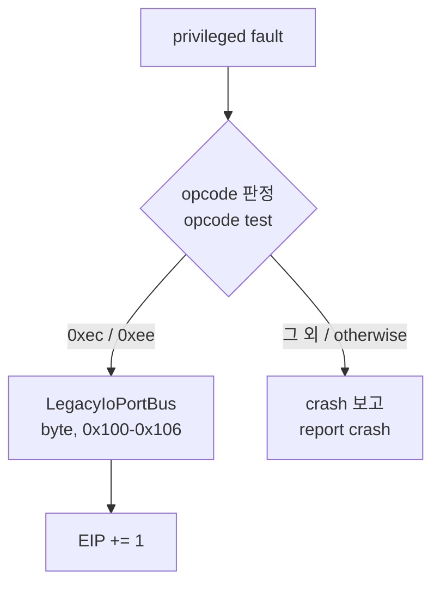
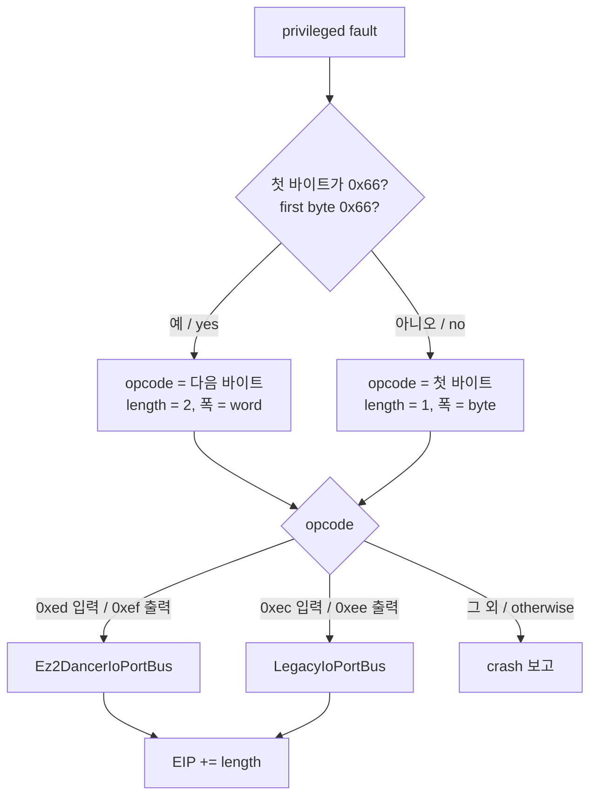

# 16비트 폭 legacy I/O 경계 설계

## 한국어

### 목적

`ez2d2m`이 원본 게임 코드에서 멈추는 지점을 넘깁니다. Hardlock 보호는 [작업 242](../work-logs/20260910-242-ez2d2m-runtime-map-judgement.md)에서 통과했고, 지금 게스트는 원본 `.text`의 트랩되지 않은 port 명령에서 죽습니다. 이것이 이 target의 유일한 차단 지점입니다.

### 관측된 사실

두 번의 실행에서 동일하게 나온 fault입니다.

| 항목 | 값 |
| --- | --- |
| 예외 | `0xc0000096` (privileged instruction) |
| 주소 | main image RVA `0x0000b565`, 원본 `.text` 안 |
| 명령 바이트 | `66 ef` |
| 명령 | `OUT DX, AX` |
| `edx` | `0x030a` |
| `eax` | `0x00000004` |

**확인됨.** EZ2Dancer는 16비트 폭 port 접근을 사용하며 `0x66` operand-size prefix가 실제로 붙습니다. 근거는 [EZ2Dancer I/O 포트 맵](../analysis/ez2dancer-io-map.md)에 있습니다.

### 현재 구조가 맞지 않는 이유



현재 handler는 세 가지를 전제합니다. 셋 다 EZ2Dancer에서 틀립니다.

1. **opcode가 1바이트다.** `66 ef`는 2바이트이므로 `EIP += 1`은 명령 중간으로 복귀시킵니다.
2. **폭이 byte다.** 결과를 `EAX`의 하위 8비트에만 넣고, bus가 `std::uint8_t`로 주고받습니다.
3. **port가 `0x100`–`0x106`이다.** EZ2Dancer는 `0x300`–`0x30c`입니다.

`Ez2DjIoBoard`의 port 의미도 다릅니다. 같은 클래스에 EZ2Dancer 배치를 섞으면 두 제품의 계약이 한 파일에서 얽힙니다.

### 설계

#### 1. 폭을 프로파일이 정한다

`TargetLptdiPolicy`에 폭을 둡니다.

```cpp
enum class LegacyIoWidth { kByte, kWord };
LegacyIoWidth legacy_io_width = LegacyIoWidth::kByte;
```

기본값이 `kByte`이므로 기존 다섯 제품의 값은 그대로입니다.

같은 작업에서 `legacy_io_in_byte_rva`와 `legacy_io_out_byte_rva`를 `legacy_io_in_rva`, `legacy_io_out_rva`로 바꿉니다. 이 필드는 helper의 위치를 가리킬 뿐이며 폭은 이제 별도 항목이 정합니다. 이름에 `byte`가 남아 있으면 word 프로파일에서 사실과 다른 이름이 됩니다. 이 개명은 C++ 멤버 접근뿐이라 컴파일러가 누락을 전부 잡습니다. 반면 injected runtime의 export 이름은 launcher가 **문자열로** 찾으므로 개명하지 않습니다. 문자열은 컴파일러가 검증하지 못하고, 놓치면 런타임에서만 드러납니다.

#### 2. handler가 prefix를 해석한다



폭과 opcode가 프로파일이 선언한 폭과 어긋나면 처리하지 않고 crash로 보고합니다. 추측해서 답하는 것보다 멈추는 편이 낫습니다. 이 원칙은 기존 handler와 같습니다.

prefix 없는 `0xed`·`0xef`는 32비트 폭입니다. 이 설계는 처리하지 않고 crash로 보고합니다. EZ2Dancer에서 관측된 적이 없으므로 구현할 근거가 없습니다.

읽기 결과는 폭에 따라 다르게 넣습니다. byte는 `EAX`의 하위 8비트만, word는 하위 16비트만 바꾸고 나머지는 보존합니다.

#### 3. EZ2Dancer 보드는 별도 파일

`Ez2DancerIoBoard`를 `include/re2dj/input/ez2dancer_io_board.h`와 `src/input/ez2dancer_io_board.cpp`에 둡니다. 독립적으로 이름 붙는 하위 시스템이므로 `Ez2DjIoBoard`에 섞지 않습니다. 버튼·조명 열거형과 port 의미가 모두 다릅니다.

`Ez2DancerIoPortBus`는 word 폭 API를 갖는 별도 클래스입니다. `LegacyIoPortBus`는 손대지 않습니다. 다섯 제품이 그 경로에 의존하고 있고, 이 작업이 그 동작을 바꿀 이유가 없습니다.

injected runtime은 두 bus를 모두 들고 폭으로 갈라 씁니다.

#### 4. 보드 의미의 확인 상태

port `0x30a`가 출력이라는 것과 접근 폭만 원본에서 확인됐습니다. 나머지 port와 bit 배치는 공개 구현에서 온 **추정**입니다. 구현은 추정을 그대로 따르되, 코드 주석과 분석 문서가 그 상태를 분명히 적습니다. 확인된 것처럼 쓰지 않습니다.

| port | 방향 | 상태 |
| --- | --- | --- |
| `0x300`, `0x302` | 입력, 발판 | 추정 |
| `0x304` | 입력, 용도 미상 | 추정 |
| `0x306` | 입력, 손 센서와 TEST·SERVICE | 추정 |
| `0x308` | 출력, 의미 미상 | 추정 |
| `0x30a` | 출력, 캐비닛 조명 | **주소는 확인됨**, bit 배치는 추정 |
| `0x30c` | 출력, 의미 미상 | 추정 |

#### 5. 프로파일 갱신

`ez2d2m`의 raw I/O를 켭니다.

| 항목 | 값 | 근거 |
| --- | --- | --- |
| `legacy_io_width` | `kWord` | `66 ef` 관측 |
| `legacy_io_out_rva` | `0x0000b565` | fault 주소 |
| `legacy_io_in_rva` | `0` | 아직 관측되지 않음 |
| `legacy_io_ports` | true | |

입력 helper 주소는 모릅니다. 출력이 먼저 걸려 실행이 거기서 멈췄기 때문입니다. 출력을 트랩해 실행이 이어지면 다음 fault가 입력 helper를 드러냅니다. 그때까지 `legacy_io_in_rva`는 0으로 두고, handler는 RVA가 0인 방향에 대해 opcode만으로 판정합니다. 이는 기존 `legacy_io_port_range_fallback`과 같은 성격의 허용이며, 폭이 프로파일로 고정돼 있어 오인 여지가 좁습니다.

### 이 설계가 다루지 않는 것

- **32비트 폭 port 접근.** 관측 근거가 없습니다.
- **EZ2Dancer 키보드 입력 매핑.** `Ez2DjKeyboardInput`은 EZ2DJ 버튼 열거형에 묶여 있습니다. 대응하는 dancer 매핑은 보드가 동작한 뒤에 별도 작업으로 만듭니다. 이 작업의 목표는 게스트가 정지 지점을 넘기는 것이지 플레이가 아닙니다.
- **bit 배치의 확정.** 원본에서 확인되지 않은 부분은 추정으로 남습니다.
- **`ez2d2m`의 실행 성공.** 이 경계를 넘긴 뒤 무엇이 나오는지는 관측해야 압니다.

### 성공 기준

- `ez2d2m`이 RVA `0x0000b565`의 `out dx, ax`를 트랩하고 그 다음으로 진행합니다.
- 기존 다섯 제품의 byte 경로 동작이 변하지 않습니다.
- 단위 시험이 prefix 해석, 폭별 `EAX` 반영, EZ2Dancer port 의미를 덮습니다.
- Windows x86 build와 CTest가 통과합니다.

## English

### Purpose

Get `ez2d2m` past the point where it stops in original game code. Its Hardlock protection was passed in [task 242](../work-logs/20260910-242-ez2d2m-runtime-map-judgement.md), and the guest now dies on an untrapped port instruction inside the original `.text`. This is the target's only blocker.

### Observed facts

The fault is identical across two runs: exception `0xc0000096` (privileged instruction) at main-image RVA `0x0000b565`, inside the original `.text`, where the bytes are `66 ef` — `OUT DX, AX` — with `edx` `0x030a` and `eax` `0x00000004`.

**Confirmed.** EZ2Dancer uses 16-bit-wide port access and the `0x66` operand-size prefix is really present. The evidence is in [the EZ2Dancer I/O port map](../analysis/ez2dancer-io-map.md).

### Why the current structure does not fit

The present handler assumes three things, and all three are wrong for EZ2Dancer. It assumes a **one-byte opcode**, so `EIP += 1` on the two-byte `66 ef` resumes in the middle of an instruction. It assumes **byte width**, placing the result in the low 8 bits of `EAX` and exchanging `std::uint8_t` with the bus. And it assumes ports **`0x100`–`0x106`**, where EZ2Dancer uses `0x300`–`0x30c`.

`Ez2DjIoBoard`'s port meanings differ as well; folding the EZ2Dancer layout into that class would tangle two products' contracts in one file.

### Design

#### 1. The profile states the width

`TargetLptdiPolicy` gains `LegacyIoWidth { kByte, kWord }` with `legacy_io_width` defaulting to `kByte`, so the five existing products are unchanged.

In the same task, `legacy_io_in_byte_rva` and `legacy_io_out_byte_rva` become `legacy_io_in_rva` and `legacy_io_out_rva`. These fields only locate the helper; width is now a separate item, and leaving `byte` in the name would make it false for a word profile. The rename touches only C++ member accesses, so the compiler catches every site. The injected runtime's exported symbol names are **not** renamed, because the launcher looks them up as strings, which the compiler cannot verify and which would fail only at run time.

#### 2. The handler decodes the prefix

When the first byte at the faulting address is `0x66`, the opcode is the next byte, the instruction is two bytes long, and the width is word; otherwise the first byte is the opcode, the instruction is one byte, and the width is byte. Input `0xed` and output `0xef` go to the EZ2Dancer bus; input `0xec` and output `0xee` go to the existing byte bus. Anything else is reported as a crash rather than answered.

A width or opcode that disagrees with the width the profile declares is not handled but reported as a crash — stopping beats guessing, which is the existing handler's principle too. Unprefixed `0xed` and `0xef` are 32-bit and are likewise reported rather than handled: nothing in EZ2Dancer has been observed using them, so there is no basis to implement them.

A read result is placed according to width: byte replaces only the low 8 bits of `EAX`, word only the low 16, preserving the rest. `EIP` advances by the decoded instruction length.

#### 3. The EZ2Dancer board is its own file

`Ez2DancerIoBoard` lives in `include/re2dj/input/ez2dancer_io_board.h` and `src/input/ez2dancer_io_board.cpp`. It is an independently nameable subsystem with different button and light enumerations and different port meanings, so it is not folded into `Ez2DjIoBoard`.

`Ez2DancerIoPortBus` is a separate class with a word-width API. `LegacyIoPortBus` is left alone: five products depend on that path and this task has no reason to change its behaviour. The injected runtime holds both buses and selects by width.

#### 4. The confirmation status of the board's meanings

Only the access width and the fact that `0x30a` is an output are confirmed from the original binary. Every other port and the whole bit layout are **inferred** from the public implementation. The implementation follows the inference, and the code comments and analysis document say so plainly rather than presenting it as confirmed.

#### 5. Profile update

`ez2d2m` turns raw I/O on with `legacy_io_width` = `kWord` and `legacy_io_out_rva` = `0x0000b565`, both from the observed fault. `legacy_io_in_rva` stays `0`, because the input helper's address is unknown: output was hit first and execution stopped there. Once the output is trapped and execution continues, the next fault reveals the input helper. Until then the handler judges a direction whose RVA is zero by opcode alone — the same kind of allowance as the existing `legacy_io_port_range_fallback`, and a narrow one, because the profile pins the width.

### What this design does not cover

- **32-bit-wide port access.** No observation supports it.
- **An EZ2Dancer keyboard mapping.** `Ez2DjKeyboardInput` is tied to the EZ2DJ button enumeration; the corresponding dancer mapping is separate work once the board runs. This task's goal is getting the guest past the stop, not playing it.
- **Settling the bit layout.** What the original has not confirmed stays inferred.
- **Whether `ez2d2m` runs.** What appears past this boundary has to be observed.

### Success criteria

- `ez2d2m` traps the `out dx, ax` at RVA `0x0000b565` and proceeds past it.
- The five existing products' byte path is unchanged.
- Unit tests cover prefix decoding, the per-width `EAX` update, and the EZ2Dancer port meanings.
- The Windows x86 build and CTest pass.
