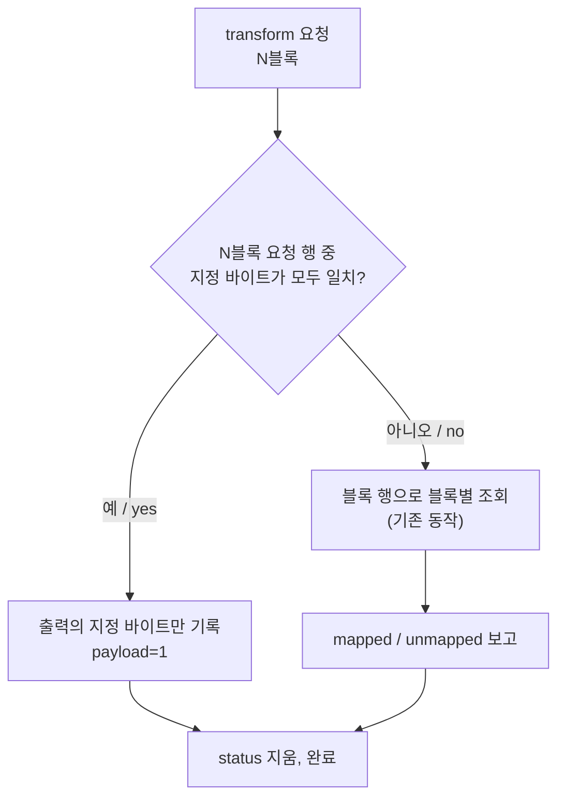

# Hardlock 요청 단위 응답 행 설계

## 한국어

### 목적

`ez2d2m`이 멈추는 12번째 transform 요청(`function=0x0011`, 7블록)에 외부 도구가 계산한 응답을 주입할 수 있게 합니다. 현재 응답 map은 8바이트 블록 하나를 키로 삼는 행만 표현할 수 있어, 이 요청의 응답을 담을 수 없습니다.

re2DJ가 응답을 계산하지 않는다는 원칙은 그대로입니다. 이 설계는 **외부에서 받은 응답을 더 넓은 모양으로 적용하는 경계**만 추가합니다.

### 관측된 사실

이 머신에서 [작업 246](../work-logs/20260910-246-chd-root-from-profile.md)의 결과를 다시 재현했습니다. trace 261줄, 264바이트 transform 11건 전부 매핑, 312바이트 transform 1건 `unmapped=7`, 이후 `ExitProcess(0)`입니다.

`--hardlock-transform-input-dump`로 입력을 두 번 받고 이전 머신의 관찰(reSoftlock `artifacts/ez2d2m/runtime-challenges-full.txt`)과 대조했습니다. 바이트 값은 기록하지 않고 동일 여부와 차이만 적습니다.

| 블록 | 이 머신 두 실행 | 이전 머신과 | 관찰 |
| --- | --- | --- | --- |
| `0x000e` 11건 | 같음 | 같음 | 결정적 |
| `0x0011` 블록 0 | 다름 | 다름 | DWORD 하나가 두 실행의 runtime 적재 주소 차이 `0x50000`만큼 이동 |
| `0x0011` 블록 1 | 다름 | 다름 | 블록 0과 같은 이동 |
| `0x0011` 블록 2–4 | 같음 | 다름 | 0과 `cc` 채움이 머신마다 다름 |
| `0x0011` 블록 5 | 같음 | 같음 | 세 관찰 모두 동일 |
| `0x0011` 블록 6 | 다름 | 다름 | 블록 0과 같은 이동 |

**확인됨.** `0x0011` 요청 56바이트 중 상당 부분은 실행과 환경에 따라 바뀝니다. 요청 전체를 정확히 비교하는 행은 다음 실행에서 빗나갑니다.

### 상위 계약 대조

[작업 130](20260901-130-ez2dj4th-hardlock-bypass-path.md)이 `API_CRYPT`를 대조한 것과 같은 방식으로 2EZConfig-V2를 참고했습니다. 이 저장소는 [GPL-3.0-or-later](https://github.com/ben-rnd/2EZConfig-V2/blob/master/LICENSE)이므로 **사실 대조에만 쓰고 코드는 복사·번역·링크하지 않습니다.** 참조 commit은 reSoftlock `UPSTREAM.md`와 같은 `a7346e066bb569643e0cb25f41cfdc079126fbc6`입니다.

- `src/libs/hardlock/fastapi.h`: `API_INIT 0`, `API_DOWN 1`, `API_AVAIL 6`, `API_CRYPT 14`(`0x0e`), `API_CODE 17`(`0x11`).
- `src/libs/hardlock/io.hardlock.emulator.c`: `API_CRYPT`는 payload(`0x100`)의 각 8바이트 블록을 독립적으로 제자리 변환합니다. `API_CODE`는 **끝에서 두 번째 블록**을 계산 입력으로 한 번 계산한 뒤, 결과를 payload의 블록 0–2와 4–5에 쓰고 블록 3의 두 DWORD에는 **더하며**, 마지막 블록은 건드리지 않습니다.

이 계약에서 따라오는 것은 다음과 같습니다. `API_CODE`의 응답은 블록마다 독립이 아니라 **요청 전체의 함수**입니다. 같은 입력 블록(예: 0 채움)이 위치에 따라 다른 출력을 받아야 하며, 바뀌지 않는 블록도 있습니다.

**추정.** `ez2d2m`의 `function=0x0011`은 `API_CODE`입니다. descriptor의 `0x0000`·`0x0001`·`0x0006`이 각각 `API_INIT`·`API_DOWN`·`API_AVAIL`과 맞고, 상위 계약의 계산 입력 위치(블록 5)가 정확히 모든 관찰에서 변하지 않는 블록입니다. 나머지 블록은 게스트가 채우지 않은 버퍼 내용으로 보입니다.

### 현재 구조가 맞지 않는 이유

| 전제 | `0x0011` 요청에서 |
| --- | --- |
| 응답은 블록마다 독립 | 요청 전체의 함수 |
| 같은 입력 블록은 같은 출력 | 위치마다 다른 출력 |
| 입력 블록 값은 결정적 | 블록 0–4, 6이 실행·환경마다 바뀜 |
| 모든 블록을 덮어씀 | 마지막 블록은 유지, 블록 3은 더하기 |

### 설계

#### 1. map 행 문법을 넓힌다

한 행은 지금처럼 `<입력> <출력> [# 주석]`입니다. 두 토큰의 길이로 행의 종류가 정해집니다.

| 토큰 길이 | 종류 | 바이트 표기 | 뜻 |
| --- | --- | --- | --- |
| 16자 | **블록 행** | hex만 | 지금과 같음. 모든 transform의 각 블록에 적용 |
| 16×N자 (2 ≤ N ≤ 16) | **요청 행** | hex 또는 `??` | N블록 transform의 payload 전체에 적용 |

요청 행의 `??`는 "이 행이 이 바이트에 대해 말하지 않는다"는 뜻입니다.

- 입력의 `??`: 비교하지 않습니다.
- 출력의 `??`: 게스트가 보낸 바이트를 그대로 둡니다.

입력과 출력은 길이가 같아야 하고, 각각 적어도 한 바이트는 지정해야 합니다. 입력이 전부 `??`인 행은 모든 N블록 요청에 맞아 버리므로 거절합니다. `?a`처럼 반만 지정한 바이트도 거절합니다.

기존 map 파일은 모두 16자 행이므로 **해석이 바뀌지 않습니다.**

#### 2. 적용 순서

요청 행이 맞으면 그 요청에는 블록별 조회를 하지 않습니다. 맞는 요청 행이 없으면 지금과 똑같이 동작하므로, 기존 다섯 제품과 6th의 실행은 바뀌지 않습니다. descriptor 요청은 어떤 행도 건드리지 않습니다.

#### 3. 모호한 행은 파싱 단계에서 거절한다

두 요청 행의 블록 수가 같고, **둘 다 지정한 모든 위치에서 바이트가 같다면** 두 행이 동시에 맞는 payload가 존재합니다. 이런 map은 적용 결과가 행 순서에 달리므로 거절합니다. 블록 행의 중복 입력을 거절하는 기존 원칙과 같습니다.

#### 4. function은 키에 넣지 않는다

행은 function 값을 갖지 않습니다. reSoftlock의 `INTERFACE.md`가 function을 map **생성 입력**으로만 두고 파일에는 불투명한 두 열만 남기는 계약과 맞춥니다. 요청 행은 블록 수와 지정 바이트로 충분히 좁혀집니다.

#### 5. runtime 전달

주입 runtime에 새 export 두 개를 둡니다.

| export | 내용 |
| --- | --- |
| `g_re2dj_hardlock_payload_response_count` | 요청 행 수 |
| `g_re2dj_hardlock_payload_responses` | 행당 고정 폭 레코드 |

레코드 배치와 용량 상수는 플랫폼 공용 `payload_responses` 모듈이 소유하고, launcher·자식 프로세스 인계·runtime이 같은 pack/unpack 함수를 씁니다. 레코드는 `u32 블록 수` 뒤에 입력·입력 mask·출력·출력 mask를 각각 최대 16블록(128바이트)씩 둡니다.

launcher는 map이 runtime 용량을 넘으면 **실행을 거절**합니다. 이는 기존 블록 행에도 적용합니다. 지금은 256행을 넘는 map이 runtime 배열 밖으로 쓰일 수 있고, runtime은 개수가 용량을 넘으면 map 전체를 조용히 무시합니다.

#### 6. 진단

바이트는 어디에도 출력하지 않는다는 기존 원칙을 유지합니다.

- launcher JSONL: `hardlock_transform_map` 이벤트에 `payload_entries`를 추가합니다.
- VFS trace: `hardlock-device` 줄에 `payload=0|1`을 추가합니다.

#### 7. 코드 배치

| 파일 | 책임 |
| --- | --- |
| `include/re2dj/hle/hardlock/payload_responses.h`, `src/hle/hardlock/payload_responses.cpp` | 요청 행 자료형, 패턴 파싱, 모호성 판정, 일치·적용, pack/unpack |
| `transform_responses.{h,cpp}` | 행 종류 분기와 map 전체 파싱(`HardlockTransformResponseMap`) |
| `device.{h,cpp}` | 요청 행 우선 적용 |
| `injected_runtime.cpp` | export와 unpack, trace 필드 |
| launcher `main.cpp`, `child_process_handoff.{h,cpp}` | 용량 검사, pack, 원격 기록 |

### 이 설계가 하지 않는 것

- `API_CODE` 응답 계산. 이는 외부 도구의 몫입니다. 어떤 바이트를 지정할지도 도구가 정합니다. 위 관측에 따르면 실행마다 바뀌는 블록은 입력에서 `??`로 두어야 합니다.
- function을 키로 쓰는 것.
- reSoftlock 변경. 별도 저장소이며 그 저장소의 절차를 따릅니다.

### 검증 전략

- 단위 시험(합성 값만 사용): 행 종류 분기, `??` 해석, 반쪽 wildcard·길이 불일치·블록 수 초과·전부 `??` 거절, 모호한 행 거절, 일치·적용, pack/unpack 왕복, 장치에서 요청 행 우선과 불일치 시 블록 조회로의 복귀.
- 실행: 요청 행이 없는 기본 map에서 `ez2d2m` 결과가 그대로인지(261줄, 12번째 `unmapped=7:payload=0`), `ez2dj3rd`가 그대로인지.
- 전달 경로 smoke: 게스트 자신의 블록 5를 그대로 되돌려 쓰는 **항등** 요청 행으로 `payload=1`을 확인합니다. 새 보호 응답을 만들지 않으며, 게스트가 받는 바이트는 현재의 echo와 같습니다. 이 행은 Git이 무시하는 `cfg/`에만 둡니다.

## English

### Purpose

Make it possible to inject an externally computed answer for the twelfth transform request at which `ez2d2m` stops — `function=0x0011`, seven blocks. The response map can currently express only rows keyed on a single eight-byte block, which cannot hold this request's answer.

The rule that re2DJ never computes a response is unchanged. This design only adds **a boundary that applies an externally supplied answer in a wider shape.**

### Observed facts

On this machine the result of [task 246](../work-logs/20260910-246-chd-root-from-profile.md) reproduces: 261 trace lines, all eleven 264-byte transforms mapped, one 312-byte transform with `unmapped=7`, then `ExitProcess(0)`.

The inputs were captured twice with `--hardlock-transform-input-dump` and compared with the other machine's capture (reSoftlock `artifacts/ez2d2m/runtime-challenges-full.txt`). Only equality and differences are recorded, never the bytes. The eleven `0x000e` challenges are identical in all three. In the `0x0011` request, blocks 0, 1 and 6 differ between the two runs here, each carrying one DWORD that moves by `0x50000` — exactly the difference between the two runs' runtime load addresses; blocks 2 to 4 are identical within this machine but differ from the other machine, a mix of zero and `cc` fill; and **block 5 is identical in all three captures.**

**Confirmed:** much of the `0x0011` request's 56 bytes changes with the run and the environment, so a row that compares the whole request exactly would miss on the next run.

### Upstream contract comparison

2EZConfig-V2 was consulted the same way [task 130](20260901-130-ez2dj4th-hardlock-bypass-path.md) consulted it for `API_CRYPT`. It is [GPL-3.0-or-later](https://github.com/ben-rnd/2EZConfig-V2/blob/master/LICENSE), so it is **used for fact comparison only; no code is copied, translated or linked.** The reference commit is `a7346e066bb569643e0cb25f41cfdc079126fbc6`, the same one reSoftlock's `UPSTREAM.md` records.

`src/libs/hardlock/fastapi.h` defines `API_INIT 0`, `API_DOWN 1`, `API_AVAIL 6`, `API_CRYPT 14` (`0x0e`) and `API_CODE 17` (`0x11`). In `src/libs/hardlock/io.hardlock.emulator.c`, `API_CRYPT` transforms each eight-byte block of the payload at `0x100` independently and in place, while `API_CODE` computes once from the **second-to-last block**, then writes the result into payload blocks 0–2 and 4–5, **adds** into the two DWORDs of block 3, and leaves the last block untouched.

What follows from that contract: an `API_CODE` answer is **a function of the whole request**, not of each block. An identical input block, such as zero fill, must receive different outputs by position, and some blocks are not changed at all.

**Inferred:** `ez2d2m`'s `function=0x0011` is `API_CODE`. The descriptor functions `0x0000`, `0x0001` and `0x0006` match `API_INIT`, `API_DOWN` and `API_AVAIL`, and the upstream contract's input position, block 5, is exactly the block that never changes across the captures. The other blocks look like buffer contents the guest never filled.

### Why the current structure does not fit

The current map assumes each block's answer is independent, that an identical input block gets an identical output, that input values are deterministic, and that every block is overwritten. For the `0x0011` request the answer is a function of the whole request, identical blocks need different outputs by position, blocks 0–4 and 6 vary with run and environment, and the last block is kept while block 3 is added to.

### Design

#### 1. Widen the map row grammar

A row stays `<input> <output> [# comment]`, and the token length decides the row kind. A 16-character token is a **block row**, hex only, with today's meaning: it applies to each block of every transform. A 16×N-character token with 2 ≤ N ≤ 16 is a **request row**, hex or `??` per byte, applied to the whole payload of an N-block transform.

In a request row `??` means "this row says nothing about this byte": in the input the byte is not compared, and in the output the guest's byte is kept. Input and output must have equal length and each must specify at least one byte — an all-`??` input would match every N-block request and is rejected — and a half-specified byte such as `?a` is rejected.

Every existing map file consists of 16-character rows, so **its reading does not change.**

#### 2. Order of application

If a request row with N blocks matches every byte it specifies, only its output's specified bytes are written and the result reports `payload=1`; that request gets no per-block lookup. If no request row matches, the per-block lookup runs exactly as it does today, so the runs of the five existing products and of 6th are unchanged. Descriptor requests are never touched by any row.

#### 3. Reject ambiguous rows at parse time

When two request rows have the same block count and **agree on every position both of them specify**, some payload matches both, and the result would depend on row order. Such a map is rejected — the same principle that already rejects a repeated block-row input.

#### 4. Function stays out of the key

Rows carry no function value. This matches reSoftlock's `INTERFACE.md`, which keeps the function as a map **generation input** and leaves the file as two opaque columns. The block count and the specified bytes narrow a request row enough.

#### 5. Runtime transfer

The injected runtime gains two exports: `g_re2dj_hardlock_payload_response_count`, the number of request rows, and `g_re2dj_hardlock_payload_responses`, one fixed-width record per row. The record layout and capacity constants belong to the platform-neutral `payload_responses` module, and the launcher, the child-process handoff and the runtime all use its pack and unpack functions. A record is a `u32` block count followed by input, input mask, output and output mask, each sized for sixteen blocks (128 bytes).

The launcher **refuses to run** when a map exceeds the runtime capacity, and this now applies to block rows too: today a map of more than 256 rows could be written past the runtime array, and the runtime silently ignores the whole map when the count exceeds its capacity.

#### 6. Diagnostics

The rule that no byte is printed anywhere is kept. The launcher's `hardlock_transform_map` JSONL event gains `payload_entries`, and the VFS trace's `hardlock-device` line gains `payload=0|1`.

#### 7. Code layout

`include/re2dj/hle/hardlock/payload_responses.h` and `src/hle/hardlock/payload_responses.cpp` own the request-row type, pattern parsing, the ambiguity test, matching and applying, and pack/unpack. `transform_responses.{h,cpp}` dispatch on row kind and parse the whole map into `HardlockTransformResponseMap`. `device.{h,cpp}` apply request rows first. `injected_runtime.cpp` holds the exports, the unpacking and the trace field. The launcher's `main.cpp` and `child_process_handoff.{h,cpp}` check capacity, pack and write remotely.

### What this design does not do

It does not compute `API_CODE` answers; that belongs to the external tool, which also decides which bytes a row specifies — by the observations above, blocks that change between runs must stay `??` in the input. It does not key rows on the function. And it does not change reSoftlock, a separate repository with its own procedure.

### Verification strategy

Unit tests, with synthetic values only, cover row-kind dispatch, `??` handling, rejection of half wildcards, length mismatches, too many blocks and all-`??` inputs, rejection of ambiguous rows, matching and applying, pack/unpack round trips, and the device preferring a request row and falling back to per-block lookup when none matches.

At run time, `ez2d2m` must be unchanged with the default map, which has no request row — 261 lines and a twelfth request reporting `unmapped=7:payload=0` — and `ez2dj3rd` must be unchanged. A transfer-path smoke test uses an **identity** request row that writes the guest's own block 5 back and checks for `payload=1`. That invents no protection answer — the guest receives the same bytes as today's echo — and the row lives only in the Git-ignored `cfg/`.
