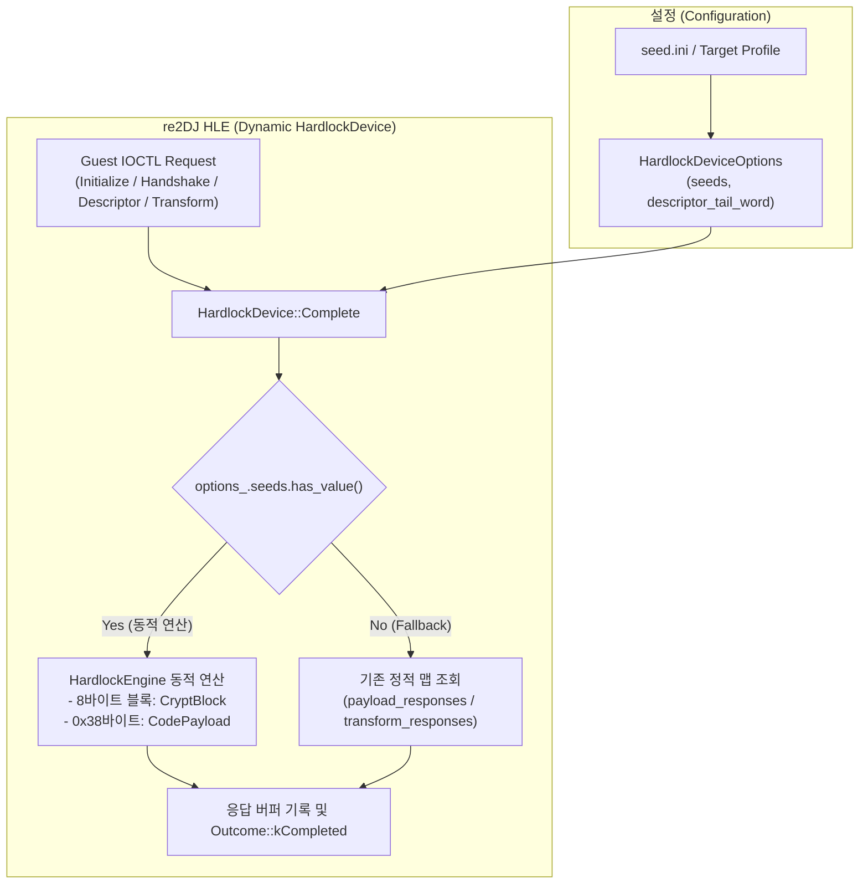

# 클린룸 Hardlock 엔진 통합 및 동적 HLE 구현 설계

## 개요

본 문서는 `reSoftlock`에서 클린룸 C++20으로 구현된 `HardlockEngine`을 `re2DJ`의 HLE 계층(`re2dj::hle::hardlock::HardlockEngine`)으로 통합하고, 정적 매핑 테이블 방식 대신 **시드 값(`module_address`, `seed1`, `seed2`, `seed3`)만으로 런타임에 동적 응답을 실시간 계산**하도록 `HardlockDevice`를 개편하는 설계를 다룬다.

또한 `reSoftlock`에서 생성된 1차 통합 아티팩트(`hardlock_analysis.json`)를 입력받아 후보 시드셋 중 올바른 시드를 정적/동적으로 검증 및 확정하고, 최종적으로 `seed.ini`를 생성하는 워크플로우를 정의한다.

## Overview

This document describes the integration of the clean-room C++20 `HardlockEngine` from `reSoftlock` into `re2DJ`'s HLE layer (`re2dj::hle::hardlock::HardlockEngine`) and the modernization of `HardlockDevice` to **dynamically generate responses in real time using seeds only (`module_address`, `seed1`, `seed2`, `seed3`)**, replacing pre-generated static response maps.

It also defines the verification pipeline that consumes the unified artifact (`hardlock_analysis.json`) generated by `reSoftlock`, confirms the valid seed set among candidates, and emits the final `seed.ini`.

---

## 아키텍처 및 런타임 흐름

### 한국어

1. **Clean Room 엔진 도입**:
   - `include/re2dj/hle/hardlock/engine.h` 및 `src/hle/hardlock/engine.cpp`에 독자 C++20 Hardlock 암호화 엔진을 배치한다.
   - 외부 의존성이 없으며 순수 함수 형태로 8바이트 블록 암호화(`CryptBlock`) 및 56바이트 페이로드 다중 블록 암호화(`CodePayload`)를 제공한다.
2. **HardlockDevice 동적 분기**:
   - `HardlockDeviceOptions`에 `std::optional<HardlockSeeds> seeds`를 추가한다.
   - `seeds`가 활성화되어 있으면, 0x0009(API_CODE) 요청 시 `CodePayload`를 호출하고, 0x000e/0x0011(Transform) 요청 시 각 8바이트 블록에 대해 `CryptBlock`을 실시간 호출하여 버퍼를 채운다.
   - `seeds`가 비어있으면 기존의 정적 테이블(`payload_responses`, `transform_responses`) 조회를 유지하여 하위 호환성을 보장한다.
3. **시드 검증 및 INI 생성 도구**:
   - `reSoftlock`의 분석 아티팩트(`hardlock_analysis.json`)를 읽어 챌린지 패턴들에 대해 시드 후보들로 암호화를 수행하고, 게임 코드의 무결성 검증을 통과하는 시드셋을 확정하여 `hardlock.ini` 형식으로 출력하는 도구를 제공한다.

### English

1. **Clean-Room Engine Integration**:
   - Place the clean-room C++20 Hardlock cryptographic engine in `include/re2dj/hle/hardlock/engine.h` and `src/hle/hardlock/engine.cpp`.
   - Keep it self-contained without external dependencies, offering pure functional block encryption (`CryptBlock`) and multi-block payload encryption (`CodePayload`).
2. **Dynamic Dispatch in HardlockDevice**:
   - Add `std::optional<HardlockSeeds> seeds` to `HardlockDeviceOptions`.
   - When `seeds` is present, dynamically compute 0x0009 (API_CODE) requests via `CodePayload` and 0x000e/0x0011 (Transform) requests block-by-block via `CryptBlock`.
   - When `seeds` is absent, fall back to existing static tables (`payload_responses`, `transform_responses`) to preserve backward compatibility.
3. **Seed Verification and INI Generation Tooling**:
   - Provide tooling to parse `reSoftlock`'s analysis artifact (`hardlock_analysis.json`), evaluate seed candidates against challenges, confirm the valid set, and output a ready-to-use `hardlock.ini`.
