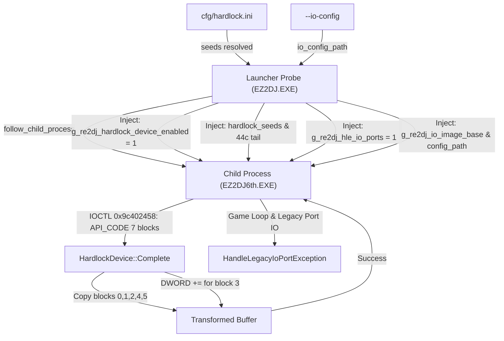

# 설계: ez2dj6th 자식 프로세스 Hardlock 동적 HLE 및 I/O HLE 활성화

## 한국어

### 배경 및 문제 정의

`ez2dj6th`는 부트스트랩 실행 파일(`EZ2DJ.EXE`)이 Hardlock 동글 검증 후 자식 프로세스(`EZ2DJ6th.EXE`)를 생성(`follow_child_process = true`)하는 이중 프로세스 구조를 갖습니다.
직전 분석에서 다음 네 가지 문제가 확인되었습니다:

1. **Launcher Probe의 자식 프로세스 Hardlock 활성화 플래그 조기 평가**:
   - `src/tools/windows_x86_launcher_probe/main.cpp`에서 `child_hardlock_device = follow_child_process && hardlock_device;`를 평가할 당시 `hardlock_device`는 `false`였습니다. 이후 `hardlock.ini`를 파싱하여 `hardlock_device = true`가 되었으나 자식 프로세스 전달 옵션(`child_follow_options.hardlock_device`)은 이전 `false` 값을 유지했습니다.
   - 이로 인해 자식 프로세스(`EZ2DJ6th.EXE`) 메모리에 `g_re2dj_hardlock_device_enabled`가 `1`로 주입되지 않아, 자식 프로세스가 보낸 IOCTL `0x9c402458`(312바이트 transform)이 HLE 계층에서 거절되고 자식 프로세스는 API_DOWN(Function 1, Status 7) 호출 후 즉시 종료되었습니다.

2. **동적 Hardlock API_CODE 변환의 블록 3 2개 DWORD 가산(`+=`) 누락**:
   - `src/hle/hardlock/device.cpp`의 동적 `CodePayload` 분기에서 `code_resp`의 블록 0,1,2,4,5만 덮어쓰고, 블록 3(offset 24..31)의 두 DWORD에 대한 32비트 little-endian 가산(`+=`)이 누락되어 있었습니다.

3. **`ez2dj6th` 프로필의 레거시 I/O 비활성화**:
   - `src/target/target_profile.cpp`에서 `ez2dj6th`의 `legacy_io_ports = false`, `legacy_io_ports_default = false`로 하드코딩되어 CLI에서 `--io-config` 지정 시 무시되었습니다.

4. **자식 프로세스 핸드오프에 I/O HLE 전달 및 주입 미구현**:
   - `BootstrapChildHandoffOptions`에 I/O 관련 필드가 없어 자식 프로세스 메모리에 `g_re2dj_hle_io_ports`, `g_re2dj_io_image_base`, `g_re2dj_io_config_path` 등이 주입되지 않았습니다.

### 해결 설계

1. **`HardlockDevice::Complete` 블록 3 가산 구현**:
   - `header.function == 0x0009` 또는 `(header.block_count == 7 && header.function == 0x0011 && payload.size() == 56)` 분기에서:
     - `payload[24..27]` (DWORD 0)에 `code_resp[24..27]` 가산.
     - `payload[28..31]` (DWORD 1)에 `code_resp[28..31]` 가산.

2. **Launcher Probe 자식 프로세스 옵션 갱신**:
   - `main.cpp`에서 `child_follow_options.hardlock_device = follow_child_process && hardlock_device;`를 최신 `hardlock_device` 값 기준으로 설정.
   - `follow_child_process`에 의해 `hle_io_ports = false`로 리셋되기 전에 `child_hle_io_ports`를 저장하여 `child_follow_options`에 전달.

3. **`BootstrapChildHandoffOptions` 및 주입 확장**:
   - `child_process_handoff.h`에 I/O 옵션 추가 (`hle_io_ports`, `io_config_path`, `io_in_byte_rva`, `io_out_byte_rva`, `io_word_width`).
   - `child_process_handoff.cpp`에서 `options.hle_io_ports`가 활성화되었을 때 `g_re2dj_io_word_width`, `g_re2dj_io_config_path`, `g_re2dj_io_image_base` (`result->image_base`), `g_re2dj_io_in_byte_rva`, `g_re2dj_io_out_byte_rva`, `g_re2dj_hle_io_ports` (1)를 자식 프로세스 메모리에 주입.

4. **Target Profile 갱신**:
   - `src/target/target_profile.cpp`의 `ez2dj6th` 프로필에서 `legacy_io_ports = true`, `legacy_io_ports_default = true` 활성화.
   - `target_profile_test.cpp` 및 `windows_product_loader_probe`의 관련 테스트 갱신.

---

## English

### Background & Problem Definition

`ez2dj6th` uses a dual-process architecture where the bootstrap executable (`EZ2DJ.EXE`) validates the Hardlock dongle and launches the game child process (`EZ2DJ6th.EXE`) with `follow_child_process = true`.
Recent analysis identified four concrete issues:

1. **Premature evaluation of child Hardlock device flag in Launcher Probe**:
   - In `main.cpp`, `child_hardlock_device = follow_child_process && hardlock_device;` was evaluated when `hardlock_device` was still `false`. Subsequent parsing of `hardlock.ini` set `hardlock_device = true`, but `child_follow_options.hardlock_device` retained the stale `false`.
   - Consequently, `g_re2dj_hardlock_device_enabled` was never written as `1` in `EZ2DJ6th.EXE`, causing the child's IOCTL `0x9c402458` (312-byte transform) to be rejected by the HLE layer, whereupon the child invoked API_DOWN (Function 1, Status 7) and exited immediately.

2. **Missing two-DWORD addition (`+=`) for Block 3 in dynamic API_CODE transform**:
   - In `src/hle/hardlock/device.cpp`, the dynamic `CodePayload` branch copied blocks 0,1,2,4,5 but omitted the 32-bit little-endian addition (`+=`) into the two DWORDs of block 3 (offsets 24..31).

3. **Disabled legacy I/O in `ez2dj6th` profile**:
   - In `src/target/target_profile.cpp`, `ez2dj6th` had `legacy_io_ports = false` and `legacy_io_ports_default = false`, causing `--io-config` to be ignored on CLI invocations.

4. **Missing I/O HLE forwarding and injection in Child Process Handoff**:
   - `BootstrapChildHandoffOptions` lacked I/O fields, so `g_re2dj_hle_io_ports`, `g_re2dj_io_image_base`, and `g_re2dj_io_config_path` were never injected into the child process.

### Solution Design

1. **Block 3 addition in `HardlockDevice::Complete`**:
   - For `header.function == 0x0009` or `(header.block_count == 7 && header.function == 0x0011 && payload.size() == 56)`:
     - Add `code_resp[24..27]` into `payload[24..27]` (DWORD 0).
     - Add `code_resp[28..31]` into `payload[28..31]` (DWORD 1).

2. **Launcher Probe child options update**:
   - Update `child_follow_options.hardlock_device = follow_child_process && hardlock_device;` based on the fully resolved `hardlock_device` value.
   - Preserve `child_hle_io_ports = follow_child_process && hle_io_ports;` before resetting `hle_io_ports` in the bootstrap.

3. **`BootstrapChildHandoffOptions` and injection extension**:
   - Add I/O options to `child_process_handoff.h`.
   - In `child_process_handoff.cpp`, write `g_re2dj_io_word_width`, `g_re2dj_io_config_path`, `g_re2dj_io_image_base` (`result->image_base`), `g_re2dj_io_in_byte_rva`, `g_re2dj_io_out_byte_rva`, and `g_re2dj_hle_io_ports` (1) into the child process.

4. **Target Profile updates**:
   - Enable `legacy_io_ports = true` and `legacy_io_ports_default = true` for `ez2dj6th` in `src/target/target_profile.cpp`.
   - Update unit and probe tests accordingly.
