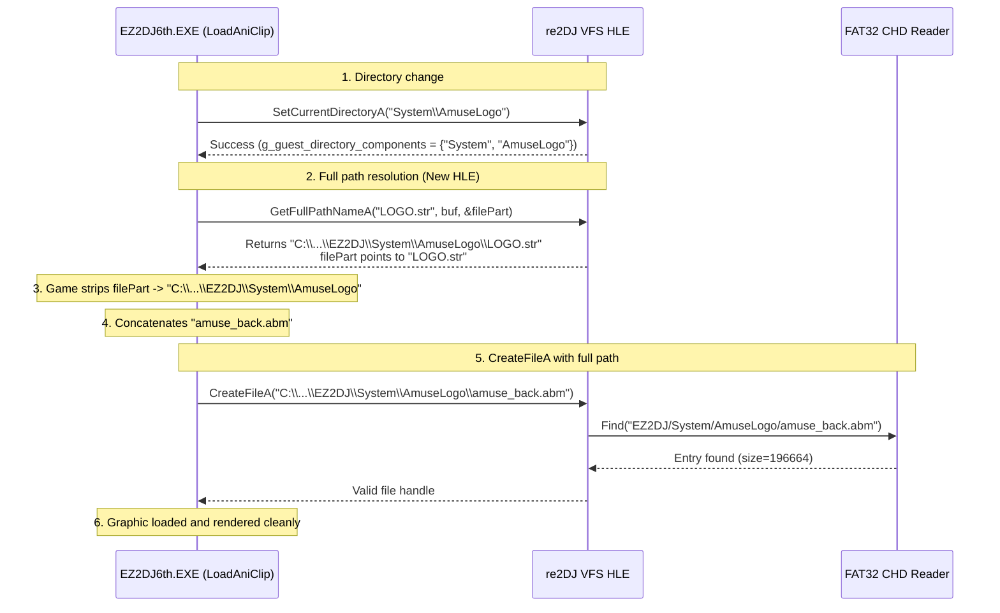

# ez2dj6th VFS GetFullPathNameA HLE 및 그래픽 에셋 로드 정상화 설계
# Design: ez2dj6th VFS GetFullPathNameA HLE and Graphic Asset Loading Normalization

## 1. 개요 (Overview)

`ez2dj6th` 실행 시 게임 루프 및 사운드/I/O 트랩은 정상 동작하나, 화면에 정상적인 비트맵 그래픽 대신 `6logo`, `ttr base`, `type`, `press_s` 등의 파일명 텍스트가 파란색 플레이스홀더 형태로 렌더링되는 현상이 관찰되었다.

원인 분석 결과:
1. `EZ2DJ6th.EXE`의 애니메이션 클립 로더(`LoadAniClip`, RVA `0x00011e40`)는 스크립트(`.str`) 로드 시 `GetFullPathNameA`를 호출하여 스크립트 파일이 위치한 전체 디렉터리 경로를 획득한 후, 스크립트 내부에서 참조하는 비트맵 에셋(`.abm`)의 상대 경로와 결합하여 `CreateFileA`를 호출한다.
2. 현재 `re2DJ` VFS는 `SetCurrentDirectoryA` 및 `GetCurrentDirectoryA`를 가상 디렉터리(`g_guest_directory_components`) 기반으로 HLE 처리하고 있으나, `GetFullPathNameA`는 HLE 가로채기(thunk/import) 대상에 포함되어 있지 않아 호스트 OS의 `KERNEL32!GetFullPathNameA`가 직접 호출되었다.
3. 호스트 프로세스의 실제 OS 작업 디렉터리는 `C:\...\Temp\re2dj\chd\ez2dj6th\EZ2DJ`로 고정되어 있으므로, 게임이 `SetCurrentDirectoryA("System\\Title")` 등을 호출했음에도 `GetFullPathNameA("Title.str")`는 호스트 작업 디렉터리를 기준으로 `C:\...\EZ2DJ\Title.str`를 반환하였다.
4. 파일명을 잘라낸 디렉터리 경로가 `C:\...\EZ2DJ`로 잘못 결정되었고, 여기에 비트맵 파일명(`tt_base.abm` 등)이 결합되어 `C:\...\EZ2DJ\tt_base.abm`으로 `CreateFileA`가 요청되었다.
5. VFS의 CHD 경로 해석은 이를 `EZ2DJ/tt_base.abm`으로 변환하였으나 실제 에셋은 `EZ2DJ/SYSTEM/Title/TT_BASE.ABM`에 존재하므로 파일 열기가 실패(`ERROR_FILE_NOT_FOUND`)하였다.
6. `LoadAniClip`은 에셋 열기 실패 시 `LoadAniClip: Not Found '%s'` 메시지와 함께 화면에 파일명 문자열을 대체 폰트로 렌더링하는 폴백을 수행하였다.

본 작업은 VFS 계층에 `GetFullPathNameA` HLE 구현을 추가하고 IAT 패칭 및 동적 리졸버에 등록하여, 가상 현재 디렉터리가 결합된 올바른 전체 경로를 반환하도록 함으로써 모든 그래픽 에셋이 CHD로부터 정상 로드되도록 한다. 또한 CHD 부트스트랩 프로필인 `ez2dj6th`의 자식 실행 파일(`EZ2DJ6th.EXE`) 자동 스테이징을 보장한다.

---

An issue was observed in `ez2dj6th` where the game loop, DirectSound audio streaming, and legacy I/O port trapping functioned normally, but blue placeholder rectangles with file name strings (such as `6logo`, `ttr base`, `type`, `press_s`) were rendered on screen instead of actual bitmap graphics.

Root cause analysis confirmed:
1. In `EZ2DJ6th.EXE`, the animation clip loader (`LoadAniClip`, RVA `0x00011e40`) calls `GetFullPathNameA` on the script path (`.str`) to obtain the full directory path where the script resides, then concatenates that directory path with sprite bitmap names (`.abm`) before calling `CreateFileA`.
2. Currently, the `re2DJ` VFS HLE handles `SetCurrentDirectoryA` and `GetCurrentDirectoryA` using virtual directory components (`g_guest_directory_components`), but `GetFullPathNameA` was not intercepted. Hence, native `KERNEL32!GetFullPathNameA` was invoked.
3. The native OS working directory of the host process remains fixed at `C:\...\Temp\re2dj\chd\ez2dj6th\EZ2DJ`. Even though the guest called `SetCurrentDirectoryA("System\\Title")`, native `GetFullPathNameA("Title.str")` resolved it against the host process working directory, returning `C:\...\EZ2DJ\Title.str`.
4. After stripping the file name, the resulting directory path was erroneously determined as `C:\...\EZ2DJ`, producing asset open requests like `C:\...\EZ2DJ\tt_base.abm`.
5. The VFS resolved this to `EZ2DJ/tt_base.abm`, which does not exist in the CHD volume (the actual file resides in `EZ2DJ/SYSTEM/Title/TT_BASE.ABM`), causing file opening to fail with `ERROR_FILE_NOT_FOUND`.
6. Upon open failure, `LoadAniClip` logged `LoadAniClip: Not Found '%s'` and triggered a fallback routine that renders the asset filename text directly on screen.

This task implements `GetFullPathNameA` HLE in the VFS layer, registers it in IAT thunk tables and dynamic resolvers, and ensures proper staging of the child executable (`EZ2DJ6th.EXE`) for CHD bootstrap profiles.

---

## 2. 변경 대상 구성요소 (Target Components)

### 1) Injected Runtime VFS (`src/platform/windows/injected_runtime.cpp`)
- `Re2djVfsGetFullPathNameA(LPCSTR file_name, DWORD buffer_length, LPSTR buffer, LPSTR* file_part)` 구현 및 dllexport 추가.
  - `ResolveGuestRelativePath(file_name, &resolved)`를 통해 가상 현재 디렉터리(`g_guest_directory_components`)를 반영한 상대 경로 계산.
  - 상대 경로와 `g_re2dj_vfs_hdd_root`를 `JoinRoot`로 결합하여 호스트 네이티브 전체 경로 생성.
  - `file_part` 포인터 계산 (마지막 `\` 다음 위치).
  - 버퍼 크기 부족 시 필요한 길이(`length + 1`) 반환, 충분 시 복사 후 문자열 길이 반환.
  - 가상 경로 해석 실패 시 네이티브 `GetFullPathNameA`로 fallback.
  - `ReportVfsAssetOpen` 또는 전용 `ReportVfsGetFullPathName` 진단 메시지 로깅.
- `Re2djHleGetProcAddress`의 동적 리졸버 매핑에 `"GetFullPathNameA"` 추가.

### 2) Launcher & Child Process Handoff
- `src/tools/windows_x86_launcher_probe/child_process_handoff.cpp`:
  - `vfs_exports`에 `"_Re2djVfsGetFullPathNameA@16"` 추가.
  - `vfs_imports`에 `"GetFullPathNameA"` 추가.
- `src/tools/windows_x86_launcher_probe/main.cpp`:
  - `vfs_exports`에 `"_Re2djVfsGetFullPathNameA@16"` 추가.
  - `vfs_imports`에 `"GetFullPathNameA"` 추가.

### 3) Host CLI CHD Staging (`src/host/cli/main.cpp`)
- `PrepareChdStaging`:
  - `profile_id == "ez2dj6th"`인 경우 부트스트랩 실행 파일(`EZ2DJ/EZ2DJ.EXE`) 외에 자식 실행 파일(`EZ2DJ/EZ2DJ6th.EXE`)도 함께 대상 임시 디렉터리에 머티리얼라이즈되도록 보장.

---

## 3. 검증 계획 (Verification Plan)

1. **단위 테스트**:
   - `src/tools/windows_vfs_runtime_probe/main.cpp`:
     - `Re2djVfsSetCurrentDirectoryA("System\\Title")` 설정 상태에서 `Re2djVfsGetFullPathNameA("Title.str", ...)` 호출 시 가상 디렉터리가 반영된 전체 경로와 올바른 `file_part` 포인터가 반환되는지 검증하는 테스트 추가.
2. **실기 실행 검증**:
   - `re2dj.exe ez2dj6th --io-config .\config\ez2dj-io.example.ini` 실행:
     - `.child.vfs.log`에서 `amuse_back.abm`, `tt_base.abm`, `type.abm` 등이 `success=1:chd://`로 정상 오픈되는지 확인.
     - 게임 창에서 파란색 파일명 텍스트 대신 실제 로고, 타이틀 화면 및 타이틀 텍스처 그래픽이 깨끗하게 렌더링되는지 확인.
