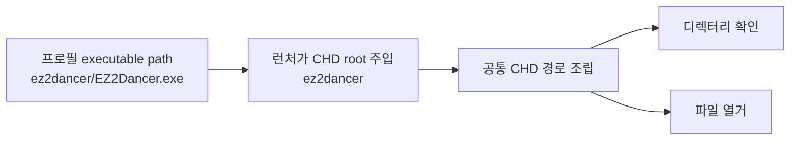

# ez2d2m VFS CHD 루트 일반화 설계
# Design: Generalize the ez2d2m VFS CHD Root

## 한국어

### 목적

`ez2d2m` 실행 시 `SetCurrentDirectoryA("system\\opening\\")`와
`SetCurrentDirectoryA("system\\title\\")`가 실패하는 문제를 수정합니다. 프로필과
런처는 이미 실행 파일 경로에서 CHD 내부 제품 루트(`ez2dancer`)를 계산해 주입하지만,
VFS의 디렉터리 확인 및 열거 경로가 기존 EZ2DJ 루트(`EZ2DJ`)를 직접 사용하고 있습니다.

### 확인된 사실

- `ez2d2m`의 CHD 내부 실행 파일은 `ez2dancer/EZ2Dancer.exe`입니다.
- 파일 열기 경로는 이미 `g_re2dj_vfs_chd_root`를 사용하므로 `system\\soundFX` 등 일부
  CHD 파일은 정상적으로 읽힙니다.
- `GuestDirectoryExists`와 `Re2djVfsFindFirstFileA`만 CHD 경로를 `EZ2DJ/`로 조립합니다.
- 실제 실행 로그에서 `system/opening`, `system/title` 디렉터리 설정이 실패한 뒤
  `opening.scr`, `1P_Press.str`가 루트에서 검색되고 `ERROR_FILE_NOT_FOUND`가 발생합니다.

### 설계

1. CHD 내부 경로를 조립하는 작은 공통 함수가 `g_re2dj_vfs_chd_root`를 접두사로 사용하도록
   합니다.
2. `GuestDirectoryExists`는 이 함수를 통해 제품별 CHD 루트 아래의 디렉터리를 확인합니다.
3. `Re2djVfsFindFirstFileA`도 동일한 함수를 사용해 현재 게스트 디렉터리를 열거합니다.
4. 기본값 `EZ2DJ`는 유지하여 기존 EZ2DJ 프로필의 동작을 바꾸지 않습니다.
5. Hardlock `Function 0x0011` 응답은 이번 수정 범위에서 변경하지 않습니다. 경로 문제와
   보호 응답 문제를 분리해 다음 실행에서 각각 검증할 수 있어야 합니다.

### 검증 전략

- Windows x86 Debug 빌드와 기존 CTest를 실행합니다.
- `re2dj_windows_vfs_runtime_probe`를 실행해 기존 HDD 기반 현재 디렉터리 및 열거 회귀가
  없는지 확인합니다.
- 사용자가 제공한 `ez2d2m.chd`로 다시 실행해 `system/opening`과 `system/title` 설정이
  성공하고, `opening.scr` 및 `1P_Press.str`가 CHD에서 열리는지 VFS 로그로 확인합니다.
- Hardlock 응답이 아직 검증되지 않았으므로 경로 수정 후에도 보호 코드에서 종료할 수 있으며,
  그 경우 새 종료 지점을 별도로 기록합니다.

## English

### Purpose

Fix the `ez2d2m` startup failure where `SetCurrentDirectoryA("system\\opening\\")` and
`SetCurrentDirectoryA("system\\title\\")` fail. The profile and launcher already derive and
inject the image-internal product root (`ez2dancer`) from the executable path, but the VFS
directory-existence and enumeration paths still hard-code the old EZ2DJ root (`EZ2DJ`).

### Confirmed facts

- The `ez2d2m` executable inside the CHD is `ez2dancer/EZ2Dancer.exe`.
- File opens already use `g_re2dj_vfs_chd_root`, so some CHD files such as `system\\soundFX`
  are read successfully.
- `GuestDirectoryExists` and `Re2djVfsFindFirstFileA` are the remaining CHD paths that build
  `EZ2DJ/` directly.
- The run log shows directory changes to `system/opening` and `system/title` failing, followed
  by root-relative opens for `opening.scr` and `1P_Press.str` returning `ERROR_FILE_NOT_FOUND`.

### Design

1. Make one small common CHD-relative path builder use `g_re2dj_vfs_chd_root` as its prefix.
2. Use it from `GuestDirectoryExists` when checking a directory in the CHD.
3. Use it from `Re2djVfsFindFirstFileA` when enumerating the current guest directory.
4. Preserve the default `EZ2DJ` value so existing EZ2DJ profiles remain unchanged.
5. Leave the Hardlock `Function 0x0011` response untouched. The path and protection-response
   issues must remain independently observable.

### Verification strategy

- Build the Windows x86 Debug configuration and run the existing CTest suite.
- Run `re2dj_windows_vfs_runtime_probe` to verify the existing HDD-backed current-directory and
  enumeration behavior.
- Re-run with the user-supplied `ez2d2m.chd` and verify in the VFS log that `system/opening` and
  `system/title` succeed and that `opening.scr` and `1P_Press.str` open from the CHD.
- The Hardlock response remains unconfirmed, so the game may still stop in protected code after
  this path fix; record that as a separate boundary.
