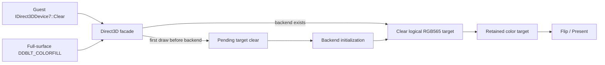

# Direct3D Clear와 retained frame 연결 설계

## 목적

`ez2d2m` 실행 화면에서 이전 프레임의 색상이 잔상처럼 남는 문제를 조사하고 수정한다. `ez2dj4th`에서도 같은 증상이 관찰되었으므로 프로파일별 예외보다 공통 Direct3D HLE 경계를 우선 확인한다.

## 조사 결론

**확인됨:** 두 프로파일 모두 그래픽 프로파일에 별도의 retained-frame 설정이 없지만, 원본 실행 중 생성한 primary surface의 descriptor가 `caps=0x00002218`, `back_buffers=1`이다. 이 값은 `DDSCAPS_PRIMARYSURFACE | DDSCAPS_FLIP | DDSCAPS_COMPLEX | DDSCAPS_VIDEOMEMORY`와 일치하며, facade는 이 descriptor에서 `presentation_retains_frames=true`를 계산한다.

**확인됨:** `ez2d2m`은 `LegacyDeviceClear`에 `flags=0x00000001`과 검정에서 점차 밝아지는 `D3DCOLOR`를 전달하고, `ez2dj4th`는 `flags=0x00000003`으로 색상 및 depth clear를 전달한다. 두 경로 모두 clear가 첫 draw보다 먼저 발생한다.

**확인됨:** 현재 `LegacyDeviceClear`는 호출을 trace에 기록하기만 하고 SDL3/OpenGL logical render target을 지우지 않는다. retained-frame backend는 프레임 시작마다 색상 버퍼를 지우지 않도록 설계되어 있으므로, 이 누락은 원본이 요청한 화면 초기화를 잃고 이전 색상을 남기는 직접 원인이 된다.

**결론:** 프로파일 설정 누락이 아니라 공통 HLE의 clear 전달 누락이다. profile별 graphics 옵션을 추가하지 않고 Direct3D facade에서 logical render target으로 clear를 전달한다.

## 설계

1. `D3DCOLOR`의 RGB 성분을 backend가 사용하는 RGB565로 변환한다. alpha와 stencil 값은 현재 RGB565 색상 대상에 사용하지 않는다.
2. 현재 device render target이 root의 presentation surface이고 `D3DCLEAR_TARGET`이 지정된 전체 대상 clear이면, backend의 `ClearRenderTarget`을 호출한다.
3. 첫 draw 전에 backend가 아직 생성되지 않았다면 root에 마지막 clear 색상을 pending 상태로 저장한다. 첫 backend 초기화 직후, 첫 draw보다 먼저 pending clear를 적용한다.
4. 전체 화면 `DDBLT_COLORFILL`도 같은 요청 경로를 사용한다. 이로써 display-layer clear와 D3D clear가 backend 생성 시점에 따라 서로 다른 결과를 만들지 않는다.
5. surface의 CPU backing이 있는 경우에는 현재 device render target도 같은 RGB565 색상으로 채워 surface lock/readback 상태를 일관되게 유지한다. backend clear가 실패하면 해당 HLE 호출은 실패를 반환한다.
6. retained-frame 정책 자체는 유지한다. `DDSCAPS_FLIP` primary는 implicit color clear를 하지 않고, 명시적인 guest clear가 있을 때만 색상을 초기화한다. non-flip copy-present 경로의 프레임 시작 clear 정책은 변경하지 않는다.
7. 부분 `D3DRECT` clear와 presentation target이 아닌 별도 render target은 이번 작업에서 backend clear로 합성하지 않는다. 현재 두 실행의 trace에는 `rect_count=0`인 전체 대상 clear만 확인되며, 미확인 조합은 기존 보수적 동작과 별도 진단 대상으로 남긴다.

## 검증 계획

- Windows x86 Debug/Release 빌드와 기존 unit test를 실행한다.
- 실행 trace에서 두 profile의 `LegacyDeviceClear` 호출이 유지되는지 확인하고, 첫 draw 전에 pending clear가 적용되는지 확인한다.
- `ez2d2m` 및 `ez2dj4th`를 기존과 같은 CHD/HDD 입력으로 실행하여 화면 잔상과 명시적 fade 색상 clear가 사라졌는지 확인한다.
- non-flip copy-present profile의 기존 화면이 색상 누적으로 변하지 않는지 회귀 확인한다.

## English

### Purpose

Investigate and fix the afterimage-like screen output reported for `ez2d2m`. The same symptom was also observed in `ez2dj4th`, so the shared Direct3D HLE boundary is examined before adding any profile-specific exception.

### Investigation conclusion

**Confirmed:** Neither profile has a separate retained-frame graphics setting, but both originals create a primary surface with `caps=0x00002218` and `back_buffers=1`. This matches `DDSCAPS_PRIMARYSURFACE | DDSCAPS_FLIP | DDSCAPS_COMPLEX | DDSCAPS_VIDEOMEMORY`, and the facade derives `presentation_retains_frames=true` from that descriptor.

**Confirmed:** `ez2d2m` calls `LegacyDeviceClear` with `flags=0x00000001` and `D3DCOLOR` values that step from black toward brighter gray. `ez2dj4th` calls it with `flags=0x00000003` for color and depth. In both traces the clear happens before the first draw.

**Confirmed:** `LegacyDeviceClear` currently records the call in the trace but does not clear the SDL3/OpenGL logical render target. The retained-frame backend intentionally preserves color at frame start, so this omission drops the clear requested by the original and leaves the previous color content visible.

**Conclusion:** This is a shared HLE clear-forwarding defect, not a missing profile setting. The fix forwards the Direct3D clear into the logical render target without adding profile-specific graphics options.

### Design

1. Convert the RGB components of `D3DCOLOR` to the RGB565 format used by the backend. Alpha and stencil are not used by the current RGB565 color target.
2. When the device's current render target is the root presentation surface and a full-target `D3DCLEAR_TARGET` is requested, call the backend's `ClearRenderTarget`.
3. If the clear arrives before backend creation, store the latest color in the root as a pending clear. Apply it immediately after backend initialization and before the first draw.
4. Send full-surface `DDBLT_COLORFILL` through the same request path, so display-layer and D3D clears do not depend on backend creation timing.
5. When CPU surface backing exists, fill the current device render target with the same RGB565 color to keep surface lock/readback state coherent. Return an HLE failure if the backend clear fails.
6. Keep retained-frame behavior itself unchanged. A flipping primary skips the implicit color clear and is reset only by an explicit guest clear. The frame-start clear policy for non-flipping copy-present paths is unchanged.
7. Partial `D3DRECT` clears and separate non-presentation render targets are not composed into the backend in this task. Both observed runs issue only full-target clears with `rect_count=0`; other combinations remain a separate unresolved diagnostic area.

### Verification plan

- Run the Windows x86 Debug/Release build and existing unit tests.
- Confirm in runtime traces that both profiles still issue `LegacyDeviceClear` and that a clear issued before the first draw is applied after backend creation.
- Run `ez2d2m` and `ez2dj4th` with the existing CHD/HDD inputs and check that retained-frame afterimages and missing explicit fade clears are gone.
- Regression-check a non-flipping copy-present profile for the existing no-accumulation behavior.
