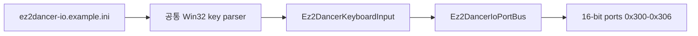

# EZ2Dancer 키보드 I/O 설정 설계
# Design: EZ2Dancer Keyboard I/O Configuration

## 한국어

### 목적

`ez2d2m`의 word-wide I/O 보드에 키보드 입력을 전달하고, 사용자가 바로 복사해서 쓸 수
있는 `config/ez2dancer-io.example.ini`를 제공합니다.

현재 `--io-config` 경로는 런타임까지 전달되지만, injected runtime은 byte-wide EZ2DJ
프로필에서만 `Ez2DjKeyboardInput`을 초기화합니다. 따라서 EZ2Dancer 설정 파일만 추가하면
모든 입력이 idle 상태로 남습니다.

### 확인 상태

- **확인됨:** `ez2d2m`은 16비트 port `0x300`, `0x302`, `0x304`, `0x306`을 읽습니다.
- **확인됨:** 현재 런타임은 word-wide 프로필에서 키보드 설정을 읽지 않습니다.
- **추정:** 패드·센서·TEST·SERVICE bit 배치는 기존 `Ez2DancerIoBoard` 모델과
  `docs/analysis/ez2dancer-io-map.md`의 제한된 protocol 근거를 따릅니다.
- **미확정:** 코인 입력 경로. 확인되지 않은 bit를 만들지 않기 위해 이번 설정에는 coin을
  넣지 않습니다.

### 설계

1. Win32 키 이름 파싱과 INI key 읽기를 `keyboard_input_common`으로 분리해 두 제품의
   키보드 어댑터가 공유합니다.
2. `Ez2DancerKeyboardInput`은 다음 `[buttons]` key를 `Ez2DancerButton`에 연결합니다.
   - `test`, `service`
   - `p1_left`, `p1_center`, `p1_right`
   - `p2_left`, `p2_center`, `p2_right`
   - `p1_sensor_top_left`, `p1_sensor_top_right`, `p1_sensor_bottom_left`,
     `p1_sensor_bottom_right`
   - `p2_sensor_top_left`, `p2_sensor_top_right`, `p2_sensor_bottom_left`,
     `p2_sensor_bottom_right`
3. injected runtime은 word-wide read 직전에 EZ2Dancer 어댑터를 poll하고, byte-wide read에는
   기존 EZ2DJ 어댑터를 유지합니다.
4. 예제 파일은 서로 겹치지 않는 기본 키를 제공하며, 코인처럼 미확정인 항목은 주석으로만
   설명합니다.

### 검증 전략

- 예제 INI가 전용 어댑터에서 초기화되는지 단위 테스트합니다.
- 잘못된 키 이름이 오류로 거부되는지 단위 테스트합니다.
- 기존 EZ2DJ 키보드 테스트를 그대로 통과시켜 공통 parser 추출의 회귀를 확인합니다.
- Windows x86 Debug 빌드와 관련 CTest를 실행합니다.
- 실제 `ez2d2m` 실행에서 word-wide input read가 계속 `handled=1`이고 설정 오류가 없는지
  확인합니다.

## English

### Purpose

Feed keyboard input into the word-wide `ez2d2m` I/O board and provide a ready-to-copy
`config/ez2dancer-io.example.ini`.

The `--io-config` path already reaches the injected runtime, but the runtime initializes
`Ez2DjKeyboardInput` only for byte-wide EZ2DJ profiles. Adding only an EZ2Dancer file would
therefore leave every input idle.

### Confirmation status

- **Confirmed:** `ez2d2m` reads 16-bit ports `0x300`, `0x302`, `0x304`, and `0x306`.
- **Confirmed:** the current runtime does not load keyboard configuration for word-wide profiles.
- **Inferred:** pad, sensor, TEST, and SERVICE bit assignments follow the existing
  `Ez2DancerIoBoard` model and the bounded protocol evidence in
  `docs/analysis/ez2dancer-io-map.md`.
- **Unresolved:** the coin input path. This work does not invent an unconfirmed bit.

### Design

1. Extract Win32 key-name parsing and INI binding reads into `keyboard_input_common`, shared by
   both product keyboard adapters.
2. Map the listed `[buttons]` keys to `Ez2DancerButton` in `Ez2DancerKeyboardInput`.
3. Poll the EZ2Dancer adapter before a word-wide read and retain the existing EZ2DJ adapter for
   byte-wide reads.
4. Provide non-overlapping default keys in the example file and mention unresolved inputs only
   in comments.

### Verification strategy

- Unit-test initialization from the example INI.
- Unit-test rejection of an unknown key name.
- Keep the existing EZ2DJ keyboard tests passing after extracting the common parser.
- Build Windows x86 Debug and run the related CTest tests.
- In a real `ez2d2m` run, verify that word-wide reads remain `handled=1` with no configuration
  error.
