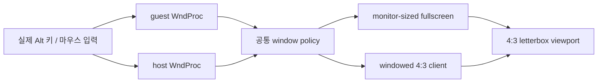

# 창 입력 전달과 4:3 표시 비율 설계

## 목적

실제 Windows 실행에서 다음 동작을 보장합니다.

- `Alt+1`, `Alt+2`, `Alt+3`이 실제 키보드 포커스 위치와 관계없이 640x480, 1280x960, 1920x1440 client 크기를 선택한다.
- client 영역 더블클릭으로 fullscreen을 전환한다.
- windowed 수동 크기 조절과 fullscreen 출력 모두 원본 4:3 비율을 유지한다.
- fullscreen 모니터의 비율이 4:3이 아니면 콘텐츠를 중앙에 letterbox/pillarbox로 배치한다.

## 확인된 원인

**확인됨:** 기존 runtime probe는 `SendMessageA`로 guest child HWND에 `WM_SYSKEYDOWN`과 mouse message를 직접 전달했다. 이 검사는 실제 포커스가 host 또는 SDL이 wrapping한 HWND에 있는 경우의 메시지 경로를 검증하지 않는다.

**확인됨:** 현재 host shell의 `WM_SIZE`는 client 전체를 guest child에 그대로 배치하고, `WM_SIZING`에서는 비율을 제한하지 않는다.

**확인됨:** OpenGL `Present`는 최종 viewport를 pixel 전체 크기로 설정한다. 따라서 fullscreen monitor의 비율이 4:3이 아니면 640x480 논리 화면이 monitor 비율로 늘어난다.

**분류:** 이 작업의 단축키/fullscreen 문제는 profile 설정이 아니라 Windows host shell의 실제 입력 전달 범위 문제이다. 비율 문제는 host window sizing과 공용 SDL/OpenGL presentation 경계의 정책 누락이다.

## 설계

1. scale shortcut과 fullscreen toggle의 공통 입력 처리를 작은 helper로 분리한다.
2. guest subclass뿐 아니라 host WndProc에서도 Alt shortcut과 double-click을 처리한다. 이미 guest에서 처리한 입력은 host로 중복 전달되지 않도록 consume한다.
3. `WM_SIZING`에서 현재 non-client frame을 제외한 client 크기를 계산하고, 제안된 outer rectangle을 4:3 client 비율로 보정한다. `WM_GETMINMAXINFO`에는 최소 client 크기를 추가한다.
4. OpenGL `Present`에서 논리 화면과 pixel framebuffer의 aspect ratio를 비교해 중앙 viewport를 계산한다. default framebuffer 전체를 검정색으로 clear한 뒤 계산된 viewport에만 논리 화면을 복사한다.
5. 논리 render target과 DirectDraw display mode는 계속 640x480으로 유지한다. profile별 설정이나 원본 실행 파일은 변경하지 않는다.

## 검증 계획

- Windows x86 Debug build와 기존 unit/keyboard tests를 실행한다.
- runtime probe에 `WM_SIZING` 4:3 보정과 host-level shortcut 경로를 추가해 client 크기와 style을 확인한다.
- OpenGL probe가 실행 가능하면 비정방형 framebuffer에서 viewport 여백과 stretch 방지 상태를 확인한다.
- 실제 제품 실행에서 Alt shortcut, double-click fullscreen, 수동 resize를 확인한다. 원본 자산이 없는 환경에서는 해당 시각 검증의 실행 여부를 별도로 기록한다.

## English

### Purpose

Guarantee the following behavior in an actual Windows run:

- `Alt+1`, `Alt+2`, and `Alt+3` select 640x480, 1280x960, and 1920x1440 client sizes regardless of whether keyboard focus is on the host or SDL-wrapped guest window.
- Double-clicking the client area toggles fullscreen.
- Manual window resizing and fullscreen presentation preserve the original 4:3 aspect ratio.
- A non-4:3 fullscreen monitor receives centered letterbox/pillarbox output instead of stretched content.

### Confirmed cause

**Confirmed:** The existing runtime probe injected `WM_SYSKEYDOWN` and mouse messages directly into the guest child HWND. It did not test the real message route when focus belongs to the host or the HWND wrapped by SDL.

**Confirmed:** The host shell resizes the guest child to the entire client area in `WM_SIZE` and does not constrain `WM_SIZING` to an aspect ratio.

**Confirmed:** OpenGL `Present` sets the final viewport to the full pixel framebuffer. A 640x480 logical image is therefore stretched to a non-4:3 fullscreen monitor.

**Classification:** The shortcut/fullscreen issue is a Windows host-shell input-delivery gap, not a profile setting omission. The aspect-ratio issue is a missing policy at the host window sizing and shared SDL/OpenGL presentation boundaries.

### Design

1. Share scale-shortcut and fullscreen-toggle handling through small helpers.
2. Handle shortcuts and double-clicks in both the guest subclass and host WndProc. Consume an input once it is handled so it is not applied twice.
3. In `WM_SIZING`, derive the proposed client dimensions after subtracting the current non-client frame and adjust the outer rectangle to a 4:3 client ratio. Add a minimum client size in `WM_GETMINMAXINFO`.
4. In OpenGL `Present`, calculate a centered viewport from the logical and framebuffer aspect ratios. Clear the default framebuffer to black, then copy the logical image only into the calculated viewport.
5. Keep the logical render target and DirectDraw display mode at 640x480. Do not change profiles or the original executable.

### Verification plan

- Run the Windows x86 Debug build and existing unit/keyboard tests.
- Extend the runtime probe to verify host-level shortcut routing and 4:3 `WM_SIZING` correction.
- If an OpenGL probe is available, verify centered bars and no stretch on a non-4:3 framebuffer.
- Verify Alt shortcuts, double-click fullscreen, and manual resize in an actual product run; record separately if original assets are unavailable.
