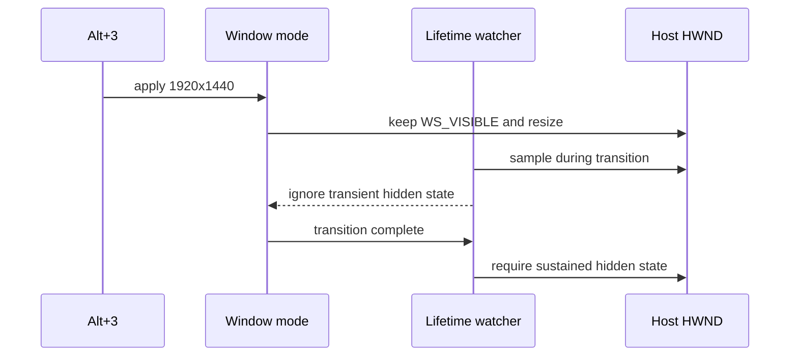

# Alt+3 창 전환 중 종료 방지 설계

## 문제와 확인 결과

`ez2dj4th` 실행 trace에서 `Alt+3`으로 보이는 창 모드 재적용 뒤 `window-lifetime:event=watcher-exit`가 기록되며, 창은 `valid=1:visible=0`이었다. 제공된 launcher handoff 기록은 `outcome success`이므로 CHD의 FAT32-LBA 볼륨, `EZ2DJ/EZ2DJ.EXE` 경로, 프로파일 준비 실패를 가리키지 않는다.

현재 host 창 모드 재적용은 `GWL_STYLE`을 먼저 갱신하면서 `WS_VISIBLE`을 제거한 뒤 `SetWindowPos(... SWP_SHOWWINDOW)`로 다시 표시한다. lifetime watcher가 그 사이를 관찰하면 정상적인 크기 전환을 창 닫기로 오인하고 현재 프로세스를 종료한다.

## 설계

1. host 창의 스타일을 적용할 때 `WS_VISIBLE`을 유지하여 정상적인 모드 재적용 동안 관찰 가능한 숨김 구간을 없앤다.
2. 창 모드 적용 전체를 전환 상태로 표시하고, 동기식 `Flip` 검사와 비동기 lifetime watcher가 전환 중 `visible=false`를 종료 조건으로 사용하지 않도록 한다.
3. 전환이 끝난 뒤에도 일시적인 Win32 상태가 남을 수 있으므로 watcher의 숨김 종료에는 1초의 연속 관찰 유예를 둔다. HWND 파괴(`valid=false`)는 즉시 종료한다.
4. `Alt+1/2/3`의 논리 client 크기, 4:3 정책, fullscreen 동작 및 CHD/VFS read-only 정책은 변경하지 않는다.

## 검증

- Windows x86 Debug build를 수행한다.
- 기존 CTest와 Windows runtime probe를 수행한다.
- trace에 `watcher-exit ... visible=0`가 전환 직후 재발하지 않는지 확인한다.

## English

### Problem and finding

The `ez2dj4th` execution trace records `window-lifetime:event=watcher-exit` after a window-mode reapplication consistent with `Alt+3`, with `valid=1:visible=0`. The launcher handoff record reports `outcome success`, so it does not indicate a FAT32-LBA CHD issue, an `EZ2DJ/EZ2DJ.EXE` path problem, or a profile preparation failure.

The host reconfiguration currently writes `GWL_STYLE` first, temporarily removing `WS_VISIBLE`, and then restores visibility with `SetWindowPos(... SWP_SHOWWINDOW)`. The lifetime watcher can observe that interval and terminate the process as if the window had been closed.

### Design

1. Preserve `WS_VISIBLE` while applying the host style so normal mode changes do not create an observable hidden interval.
2. Mark the complete mode application as a transition and make synchronous `Flip` checks and the asynchronous lifetime watcher ignore `visible=false` during that transition.
3. Add a one-second sustained-hidden grace period to the watcher for residual Win32 timing windows. Destroyed HWNDs (`valid=false`) still terminate immediately.
4. Leave the `Alt+1/2/3` logical client sizes, 4:3 policy, fullscreen behavior, and CHD/VFS read-only policy unchanged.

### Verification

- Run the Windows x86 Debug build.
- Run the existing CTest suite and Windows runtime probe.
- Confirm that `watcher-exit ... visible=0` does not recur immediately after the mode transition.
