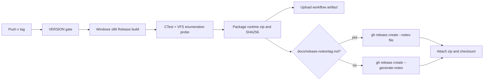

# GitHub Actions 릴리즈 CI와 릴리즈 노트 설계

## 목적

참조 저장소 [nworkers/rePIU](https://github.com/nworkers/rePIU)의 릴리즈 흐름과 동일하게 `re2DJ`의 Windows x86 Release 빌드, 검증, 패키징, GitHub Release 생성을 자동화한다. 릴리즈 노트는 태그별 `docs/release-notes/v<version>.md` 파일을 입력으로 사용하고, 파일이 없으면 GitHub의 자동 생성 노트를 사용한다.

## 확인된 현재 상태

- `.github/workflows/ci.yml`은 Debug CI만 제공한다.
- `scripts/build_release.ps1`/`.bat`은 Windows x86 Release 빌드와 CTest를 제공하지만 배포 archive를 만들지 않는다.
- Release 출력에는 `re2dj.exe`와 `re2dj_windows_injected_runtime.dll`이 원본 게임 자산과 분리되어 생성된다.
- `VERSION`은 `major.minor.patch` 형식이며 현재 릴리즈 tag 규칙은 `v<version>`이다.
- 전체 `re2dj_windows_vfs_runtime_probe`는 제품 장치/오디오 lifecycle 대기 구간에 머물 수 있다. Release workflow는 이 probe의 known wait를 제외한 CTest와 `--vfs-enumeration-only`를 분리 실행한다.

## 동작 정책

1. `v*` tag push가 Release job을 실행한다.
2. `workflow_dispatch`는 같은 Release 빌드와 artifact를 수행하지만 tag가 없으므로 GitHub Release를 생성하지 않는다.
3. Version gate가 `VERSION`의 값과 tag의 `v` 제거 후 값을 비교한다.
4. Windows-2022 runner에서 Release build와 warnings-as-errors configure를 수행한다.
5. 검증된 실행 파일, injected runtime DLL, 예제 config, README/LICENSE/VERSION만 zip으로 묶는다. HDD/CHD/원본 실행 파일은 포함하지 않는다.
6. `docs/release-notes/<tag>.md`가 있으면 `gh release create/edit --notes-file`에 사용한다. 없으면 `gh release create --generate-notes`를 사용한다.
7. 같은 tag의 Release가 이미 있으면 asset은 `--clobber`로 갱신하고, 수동 notes 파일이 있으면 노트도 갱신한다.



## 릴리즈 노트 입력

예를 들어 `VERSION`이 `0.0.40`이면 `docs/release-notes/v0.0.40.md`를 추가한 뒤 version commit과 tag를 push한다.

```text
docs/release-notes/v0.0.40.md
```

노트 파일은 사람이 읽는 변경 요약과 사용자 주의사항만 포함하며, 원본 게임 asset이나 private path를 포함하지 않는다. tag 없이 수동 실행할 때는 노트 파일을 Release로 publish하지 않고 workflow artifact만 보관한다.

## 보안과 권한

- Release workflow에는 `contents: write`만 부여한다.
- `GITHUB_TOKEN`은 `gh` CLI에만 전달하고 별도 secret을 추가하지 않는다.
- Action은 현재 저장소 CI와 같은 공식 `actions/checkout`, `actions/cache`, `actions/upload-artifact`만 사용한다.
- 원본 asset은 workflow checkout이나 package 단계에서 생성·복사하지 않는다.

## English

### Purpose

Automate the Windows x86 Release build, verification, packaging, and GitHub Release creation for `re2DJ` using the same release pattern as [nworkers/rePIU](https://github.com/nworkers/rePIU). A per-tag `docs/release-notes/v<version>.md` file is the handwritten release-note input; when it is absent, GitHub-generated notes are used.

### Current state

- `.github/workflows/ci.yml` provides Debug CI only.
- `scripts/build_release.ps1`/`.bat` build and test the Windows x86 Release configuration but do not create a distribution archive.
- Release output produces `re2dj.exe` and `re2dj_windows_injected_runtime.dll` separately from original game assets.
- `VERSION` uses `major.minor.patch`, and release tags use `v<version>`.
- The full `re2dj_windows_vfs_runtime_probe` can wait in the product device/audio lifecycle. The Release workflow therefore runs the other CTest cases and the probe's `--vfs-enumeration-only` mode separately.

### Policy

1. A `v*` tag push runs the Release job.
2. `workflow_dispatch` performs the same Release build and uploads an artifact but does not create a GitHub Release because it has no tag.
3. A version gate compares `VERSION` with the tag after removing its leading `v`.
4. The workflow uses a Windows-2022 runner for a warnings-as-errors Release build.
5. Only the executable, injected runtime DLL, example configuration, README/LICENSE/VERSION are packaged. HDDs, CHDs, and original executables are excluded.
6. An existing `docs/release-notes/<tag>.md` is passed to `gh release create/edit --notes-file`; otherwise `gh release create --generate-notes` is used.
7. If the Release already exists for the tag, assets are replaced with `--clobber` and handwritten notes are updated when present.

### Release-note input

When `VERSION` is `0.0.40`, add `docs/release-notes/v0.0.40.md`, then push the version commit and tag. The notes file contains user-facing changes and caveats only; it must not contain original assets or private paths. A tagless manual run retains only workflow artifacts.

### Security and permissions

- The Release workflow grants only `contents: write`.
- `GITHUB_TOKEN` is passed only to the `gh` CLI; no additional secret is required.
- The workflow uses the official checkout, cache, and upload-artifact actions already used by this repository.
- Original assets are never created or copied by checkout or packaging.
