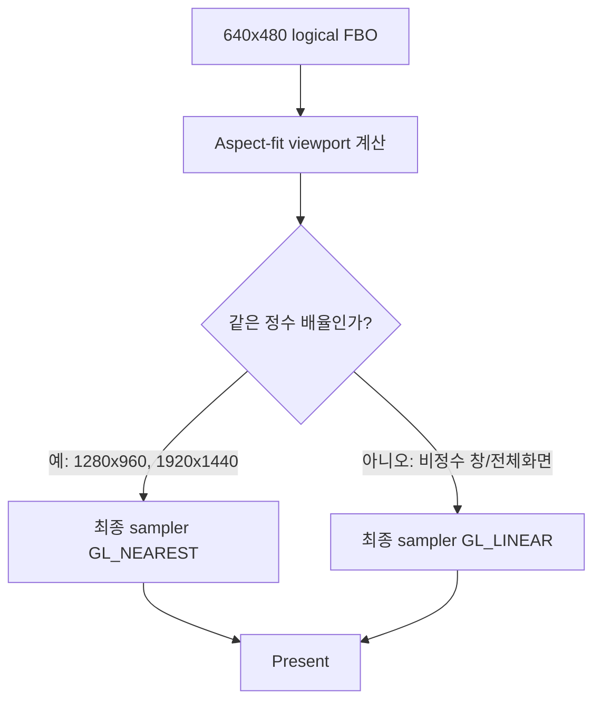

# 정수 배율 화면 필터 선택 설계

## 상태

구현 및 자동 검증 완료. 실제 화면의 체감 품질은 사용자 재검증 대기.

## 배경

현재 SDL3/OpenGL backend는 640×480 논리 렌더 타깃을 창의 aspect-fit viewport에 출력한다. 최종 presentation 단계의 FBO 샘플러는 항상 `GL_NEAREST`이므로, 비정수 배율 창이나 전체화면에서는 픽셀이 거칠게 보일 수 있다. 반대로 1280×960과 1920×1440은 각각 정확한 2배·3배이므로 픽셀 경계를 보존하는 nearest 출력이 적합하다.

개별 Direct3D 텍스처의 필터 상태는 원본 draw state를 재현하는 영역이므로, 이번 변경에서는 건드리지 않는다. 변경 대상은 논리 FBO를 실제 창으로 확대하는 최종 presentation 샘플러뿐이다.

## 결정

최종 aspect-fit viewport의 크기를 논리 해상도와 비교해 자동으로 필터를 선택한다.

- presentation width와 height가 논리 width와 height의 같은 양의 정수 배수이면 `NEAREST`를 사용한다.
- 그 외의 배율이면 `LINEAR`를 사용한다.
- 창 크기와 aspect-fit 계산은 기존 동작을 유지한다.
- 개별 게임 텍스처의 minification/magnification filter, color key, alpha 처리는 변경하지 않는다.
- 선택 정책은 순수 graphics helper로 분리해 산술 조건을 단위 테스트한다.

### 흐름

## 기대 효과와 한계

정수 배율에서는 원본 픽셀 경계와 글자 윤곽을 흐리지 않고 유지한다. 비정수 배율에서는 인접 픽셀을 보간해 계단 현상을 줄인다. 이 변경은 640×480 원본에 존재하지 않는 세부 정보를 생성하지 않으며, 개별 저해상도 텍스처의 품질이나 RGB565 색상 정밀도 자체는 개선하지 않는다.

## 검증 계획

1. presentation filter helper 단위 테스트에서 640×480, 1280×960, 1920×1440은 nearest인지 확인한다.
2. 1280×720, 1920×1080 및 임의 aspect-fit 크기는 linear인지 확인한다.
3. Windows x86 Debug/Release 빌드와 기존 CTest를 실행한다.
4. 실제 실행에서 640×480, 1280×960, 1920×1440, 비정수 전체화면을 비교한다.

## English

# Integer-Scale Presentation Filter Selection

## Status

Implemented and automatically verified. Perceived quality on the actual screen still awaits user revalidation.

## Background

The SDL3/OpenGL backend renders into a 640×480 logical target and presents it through an aspect-fit viewport. The final presentation sampler currently always uses `GL_NEAREST`, which can look harsh at non-integer window or fullscreen scales. In contrast, 1280×960 and 1920×1440 are exact 2x and 3x scales, where nearest sampling preserves the source pixel boundaries.

The filter state of individual Direct3D textures belongs to original draw-state reproduction and is not changed by this task. Only the final sampler that enlarges the logical FBO into the host window is affected.

## Decision

Select the final aspect-fit presentation filter automatically from the viewport size.

- Use `NEAREST` when presentation width and height are the same positive integer multiple of the logical width and height.
- Use `LINEAR` for every other scale.
- Preserve the existing window-size and aspect-fit calculations.
- Do not change individual game texture minification/magnification filters, color-key handling, or alpha handling.
- Keep the policy in a pure graphics helper and unit-test its arithmetic conditions.

## Expected effect and limits

Integer scales preserve original pixel boundaries and text contours without blur. Non-integer scales interpolate neighboring pixels to reduce stair-stepping. This does not create detail absent from the 640×480 source, and it does not improve individual low-resolution textures or RGB565 precision.

## Verification plan

1. Unit-test that 640×480, 1280×960, and 1920×1440 select nearest.
2. Unit-test that 1280×720, 1920×1080, and arbitrary aspect-fit sizes select linear.
3. Run the Windows x86 Debug/Release builds and existing CTest suite.
4. Compare real runs at 640×480, 1280×960, 1920×1440, and a non-integer fullscreen size.
