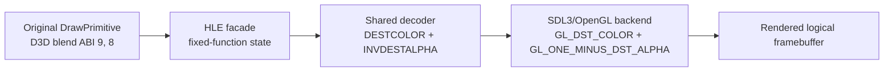

# 목적지 알파 블렌드 지원 설계

## 상태

구현 및 검증 완료. `ez2dj4th` 진단 실행에서 확인된 `D3DBLEND_INVDESTALPHA(8)` 거부를 수정했다.

## 배경

2026-09-13 진단 실행 `20260913-013726-216`에서 `DrawPrimitive` 66건이 backend에 도달하기 전에 `unsupported Direct3D3 alpha blend factor`로 실패했다. 대표 상태는 `srcblend=9`(`D3DBLEND_DESTCOLOR`)와 `dstblend=8`(`D3DBLEND_INVDESTALPHA`)이었다. 같은 실행의 CHD-backed VFS read는 모두 성공했고 note 관련 `.abm` 파일도 열렸으므로, 이 증거만으로는 데이터 로딩 오류를 원인으로 볼 수 없다.

현재 공용 `BlendFactor`와 `DecodeLegacyBlendFactor`는 D3D ABI 값 1, 2, 3, 4, 5, 6, 9, 10만 표현한다. 따라서 원본이 제출한 목적지 알파 계수 7과 8이 facade에서 명시적으로 거부되고, 해당 draw의 정점과 texture가 OpenGL backend에 전달되지 않는다.

## 결정

- 공용 `BlendFactor`에 `kDestinationAlpha`와 `kInverseDestinationAlpha`를 추가한다.
- `DecodeLegacyBlendFactor`에서 raw D3D ABI 값 7과 8을 각각 새 enum으로 변환한다.
- SDL3/OpenGL backend에서 새 enum을 `GL_DST_ALPHA`와 `GL_ONE_MINUS_DST_ALPHA`로 변환한다.
- 지원되지 않는 계수는 기존처럼 명시적으로 실패시킨다. 다른 계수로 대체하거나 source-alpha로 추정하지 않는다.
- 원본 실행 파일, profile, VFS read-only 계약, note 데이터 로딩, 기존 blend 계수의 의미는 변경하지 않는다.
- 공용 decoder 단위 테스트와 실제 OpenGL blend probe에 목적지 알파 경로를 추가한다.

## 흐름

## 호환성 및 한계

이 변경은 원본이 이미 요청한 상태를 표현하고 전달하는 수정이다. `GL_DST_ALPHA` 계수는 destination alpha를 RGB와 alpha blend 식에 제공하는 OpenGL의 대응 계수이며, 논리 framebuffer의 기존 alpha target과 함께 동작한다. 실제 note가 화면에 보이지 않는 모든 원인을 해결한다고 단정하지 않는다. 수정 후에도 draw 실패가 남으면 해당 draw의 texture upload, color-key discard, 좌표 변환을 별도로 조사한다.

## 검증 계획

1. decoder가 ABI 7과 8을 새 enum으로 변환하는지 단위 테스트한다.
2. OpenGL blend probe에서 9/8 조합을 실제로 그려 destination alpha 계수가 적용되는지 확인한다.
3. Windows x86 빌드와 기존 CTest를 실행한다.
4. 동일한 `ez2dj4th` 진단 실행에서 `unsupported Direct3D3 alpha blend factor`가 사라지는지 확인하고, VFS read 결과가 계속 성공인지 확인한다.

## English

# Destination-Alpha Blend Support Design

## Status

Implemented and verified. This task fixes the `D3DBLEND_INVDESTALPHA(8)` rejection observed in an `ez2dj4th` diagnostic run.

## Background

In diagnostic run `20260913-013726-216`, 66 `DrawPrimitive` calls failed before reaching the backend with `unsupported Direct3D3 alpha blend factor`. The representative state used `srcblend=9` (`D3DBLEND_DESTCOLOR`) and `dstblend=8` (`D3DBLEND_INVDESTALPHA`). All CHD-backed VFS reads in the same run succeeded, and note-related `.abm` files opened successfully, so the evidence does not identify data loading as the cause.

The shared `BlendFactor` and `DecodeLegacyBlendFactor` currently represent only raw D3D ABI values 1, 2, 3, 4, 5, 6, 9, and 10. The destination-alpha factors 7 and 8 are therefore rejected explicitly by the facade, preventing the submitted vertices and texture from reaching the OpenGL backend.

## Decision

- Add `kDestinationAlpha` and `kInverseDestinationAlpha` to the shared `BlendFactor` enum.
- Decode raw D3D ABI values 7 and 8 to those enum values.
- Map them in the SDL3/OpenGL backend to `GL_DST_ALPHA` and `GL_ONE_MINUS_DST_ALPHA`.
- Continue to reject unsupported factors explicitly; do not substitute another factor or guess source-alpha semantics.
- Do not change the original executable, profiles, the read-only VFS contract, note data loading, or existing blend-factor meanings.
- Cover the destination-alpha path in shared unit tests and the actual OpenGL blend probe.

## Compatibility and limits

This is a representation and forwarding fix for a state already requested by the original program. `GL_DST_ALPHA` supplies destination alpha to the OpenGL RGB and alpha blend equations and works with the existing logical framebuffer alpha target. The task does not claim to resolve every possible cause of invisible notes. If draw failures remain after this change, texture upload, color-key discard, and coordinate conversion must be investigated separately.

## Verification plan

1. Unit-test decoding ABI values 7 and 8 into the new enum values.
2. Draw the 9/8 combination in the OpenGL blend probe and verify destination-alpha behavior.
3. Run the Windows x86 build and existing CTest suite.
4. Repeat the `ez2dj4th` diagnostic run and verify that unsupported blend-factor failures disappear while VFS reads continue to succeed.
