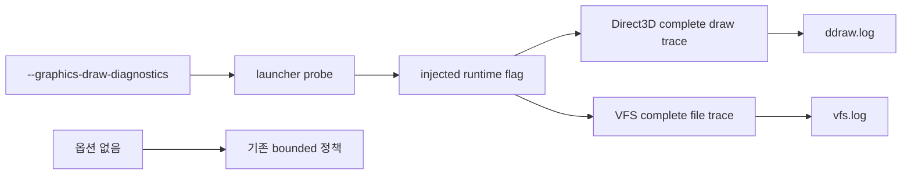

# 진단 로그 완전성 설계

## 상태

구현 예정. 명시적인 `--graphics-draw-diagnostics` 조사 실행에서 draw와 VFS 진단 로그가 실행 후반에 조용히 누락되지 않도록 수집 정책을 보완한다.

## 배경

2026-09-13 `ez2dj4th` 조사 로그에서 실제 실행 시간이 계속된 뒤에도 `LateDraw` 로그가 사라졌다. 로그에는 `LateDraw`가 정확히 `20,480`개 있고 마지막 프레임은 `3043`이지만, 같은 파일의 `DrawPrimitive`는 프레임 `4659`까지 기록되어 있었다. 소스 확인 결과 `LateDraw`는 프레임 구간별 `16,384 + 4,096`개 상한을 사용하고, `FrameDraws`도 900개로 제한하며, 성공한 `DrawPrimitive`는 텍스처별 최초 1회만 기록하고 있었다. VFS 파일 이벤트도 질의와 읽기가 공유하는 1,024개 상한에 도달했다.

이 상한들은 제품 동작 자체에는 영향을 주지 않지만, 조사자가 게임을 실제로 진행했을 때 후반의 노트·롱노트 자산과 draw 호출이 기록되지 않는 관찰 오류를 만든다. 따라서 기존 로그가 없다는 사실을 게임 미진행이나 데이터 로딩 실패의 증거로 사용할 수 없었다.

## 결정

1. `--graphics-draw-diagnostics`를 전체 진단 수집을 명시적으로 요청하는 옵션으로 정의한다. 옵션이 없을 때의 제품 경로와 기존 bounded 진단 비용은 유지한다.
2. 전체 진단 수집 모드에서는 Direct3D draw 경로의 고정 상한을 우회한다.
   - `LateDraw` 및 `MusicSelectDiscDraw`를 모두 기록한다.
   - 성공·실패 `DrawPrimitive`를 모두 기록한다.
   - `TransformDraw`와 `FrameDraws`도 실행 전체를 기록한다.
   - 기타 기존 그래픽 진단 상한도 같은 모드에서 우회한다.
3. 전체 진단 수집 모드에서는 VFS의 asset-open, create/open, file query/read, profile-read 상한을 우회한다. 장치·raw I/O trace처럼 게임 파일 관찰과 직접 관계없는 별도 고빈도 trace의 기존 상한은 유지한다.
4. 그래픽 trace formatter는 고정 1024바이트 버퍼 대신 필요한 길이를 계산해 동적으로 포맷한다. 긴 `LateDraw` 레코드의 후반 필드가 잘리지 않아야 한다.
5. 전체 수집 모드는 조사 옵션에서만 켜지므로 로그가 커지고 실행 속도가 낮아질 수 있다. 이는 사용자가 실제 진행 구간을 분석할 때 필요한 명시적 trade-off이다.

## 호환성 및 범위

- 원본 실행 파일, 프로파일, CHD read-only 계약, VFS가 반환하는 바이트, 렌더링 결과는 변경하지 않는다.
- 전체 수집 모드는 로그 관찰 정책만 변경한다.
- 로그 파일은 여전히 launcher가 지정한 경로에 기록한다.
- 전체 수집 모드에서도 `DrawPrimitive` 기록은 호출 순서를 보존해야 하며, `LateDraw`와 프레임 번호를 함께 사용해 draw와 자산 읽기를 대조할 수 있어야 한다.

## 검증 전략

- Windows x86 Debug 빌드가 성공해야 한다.
- 기존 CTest 전체가 통과해야 한다.
- 소스 수준 검증으로 complete mode에서 각 draw/VFS 상한 조건이 우회되는지 확인한다.
- 새 진단 실행에서 `LateDraw` 수가 정확히 20,480에서 멈추지 않고, `DrawPrimitive`가 텍스처 최초 1회로 축약되지 않으며, formatter가 1024바이트를 초과하는 레코드를 보존하는지 확인한다.
- 옵션 없는 실행은 기존처럼 draw-path 진단을 수행하지 않아야 한다.

## English

# Diagnostic Trace Completeness Design

## Status

Planned for implementation. An explicit `--graphics-draw-diagnostics` investigation run will collect draw and VFS diagnostics without silently dropping the later part of the run.

## Background

In the 2026-09-13 `ez2dj4th` investigation log, execution continued after `LateDraw` records stopped. The log contained exactly `20,480` `LateDraw` records ending at frame `3043`, while `DrawPrimitive` records in the same file continued through frame `4659`. Source inspection showed a `16,384 + 4,096` split budget for `LateDraw`, a 900-record budget for `FrameDraws`, and first-success-only reporting for textured `DrawPrimitive` calls. The VFS file-event trace also reached a shared budget of 1,024 events across queries and reads.

These limits do not change product behavior, but they create an observation failure: after an investigator actually plays the game, later note/long-note asset reads and draw calls can be absent from the trace. The absence of those records therefore cannot be used as evidence that the game was not played or that loading failed.

## Decision

1. Define `--graphics-draw-diagnostics` as an explicit request for complete diagnostic capture. Keep the product path and its existing bounded diagnostic cost unchanged when the option is absent.
2. In complete capture mode, bypass fixed limits in the Direct3D draw path:
   - record all `LateDraw` and `MusicSelectDiscDraw` entries;
   - record every successful and failed `DrawPrimitive` entry;
   - record the full `TransformDraw` and `FrameDraws` streams;
   - bypass the other existing graphics diagnostic limits in the same mode.
3. In complete capture mode, bypass the VFS limits for asset-open, create/open, file query/read, and profile-read diagnostics. Keep independent limits for device and raw-I/O traces that are unrelated to observing game-file reads.
4. Make the graphics trace formatter calculate the required length and format dynamically instead of truncating at a fixed 1,024-byte buffer. The tail fields of long `LateDraw` records must survive.
5. Complete capture is enabled only by the investigation option, so it can create larger logs and slow execution. That is an explicit trade-off required to analyze the interval in which the user actually played.

## Compatibility and scope

- Do not change the original executable, profiles, the read-only CHD/VFS contract, bytes returned by the VFS, or rendered output.
- Change only diagnostic observation policy.
- Continue writing logs to launcher-selected paths.
- Complete capture must preserve `DrawPrimitive` call order and keep frame numbers so draw and asset-read activity can be correlated with `LateDraw`.

## Verification strategy

- The Windows x86 Debug build must succeed.
- The existing CTest suite must pass.
- Source-level verification must show that complete mode bypasses each relevant draw/VFS limit.
- A new diagnostic run must not stop `LateDraw` at exactly 20,480, must not reduce `DrawPrimitive` to one success per texture, and must preserve records longer than 1,024 bytes.
- A run without the option must continue to avoid draw-path diagnostics as before.
