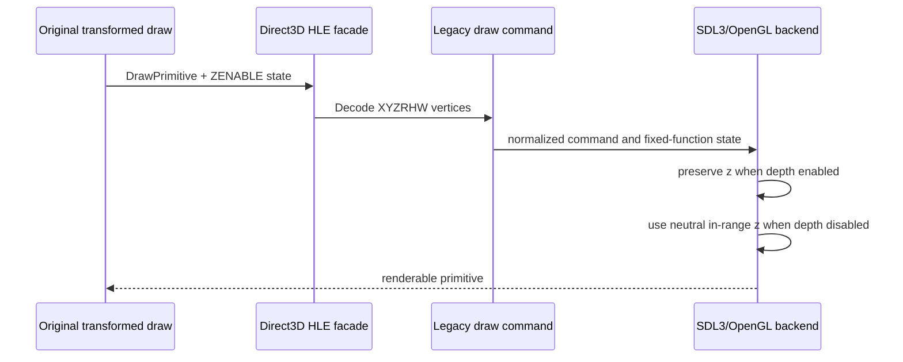

# 변환 정점의 OpenGL 클립 깊이 보정 설계

## 상태

**구현 완료, 사용자 시각 검증 대기:** 2026-09-13 최신 `ez2dj4th` complete diagnostic run에서 확인한 노트·롱노트 미출력 증상을 SDL3/OpenGL backend 경계에서 보정한다.

## 문제와 근거

최신 실행의 VFS trace에서는 `Note_white_0..5.abm`, `Note_BLUE_0..5.abm`, `Note_PEDAL_0..5.abm`, `LONG_EFFECT0..3.abm`이 모두 성공적으로 열리고 읽혔다. `DrawPrimitive`도 297,628건이 모두 `result=0x00000000`, `reason=success`로 기록되었다. 따라서 이번 증상은 프로파일 누락이나 note asset read failure로 설명되지 않는다.

반면 texture draw의 일부는 다음 상태를 반복했다.

- `z=-107374176.000000` (`0xCCCCCCCC` debug-fill 값)
- `rhw=1.000000`
- `zenable=0`
- texture IDs `425..429`, `433..437`, `501`

현재 OpenGL vertex shader는 guest `z`를 clip-space 깊이 계산에 사용한다. OpenGL은 `GL_DEPTH_TEST`가 꺼져 있어도 clip volume 검사를 수행하므로, 이 값은 depth test와 무관하게 primitive를 clip할 수 있다. 이는 호출 성공과 화면 미출력이 동시에 나타나는 원인으로 판단된다.

## 확인 상태

- **확인됨:** 최신 로그의 note 관련 VFS open/read는 성공했다.
- **확인됨:** 해당 실행에서 backend draw 호출은 OpenGL 오류 없이 성공했다.
- **확인됨:** depth-disabled transformed draw에 `0xCCCCCCCC`에 해당하는 정점 깊이값이 반복되었다.
- **추정:** 원본은 depth testing을 사용하지 않는 변환 정점 draw에서 `z`를 유효하게 초기화하지 않았고, 원본 Direct3D 경로에서는 이 값이 화면 clip에 영향을 주지 않았을 가능성이 높다.
- **미확정:** 실제 사용자 화면에서 사라진 모든 note draw가 이 texture/depth 패턴에 속하는지는 수정 후 실행에서 확인해야 한다.

## 설계

공용 `LegacyFixedFunctionState`의 `depth_test_enabled`를 기준으로 변환 정점의 clip 깊이를 선택한다.

- depth test가 켜져 있으면 guest `z`를 그대로 보존한다. 깊이 비교를 사용하는 장면의 의미를 변경하지 않는다.
- depth test가 꺼져 있으면 `z=0.5`를 사용한다. 이 값은 OpenGL shader의 현재 변환에서 유효한 clip-space 깊이를 만들며, depth test가 꺼져 있으므로 guest 깊이의 정렬 의미를 새로 부여하지 않는다.
- 이 정책은 `ResolveLegacyClipDepth`라는 공용 graphics helper로 이름을 부여하고 단위 테스트한다. OpenGL 자료형이나 SDL API는 공용 계층에 추가하지 않는다.
- `x`, `y`, `rhw`, diffuse/specular color, UV, texture loading, blend, color key, VFS 반환 바이트, 원본 실행 파일은 변경하지 않는다.

## 검증 전략

1. 공용 helper unit test에서 depth-disabled 상태는 `0.5`를 선택하고, depth-enabled 상태는 입력 `z`를 보존하는지 확인한다.
2. Windows x86 warnings-as-errors build와 CTest를 실행한다.
3. 가능하면 Windows x86 launcher probe로 complete draw diagnostic을 다시 수집하여 해당 texture draw의 `reason=success`와 화면 출력을 사용자가 확인한다.

---

# Transformed-Vertex OpenGL Clip-Depth Correction Design

## Status

**Implemented; user visual verification pending:** Correct the missing-note and long-note symptom at the SDL3/OpenGL backend boundary using the latest complete `ez2dj4th` diagnostic run from 2026-09-13.

## Problem and evidence

The latest VFS trace successfully opened and read `Note_white_0..5.abm`, `Note_BLUE_0..5.abm`, `Note_PEDAL_0..5.abm`, and `LONG_EFFECT0..3.abm`. All 297,628 `DrawPrimitive` records also report `result=0x00000000` and `reason=success`. The symptom is therefore not explained by a missing profile or a note-asset read failure.

Some textured draws repeatedly use `z=-107374176.000000` (`0xCCCCCCCC` debug-fill), `rhw=1.000000`, and `zenable=0`, including texture IDs `425..429`, `433..437`, and `501`.

The current OpenGL vertex shader uses guest `z` when calculating clip-space depth. OpenGL still performs clip-volume testing when `GL_DEPTH_TEST` is disabled, so this value can clip a primitive independently of depth testing. This explains how the draw can be reported successful while producing no visible pixels.

## Evidence status

- **Confirmed:** Note-related VFS opens and reads succeed in the latest run.
- **Confirmed:** Backend draw calls complete without OpenGL errors in that run.
- **Confirmed:** Repeated depth-disabled transformed draws carry the `0xCCCCCCCC`-equivalent depth value.
- **Inferred:** The original leaves `z` uninitialized for transformed draws that do not use depth testing, while the original Direct3D path likely does not let that value affect screen clipping in the same way.
- **Unresolved:** Whether every note draw that disappeared belongs to this texture/depth pattern remains a post-fix runtime verification item.

## Design

Select transformed-vertex clip depth from the shared `depth_test_enabled` state:

- Preserve guest `z` when depth testing is enabled, so depth-ordered scenes retain their meaning.
- Use `z=0.5` when depth testing is disabled. The value is inside the current OpenGL shader's valid clip-depth range, and disabled depth testing means this does not introduce a new guest depth ordering.
- Name this policy `ResolveLegacyClipDepth` in the shared graphics layer and cover it with unit tests. Do not add OpenGL or SDL types to the common layer.
- Leave `x`, `y`, `rhw`, colors, UVs, texture loading, blending, color-key behavior, VFS bytes, and the original executable unchanged.

## Verification strategy

1. Unit-test that depth-disabled draws select `0.5` and depth-enabled draws preserve the input `z`.
2. Run the Windows x86 warnings-as-errors build and CTest.
3. If available, repeat a complete Windows x86 launcher-probe run and correlate the affected texture draws with the user's visual result.
