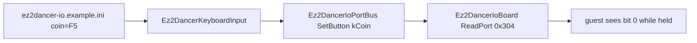

# EZ2Dancer coin 입력 바인딩 설계
# Design: EZ2Dancer Coin Input Binding

## 한국어

### 배경

`config/ez2dancer-io.example.ini`에는 coin 항목이 없고, 현재 구현도
`Ez2DancerButton`과 `Ez2DancerKeyboardInput`에서 coin 상태를 만들지 않습니다.
그 결과 `ez2d2m`의 16비트 입력 경계가 `0x304`를 읽더라도 coin을 입력할 방법이
없습니다.

원본 `ez2d2m` 실행에서 `0x304` read 자체는 확인되었지만, coin을 어느 port의 어느
bit로 표현하는지는 아직 확인되지 않았습니다. 따라서 이번 변경은 원본 배선의
확정이 아니라, 현재 이미 idle 값으로 모델링한 `0x304`에 대한 명시적인 호환 경로를
추가하는 것으로 범위를 제한합니다.

### 설계

1. `Ez2DancerButton::kCoin`을 추가합니다.
2. `Ez2DancerKeyboardInput`에 `coin` binding을 추가합니다. 키가 생략된 기존 INI는
   공통 parser의 기본값 `NONE`을 사용하므로 호환됩니다.
3. coin이 눌린 동안 `0x304`의 bit 0을 1로 반환합니다. idle 값은 기존과 같은
   `0x0000`입니다. 이 active-high bit 0 매핑은 **추정 호환 동작**이며 원본에서
   확인된 사실로 기록하지 않습니다.
4. 예제 설정에는 EZ2DJ와 같은 `coin=F5`를 넣어 즉시 사용할 수 있게 합니다.
5. board 단위 테스트에서 idle, pressed, released 상태를 확인하고, 키보드 설정
   테스트의 최소 INI에도 coin 항목을 포함합니다.

### 확인 상태와 후속 조치

- **확인됨:** 원본은 16비트 입력 read를 사용하고, `0x304` read가 실행 로그에
  기록됩니다.
- **추정:** `0x304` bit 0을 coin 호환 입력으로 사용하는 것과 active-high 극성.
- **미확정:** 실제 EZ2Dancer cabinet의 coin port, bit, 극성, 그리고 coin이
  level 입력인지 edge/latch 입력인지.

실행 후 coin이 credit으로 반영되지 않으면 이번 추정 mapping을 원본 입력 helper의
추가 관측 결과로 교체합니다. 그때까지는 다른 pad·sensor bit를 건드리지 않고
`0x304` bit 0만 사용합니다.

## English

### Background

`config/ez2dancer-io.example.ini` has no coin entry, and the implementation does not
create a coin state in `Ez2DancerButton` or `Ez2DancerKeyboardInput`. As a result,
`ez2d2m` has no way to provide coin input even though its 16-bit boundary reads `0x304`.

The original `ez2d2m` has confirmed reads from `0x304`, but it has not confirmed which
port and bit represent coin. This change therefore adds an explicit compatibility path
to the already modelled `0x304` idle value; it does not claim to have recovered the
original cabinet wiring.

### Design

1. Add `Ez2DancerButton::kCoin`.
2. Add a `coin` binding to `Ez2DancerKeyboardInput`. Existing INI files that omit it
   remain compatible because the shared parser defaults missing entries to `NONE`.
3. While coin is held, report bit 0 of `0x304` as 1. Idle remains `0x0000`. This
   active-high bit-0 mapping is **inferred compatibility behaviour**, not an original
   executable confirmation.
4. Add `coin=F5` to the example configuration, matching the EZ2DJ example.
5. Cover idle, pressed, and released states in board tests and include coin in the
   minimal keyboard test INI.

### Status and follow-up

- **Confirmed:** the original uses 16-bit input reads and runtime logs contain reads from
  `0x304`.
- **Inferred:** `0x304` bit 0 and active-high polarity as the coin compatibility mapping.
- **Unresolved:** the real EZ2Dancer cabinet coin port, bit, polarity, and whether coin is
  a level, edge, or latched input.

If a real run does not turn the press into credit, replace this inferred mapping with a
new observation of the original input helper. Until then, only bit 0 of `0x304` is used;
pad and sensor bits are unaffected.
