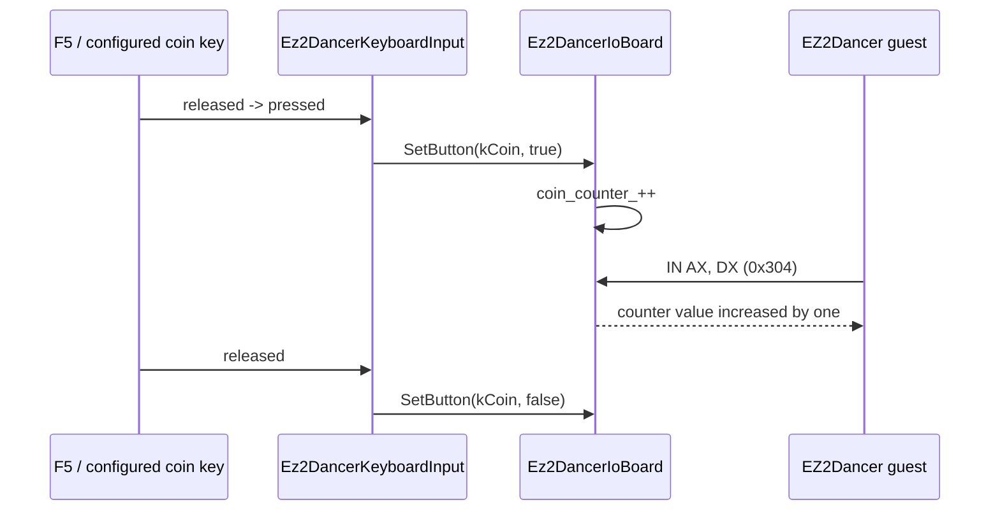

# EZ2Dancer coin counter 입력 설계
# Design: EZ2Dancer Coin Counter Input

## 한국어

### 배경

이전 작업은 `ez2d2m`의 `0x304` read를 coin held level로 보고, `coin` 키를 누르는 동안
bit 0을 1로 반환했습니다. 사용자의 실제 실행에서 이 mapping이 credit으로 이어지지
않았습니다.

원본 실행 파일이 `0x304`를 읽는 사실은 확인되었지만, 원본 cabinet의 `0x304` 의미와
bit 배치는 아직 원본 하드웨어 또는 충분한 동적 관측으로 확정되지 않았습니다. 다만
현재 포트의 기본값이 0이고, EZ2DJ의 coin 경계가 rising edge를 누적한 counter로
동작하는 공통 입력 모델을 이미 사용하고 있으므로, 이번에는 `0x304`를 coin counter
호환 경로로 모델링합니다.

### 설계

1. `Ez2DancerIoBoard`에 16비트 `coin_counter_`를 둡니다.
2. `kCoin`이 released에서 pressed로 바뀔 때만 counter를 1 증가시킵니다.
3. `0x304` read는 held bit가 아니라 현재 counter를 반환합니다. counter는 16비트로
   자연스럽게 wrap합니다.
4. 기존 `coin=F5` 설정은 유지합니다. 키보드 adapter의 poll이 rising edge를 board에
   전달하므로 한 번 누르고 떼는 동작도 credit 하나로 보존됩니다.
5. runtime은 I/O 설정 초기화 성공·실패를 VFS 진단 로그에 한 번 기록합니다. 기존에는
   실패만 `OutputDebugStringA`에 기록되어 사용자가 받은 실행 로그만으로 설정이 실제로
   주입되었는지 확인할 수 없었습니다.
6. 일반 I/O trace budget이 소진된 뒤에도 `0x304` 값이 바뀌면 별도 `io-coin` 진단
   이벤트를 기록합니다. 부팅 초반의 반복 read가 이후 coin 입력 증거를 가리지 않게
   하기 위한 제한된 진단입니다.

### 확인 상태와 한계

- **확인됨:** 원본 `ez2d2m`이 word-wide `IN AX, DX` 경계에서 `0x304`를 읽습니다.
- **호환 동작:** `0x304`를 rising-edge coin counter로 제공하는 것은 이번 런타임의
  실용적인 compatibility mapping입니다.
- **미확정:** 실제 EZ2Dancer I/O 카드의 `0x304` register 의미, counter 폭·wrap 정책,
  원본 coin wiring과 polarity입니다.

이번 설계는 원본 binary에서 확인하지 않은 register 의미를 확정 사실로 기록하지
않습니다. 실행 로그에서 coin count 증가와 credit 화면 전이를 확인한 뒤 필요하면
analysis 문서의 상태를 갱신합니다.

## English

### Background

The previous change treated the `0x304` read in `ez2d2m` as a held coin level and
returned bit 0 while the configured `coin` key was held. The user's real run did not
turn that mapping into a credit.

The original executable is confirmed to read `0x304`, but the meaning and bit layout of
that register on the original cabinet are not confirmed by hardware evidence or enough
dynamic observation. However, the current port's default is zero, and the existing EZ2DJ
coin boundary already uses a rising-edge counter model. This design therefore models
`0x304` as a coin-counter compatibility path.

### Design

1. Add a 16-bit `coin_counter_` to `Ez2DancerIoBoard`.
2. Increment it only when `kCoin` changes from released to pressed.
3. Return the counter, rather than a held bit, for reads from `0x304`. The counter wraps
   naturally at 16 bits.
4. Keep the existing `coin=F5` configuration. The keyboard adapter's polling delivers
   the edge to the board, so a press-and-release remains one credit.
5. Record I/O configuration initialization success or failure once in the VFS diagnostic
   log. Previously, failures were only sent to `OutputDebugStringA`, leaving the user's
   execution log unable to prove whether the configuration had been injected.
6. Continue to record a separate `io-coin` diagnostic event when the `0x304` value changes
   after the general I/O trace budget is exhausted. This keeps repeated boot reads from
   hiding later coin evidence.

### Confirmation status and limits

- **Confirmed:** the original `ez2d2m` reads `0x304` through a word-wide `IN AX, DX`
  boundary.
- **Compatibility behaviour:** exposing a rising-edge coin counter at `0x304` is a
  practical runtime mapping for this implementation.
- **Unresolved:** the real EZ2Dancer I/O card's `0x304` register semantics, counter width
  and wrap policy, and the original coin wiring and polarity.

This design does not document an unverified register meaning as an original-binary fact.
After a real run confirms the counter increase and credit transition, the analysis
document can be updated with the new evidence.
