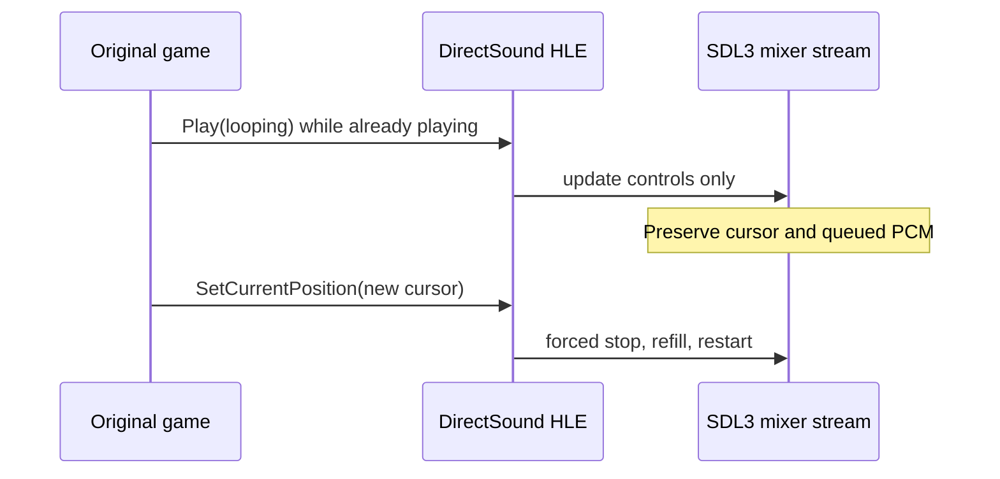

# EZ2Dancer streaming Play 의미 보정 설계

## 한국어

### 문제

실행 로그 `20260914-001658-331`에서 `jam.ezw`의 VFS open/read는 모두 성공했고,
SDL playback device도 열렸습니다. JAM streaming track의 cooked PCM에는 peak 약
`0.74`, RMS 약 `0.52`인 비무음 구간이 기록되었습니다. 따라서 파일시스템이나 PCM
변환 자체가 현재 무음의 원인이라는 증거는 없습니다.

같은 DirectSound buffer `1BD91D70`에는 `Play`와 streaming-start가 6회 기록되었으며,
모든 재생이 `pos=0`, `queued=360448`에서 시작했습니다. 현재 HLE는 streaming
`Play`마다 SDL stream을 지우고 ring buffer 전체를 다시 공급한 뒤 mixer track을
재시작합니다. 원본 DirectSound 계약상 이미 재생 중인 buffer의 `Play`는 현재 위치에서
계속 재생해야 하므로, 이 동작은 원본과 다릅니다.

### 설계

- backend `Play`가 이미 재생 중인 streaming voice를 감지하도록 합니다.
- 이미 재생 중인 streaming voice의 일반 `Play`는 SDL queue와 mixer cursor를 건드리지
  않고 DirectSound control 값만 갱신합니다.
- `SetCurrentPosition`이 재생 중이면 먼저 track을 정지한 뒤 새 cursor에서 ring을 다시
  공급하는 강제 재시작 경로를 사용합니다.
- 새 trace 필드로 continuation과 restart를 구분합니다.
- 원본 실행 파일, CHD, HDD 자산은 변경하지 않습니다.

### 검증 기준

- Windows x86 Debug 빌드가 성공해야 합니다.
- 기존 DirectSound/audio unit 및 keyboard/product probe가 통과해야 합니다.
- 반복 일반 `Play`가 `continued=1`로 기록되고 stream queue를 초기화하지 않아야
  합니다.
- 명시적 위치 변경은 새 cursor에서 재시작해야 합니다.
- 실제 JAM 실행에서 곡이 초기 무음 구간으로 반복 되감기지 않는지 청취해야 합니다.

## English

### Problem

Run `20260914-001658-331` shows successful VFS open/read for `jam.ezw` and an active
SDL playback device. The JAM streaming track's cooked PCM includes non-silent regions with
approximately `0.74` peak and `0.52` RMS, so the current evidence does not implicate the
filesystem or PCM conversion itself.

The same DirectSound buffer `1BD91D70` receives six `Play` and streaming-start events, all
starting at `pos=0` with `queued=360448`. The current HLE clears and refills the SDL stream
and restarts the mixer track for every streaming `Play`. DirectSound specifies that `Play`
on an already-playing buffer continues at its current position, so this behavior diverges
from the original contract.

### Design

- Distinguish ordinary playback from an explicit forced restart in the backend `Play` API.
- Make ordinary `Play` on an already-playing streaming voice update controls only, preserving
  the SDL queue and mixer cursor.
- Stop the track first and use the forced-restart path when `SetCurrentPosition` changes the
  cursor while playing.
- Add a trace distinction between continuation and restart.
- Do not modify the original executable, CHD, or HDD assets.

### Verification criteria

- The Windows x86 Debug build succeeds.
- Existing DirectSound/audio unit and keyboard/product probes pass.
- Repeated ordinary `Play` records `continued=1` without resetting the stream queue.
- An explicit position change restarts from the requested cursor.
- A real JAM run no longer repeatedly rewinds to the initial silent segment.

Reference: [IDirectSoundBuffer::Play — Microsoft Learn](https://learn.microsoft.com/en-us/previous-versions/windows/desktop/mt708933%28v%3Dvs.85%29)
