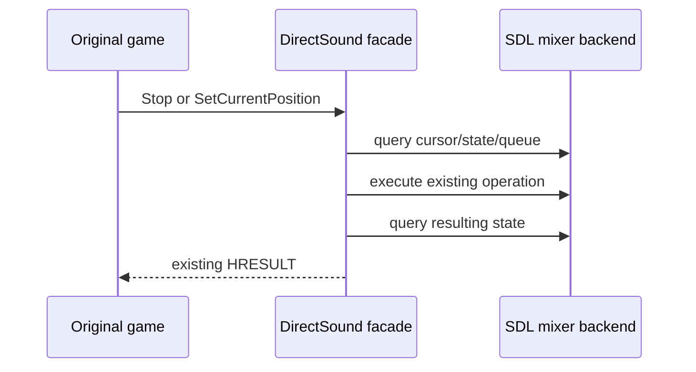

# EZ2Dancer 오디오 상태 전환 진단 설계
# Design: EZ2Dancer Audio State-Transition Diagnostics

## 한국어

### 목적

실행 로그 `20260914-003504-572`에서는 JAM streaming buffer의 각 `Play` 직전에
`playing=0`이 관찰되었습니다. 현재 로그에는 `Stop`과 `SetCurrentPosition`의 호출
시점과 전후 상태가 없으므로, 원본 게임이 재생을 중단한 것인지 HLE가 상태를 잘못
반영한 것인지 구분할 수 없습니다.

이번 작업은 DirectSound facade의 상태 전환 관찰만 보강합니다. 재생 의미, cursor
계산, SDL queue 동작은 변경하지 않으며 원본 EXE·CHD·HDD 자산도 수정하지 않습니다.

### 기록 계약

스트리밍 buffer에 한해 buffer별 최대 64개의 전환 기록을 남깁니다.

* `Stop`: 호출 전 guest playing 상태, 실제 mixer track 상태, cursor와 queue를 기록하고,
  호출 결과와 호출 후 상태를 기록합니다.
* `SetCurrentPosition`: 요청 위치, 이전 위치, guest/mixer 재생 상태, 호출 전 queue와
  적용 후 위치·상태·queue를 기록합니다.
* 기록은 PCM 원문을 포함하지 않으며 기존 bounded audio trace를 사용합니다.
* static/duplicate buffer의 대량 로그는 만들지 않습니다.

### 검증 기준

* Windows x86 Debug 빌드가 성공해야 합니다.
* 기존 `re2dj_windows_vfs_runtime_probe`가 통과하고, streaming test trace에
  `directsound:stop` 및 `directsound:set-position`이 포함되어야 합니다.
* 실제 `ez2d2m` 실행에서 `jam.ezw` 재생 구간의 `Stop` 또는 위치 재설정 호출과
  그 호출 직후 `track-playing`, `queued` 변화를 확인할 수 있어야 합니다.

## English

### Purpose

Run `20260914-003504-572` shows `playing=0` immediately before every JAM streaming
`Play`. The current trace does not show when `Stop` or `SetCurrentPosition` was called,
so it cannot distinguish an original-game playback transition from an HLE state error.

This task improves observation at the DirectSound facade only. It does not change playback
semantics, cursor calculation, or SDL queue behavior, and it does not modify the original
executable, CHD, or HDD assets.

### Trace contract

For streaming buffers, record at most 64 state-transition events per buffer.

* `Stop` records guest playing state, mixer-track state, cursor, and queue before the call,
  then the result and state after the call.
* `SetCurrentPosition` records the requested and previous positions, guest/mixer state, the
  queue before the call, and the applied position/state/queue after the call.
* Records contain no original PCM bytes and use the existing bounded audio trace.
* Static and duplicate buffers do not produce unbounded diagnostic output.

### Verification criteria

* The Windows x86 Debug build succeeds.
* The existing `re2dj_windows_vfs_runtime_probe` passes and its streaming trace contains
  `directsound:stop` and `directsound:set-position` records.
* A real `ez2d2m` run exposes the `Stop` or position-reset transition during the `jam.ezw`
  playback interval, including the resulting `track-playing` and `queued` values.
