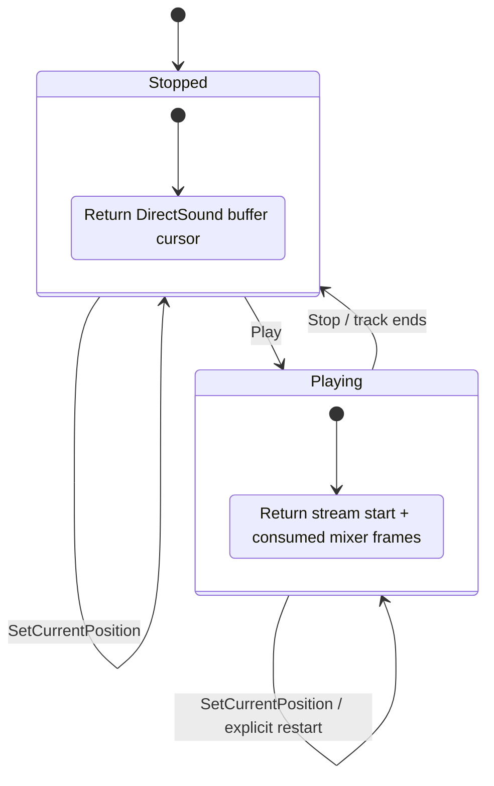

# EZ2Dancer 정지 streaming cursor 동기화 설계
# Design: EZ2Dancer Stopped-Streaming Cursor Synchronization

## 한국어

### 문제

실행 로그 `20260914-004813-801`에서 JAM streaming buffer는 재생 중 `Stop`된 뒤
`SetCurrentPosition(0)`을 받았습니다. `applied=0`이 기록되었지만 `cursor-after`는
`331632`, `69376`, `158168`, `267536`처럼 이전 playback frame을 계속 보고했습니다.

현재 streaming `PositionBytes`는 SDL mixer track의 playback position을 읽습니다.
정지된 SDL track은 마지막 playback frame을 보존하므로, DirectSound facade가 보유한
새 cursor보다 오래된 값을 우선하게 됩니다.

### 설계

SDL_AudioStream을 사용하는 voice가 현재 재생 중이 아니면 `PositionBytes`는 mixer
track position을 읽지 않고 `LegacyAudioBuffer::current_position()`을 반환합니다.
재생 중인 voice의 cursor 계산과 streaming queue 공급은 변경하지 않습니다.

이 정책은 정지 상태의 `SetCurrentPosition`이 다음 `Play`의 시작 위치만 바꾸는
DirectSound 의미와 맞으며, SDL mixer의 stream 입력에 일반 track seek를 억지로
적용하지 않습니다.

### 검증 기준

* Windows x86 Debug 빌드가 성공해야 합니다.
* streaming probe가 `requested=12`, `applied=12`, `cursor-after=12`를 기록해야 합니다.
* 기존 streaming start/continue, Unlock refresh, Stop/restart 회귀 검사가 통과해야 합니다.
* 실제 JAM 로그에서 `SetCurrentPosition` 직후 보고 cursor가 요청 위치와 일치해야 합니다.

## English

### Problem

Run `20260914-004813-801` stops the JAM streaming buffer while it is playing and then
calls `SetCurrentPosition(0)`. Although the trace reports `applied=0`, `cursor-after`
continues to report the previous playback frames such as `331632`, `69376`, `158168`,
and `267536`.

Streaming `PositionBytes` currently reads the SDL mixer track playback position. A stopped
SDL track retains its last playback frame, so that stale value takes precedence over the
new cursor held by the DirectSound facade.

### Design

When a voice backed by `SDL_AudioStream` is not currently playing, `PositionBytes` returns
`LegacyAudioBuffer::current_position()` instead of the mixer track position. Cursor
calculation and streaming queue supply for playing voices remain unchanged.

This matches the DirectSound meaning that a stopped `SetCurrentPosition` changes the next
Play start position, without forcing generic track seeking onto an SDL mixer stream input.

### Verification criteria

* The Windows x86 Debug build succeeds.
* The streaming probe records `requested=12`, `applied=12`, and `cursor-after=12`.
* Existing streaming start/continue, Unlock refresh, and Stop/restart regressions pass.
* A real JAM log reports the requested position immediately after `SetCurrentPosition`.
