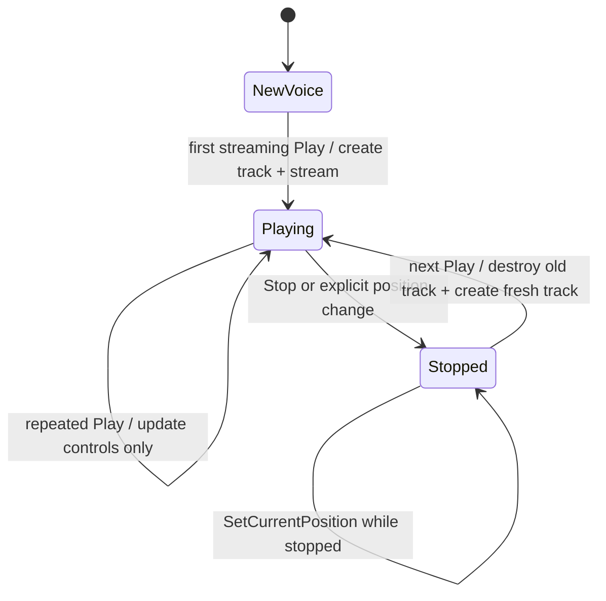

# EZ2Dancer 스트리밍 트랙 재시작 수명 설계
# Design: EZ2Dancer Streaming Track Restart Lifetime

## 한국어

### 배경

실행 로그 `20260914-005510-851`에서 `jam.ezw`는 CHD VFS를 통해 성공적으로 열리고,
파일 읽기도 요청 크기대로 완료됩니다. 실제 JAM 스트리밍 버퍼에는 첫 재생 직후
PCM callback이 전달되지만, `Stop` 뒤의 다음 재생에서 기존 SDL_mixer `MIX_Track`을
그대로 재사용합니다.

SDL_mixer의 `MIX_StopTrack`은 input stream의 데이터를 비우지만 track의 내부
`output_stream`은 비우지 않습니다. 현재 HLE는 DirectSound의 명시적 `Stop`/재생
전환을 같은 track으로 연결하므로, 이전 재생의 변환 출력이 다음 재생의 새 입력보다
먼저 소비될 수 있습니다. 이 동작은 파일시스템의 읽기 실패나 원본 파일 변경 없이
발생할 수 있는 HLE 수명 불일치입니다.

### 설계

스트리밍 voice가 이미 한 번 사용된 뒤 `MIX_TrackPlaying`이 false인 상태에서 새로운
`Play`가 들어오면, 기존 track을 폐기하고 새 `MIX_Track`을 생성합니다. caller가
소유하는 `SDL_AudioStream`은 유지하고 새 track에 다시 연결합니다. 따라서 ring
buffer의 입력 데이터와 DirectSound cursor 정책은 보존하면서 track output stream은
항상 해당 재생 세션에 새로 만들어집니다.

이미 재생 중인 streaming voice의 반복 `Play`는 기존처럼 controls만 갱신하고 queue와
cursor를 유지합니다. `SetCurrentPosition`에 따른 명시적 재시작은 새 track 수명
경로를 사용합니다. 비스트리밍 voice의 raw audio 경로는 변경하지 않습니다.

### 실패 처리

새 track 생성 또는 callback/stream 연결에 실패하면 기존 track을 재생에 사용하지
않고 `Play`를 실패시킵니다. 기존 input `SDL_AudioStream`은 voice가 계속 소유하므로
실패 경로에서도 원본 자산이나 guest buffer를 변경하지 않습니다. track 재생성은
오디오 callback이 해당 track을 사용하지 않는 `MIX_TrackPlaying == false` 경로에서만
수행합니다.

### 검증 기준

* Windows x86 Debug 빌드가 성공해야 합니다.
* 기존 DirectSound streaming start/continue, Stop, cursor 동기화 probe가 통과해야
  합니다.
* 새 회귀 probe는 Stop 후 streaming 재생에서 `track-reset`과 새 track 재생을
  확인해야 합니다.
* 새 실행 로그에서 JAM의 VFS read 성공과 track reset 이후 cooked PCM 전달을
  확인할 수 있어야 합니다.

## English

### Background

Run `20260914-005510-851` confirms that `jam.ezw` opens through the CHD VFS and that
the requested file reads complete. The JAM streaming buffer reaches the PCM callback,
but the next playback after `Stop` reuses the same SDL_mixer `MIX_Track`.

`MIX_StopTrack` clears input-stream data but does not clear the track's internal
`output_stream`. The current HLE therefore carries explicit DirectSound `Stop`/playback
transitions through the same track, allowing converted output from the previous session
to be consumed before the new input. This is an HLE lifetime mismatch that can occur
without a filesystem read failure or modifying the original file.

### Design

When a streaming voice has already been used and a new `Play` arrives while
`MIX_TrackPlaying` is false, destroy the old track and create a fresh `MIX_Track`.
Preserve the caller-owned `SDL_AudioStream` and attach it to the new track. This keeps
the ring-buffer input and DirectSound cursor policy while ensuring that the track output
stream belongs only to the new playback session.

Repeated `Play` on an already-playing streaming voice continues to update controls only,
preserving its queue and cursor. Explicit restarts caused by `SetCurrentPosition` use the
fresh-track lifetime path. Non-streaming raw-audio voices are unchanged.

### Failure handling

If creating the new track or attaching its callback/stream fails, `Play` fails instead of
reusing the old track. The voice continues to own its input `SDL_AudioStream`, so failure
does not modify original assets or the guest buffer. Track replacement is performed only
when `MIX_TrackPlaying == false`, outside active track callback use.

### Verification criteria

* The Windows x86 Debug build succeeds.
* Existing DirectSound streaming start/continue, Stop, and cursor-synchronization probes
  pass.
* A new regression probe confirms `track-reset` and successful playback after Stop.
* A fresh run confirms successful JAM VFS reads and cooked PCM delivery after track reset.
