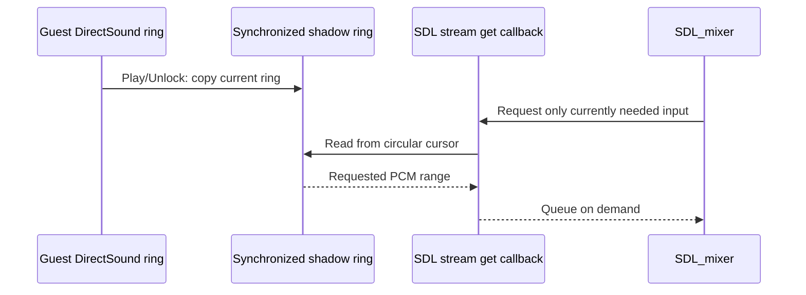

# DirectSound pull ring 재생 / DirectSound pull-ring playback

## 한국어

### 확인된 문제

실행 `20260914-013700-710`에서 `jam.ezw`는 CHD VFS를 통해 정상적으로 열렸고 초기
`4096 + 356352 + 4096`바이트와 후속 `22528`바이트 블록도 모두 성공적으로 읽혔습니다.
그러나 JAM에 해당하는 마지막 360448바이트 streaming buffer는 재생 중에도 cooked PCM
peak가 약 `0.000061`로 고정되었습니다. 같은 구간에서 guest는 전체 ring을 반복해서
Unlock했지만 committed snapshot과 바이트가 같으면 현재 backend가 아무 데이터도 추가하지
않았습니다.

반대로 작업 283의 소비량 기반 보충은 guest가 아직 갱신하지 않은 ring 구간까지 SDL FIFO에
미리 추가하여 약 1~2초마다 처음 구간을 반복했습니다. 두 방식 모두 제자리에서 계속
덮어쓰는 DirectSound circular buffer를 append-only FIFO로 근사한 데서 발생한 문제입니다.

### 설계

Streaming voice는 guest가 직접 쓰는 `LegacyAudioBuffer`와 별도의 synchronized shadow ring을
소유합니다. Play와 Unlock은 shadow ring을 최신 guest ring 전체로 복사합니다. SDL audio
stream에는 전체 ring을 미리 넣지 않고 get callback을 등록합니다. Mixer가 입력을 요청하면
callback이 요청된 양만큼 shadow ring의 read cursor부터 복사하고 cursor를 원형으로
진행시킵니다.

Shadow ring 갱신과 callback read는 `SDL_LockAudioStream`으로 직렬화합니다. 따라서 mixer
thread가 guest 저장소를 직접 읽지 않으며, 원본 PCM 바이트는 로그나 저장소에 남지 않습니다.
Stop/restart 시 mixer track은 기존 정책대로 재생성하되 caller-owned stream callback과
shadow ring은 다시 연결합니다. 재생 cursor는 기존과 같이 mixer가 실제 소비한 frame 수를
기준으로 계산합니다.

진단 로그의 streaming Lock/Unlock sampling budget은 새 streaming Play마다 재설정합니다.
따라서 동일 buffer 객체를 여러 곡이 재사용해도 마지막 곡의 shadow 갱신을 관찰할 수 있습니다.

### 검증

합성 streaming 테스트는 작은 ring을 1회 이상 재생한 뒤 동일 PCM Unlock이 재생 진행을
멈추지 않는지 확인합니다. 이어 ring 전체를 반대 극성 PCM으로 덮어쓰고 새 값이 cooked
output에 도달하는지 확인합니다. Stop, position 변경, restart, repeated Play continuation도
함께 검증하고 Windows x86 Debug 제품과 probe를 빌드합니다.

## English

### Confirmed problem

In run `20260914-013700-710`, `jam.ezw` opened successfully through the CHD VFS. The
initial `4096 + 356352 + 4096` bytes and later `22528`-byte blocks were all read in full.
The final 360448-byte streaming buffer associated with JAM nevertheless held its cooked
PCM peak near `0.000061` throughout playback. The guest repeatedly unlocked the complete
ring, but the committed-snapshot backend appended nothing when the bytes compared equal.

Conversely, task 283's consumption-based refill appended ring regions before the guest
updated them, replaying the beginning about every one or two seconds. Both failures come
from approximating an in-place DirectSound circular buffer with an append-only FIFO.

### Design

Each streaming voice owns a synchronized shadow ring separate from the guest-writable
`LegacyAudioBuffer`. Play and Unlock copy the current complete guest ring into the shadow.
Instead of prequeueing a full revolution, the SDL audio stream has a get callback. When
the mixer requests input, the callback copies only the requested amount from the shadow
ring's read cursor and advances that cursor circularly.

`SDL_LockAudioStream` serializes shadow updates with callback reads. The mixer thread never
reads guest storage directly, and no original PCM bytes enter logs or the repository. A
Stop/restart recreates the mixer track as before and reattaches the caller-owned stream,
callback, and shadow ring. Cursor reporting continues to use frames actually consumed by
the mixer.

The diagnostic streaming Lock/Unlock sampling budget resets for each new streaming Play,
so shadow updates for the final song remain observable when several songs reuse one buffer.

### Verification

The synthetic streaming test plays through a small ring more than once and verifies that
an Unlock containing identical PCM does not stop progress. It then overwrites the ring
with opposite-polarity PCM and requires the new data to reach cooked output. Stop,
position change, restart, repeated-Play continuation, and Windows x86 Debug builds are
also verified.
