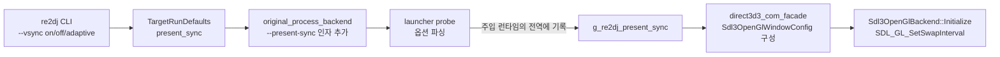
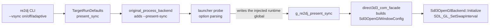

# 작업 288 설계 — present 동기화 정책 / Task 288 design — Present synchronization policy

## 한국어

### 배경

2026-09-15 측정에서 `ez2dj3rd`가 타이틀 화면에서 56~57 fps로 동작하는 것을 재현했다. 원인 조사 결과는 다음과 같다.

| 측정 | 결과 |
| --- | --- |
| 호스트 디스플레이 | 3840×2160 @ 60.000 Hz |
| 저장소의 `SDL_GL_SetSwapInterval` 호출 | **없음** |
| 백엔드와 같은 절차로 만든 독립 probe의 swap interval | **1** (드라이버 기본값) |
| 같은 probe의 swap 간격 | p50 16.679 ms, p95 16.969 ms → 60.00 fps |
| `ez2dj3rd` 창 모드 | 평균 56.6 fps |
| `ez2dj3rd` 전체화면 | 평균 56.70 fps |
| `ez2dj3rd` 게스트 프로세스 CPU | 한 코어의 15.6~16.4% |

vsync가 1이므로 present 간격은 16.667 ms의 정수배로만 가능하다. 평균 17.64 ms는 프레임의 약 5.9%가 두 주기로 밀린다는 뜻이다. 그런데 CPU는 84%가 놀고 있고, 창 모드와 전체화면 수치가 같아 DWM 합성 차이도 아니다. 즉 프레임이 **오래 걸려서**가 아니라 **늦게 도착해서** 밀린다.

이 문서는 그 원인 규명을 끝내기 위한 진단 수단이자, 그 자체로 필요한 기능인 **present 동기화 정책**을 설계한다. 원인 확정은 [작업 288 작업 로그](../work-logs/20260915-288-present-sync-policy.md)에서 이 기능을 사용해 이어간다.

### 지금 상태의 문제

swap interval을 **한 번도 설정하지 않는다.** 현재의 vsync 동작은 의도한 것이 아니라 드라이버 기본값이 우연히 그렇게 된 것이다. 이는 두 가지 면에서 결함이다.

1. **재현성이 없다.** 같은 코드가 드라이버·플랫폼·전원 프로파일에 따라 다른 present 타이밍으로 동작한다. Linux·Web 호스트에서는 기본값이 다를 수 있다.
2. **정책을 표현할 수단이 없다.** 프레임 페이싱을 조사하거나 조정하려면 present가 언제 블록하는지를 고를 수 있어야 한다.

### 목표

1. present 동기화를 **명시적으로 설정**하고, 드라이버가 실제로 허용한 값을 기록한다.
2. 플랫폼 공용 코어에서 정책을 표현하고, 호스트별 세부를 분리한다.
3. 제품 명령줄과 target profile 기본값으로 정책을 고를 수 있게 한다.
4. 기본값은 **현재의 실효 동작(vsync 켜짐)을 유지**한다. 이 작업은 화면 동작을 바꾸지 않는다.

### 비목표

* 3rd의 56~57 fps를 이 작업에서 고치지 않는다. 이 작업은 원인을 가릴 수단을 만든다.
* 게스트의 자체 페이싱 루프에 개입하지 않는다. 원본 코드는 그대로 둔다.
* 프레임 시간 측정·표시 기능은 이 작업 범위가 아니다.

### 설계

#### 1. 공용 코어 — `PresentSync`

`include/re2dj/graphics/sdl3_opengl_backend.h`에 플랫폼 중립 열거형을 둔다.

```cpp
enum class PresentSync
{
    // 매 present가 다음 수직 귀선까지 블록한다. 현재의 실효 동작이자 기본값.
    kVerticalSync,
    // present가 블록하지 않는다. 티어링을 허용하는 대신 게스트 자신의
    // 페이싱만 남긴다. 프레임 페이싱 조사에 필요하다.
    kImmediate,
    // 마감을 지킨 프레임은 vsync를 기다리고, 놓친 프레임은 기다리지 않는다.
    // SDL의 late-swap-tearing(-1)이며, 드라이버가 거부할 수 있다.
    kAdaptive,
};
```

`Sdl3OpenGlWindowConfig`에 `PresentSync present_sync = PresentSync::kVerticalSync;`를 더한다. 기본값이 곧 현재 동작이므로 호출자가 이 필드를 채우지 않아도 동작이 바뀌지 않는다.

#### 2. 백엔드 동작

`Initialize`가 컨텍스트를 만든 직후에 정책을 적용한다.

* `kAdaptive`는 `SDL_GL_SetSwapInterval(-1)`을 먼저 시도하고, 실패하면 `1`로 내려간다. 적응형은 드라이버가 흔히 거부하므로 실패가 오류가 아니다.
* `kVerticalSync`는 `1`, `kImmediate`는 `0`.
* 설정 후 `SDL_GL_GetSwapInterval`로 **실제로 적용된 값**을 읽어 graphics trace에 한 줄 남긴다. 요청과 결과가 다를 수 있으므로 요청값만 기록하면 안 된다.
* interval 설정 실패는 초기화 실패로 취급하지 않는다. 그리는 것 자체는 가능하기 때문이다.

#### 3. 호스트 배선

게스트 프로세스 안에서 백엔드를 만드는 것은 주입된 런타임이므로, 런처가 값을 전달하는 경로는 기존 `g_re2dj_graphics_draw_diagnostics`와 같은 **내보낸 전역 변수** 방식을 재사용한다. 새 메커니즘을 만들지 않는다.



* `g_re2dj_present_sync` — `unsigned long` 내보낸 전역. `0` = vsync, `1` = immediate, `2` = adaptive. 기본값 `0`이므로 런처가 쓰지 않으면 현재 동작이 유지된다. 값 이름은 `graphics_trace_log.cpp`의 기존 두 전역과 같은 파일에 둔다.
* 런처 옵션 `--present-sync <vsync|immediate|adaptive>`.
* 제품 옵션 `--vsync <on|off|adaptive>`. `--fullscreen`/`--windowed`와 같은 `_explicit` 패턴을 따라 프로파일 기본값을 덮어쓴다.
* `TargetRunDefaults.present_sync` — 기본 `kVerticalSync`. 프로파일이 값을 바꾸지 않으면 오늘과 같다.

#### 4. 다른 호스트

`PresentSync`는 공용 코어에 있으므로 Linux·Web 호스트가 같은 필드를 채운다. Web(Emscripten)에서는 swap이 `requestAnimationFrame`에 묶여 있어 `kImmediate`가 그대로 반영되지 않을 수 있다. 이 차이는 **미확정**으로 두고, 실제 Web 실행으로 확인되기 전까지 문서에 사실로 적지 않는다.

### 검증 계획

* 단위 테스트: `PresentSync` 값과 런처 옵션 문자열의 왕복 매핑, 제품 CLI 파싱(`--vsync on|off|adaptive`, 잘못된 값 거부), 프로파일 기본값 덮어쓰기.
* 빌드: Windows x86 Debug/Release, CTest.
* 실행 확인: `ez2dj3rd`를 세 정책으로 각각 실행하고 graphics trace의 적용값 한 줄과 타이틀바 FPS를 기록한다. 기본값 실행이 오늘과 같은 56~57 fps를 내는지로 **무변경**을 확인한다.

### 측정으로 해소된 항목 / Resolved by measurement

구현 후 실행 검증에서 아래 둘이 확정되었다. 상세는 작업 로그에 있다.

* 드라이버는 `kAdaptive`를 **허용한다.** `requested=2`에 `applied_interval=-1`이 기록되었다.
* `kImmediate`에서도 `ez2dj3rd`는 **56~57 fps 그대로다.** 따라서 이 문서의 배경 절이 세운 "이중 페이싱" 가설은 **기각된다.** vsync는 3rd의 프레임률 상한이 아니며, 게스트 자신이 그 속도로 페이싱한다.

### 미확정

* `ez2dj3rd`의 자체 페이싱이 왜 16.67 ms가 아니라 약 17.6 ms인지. 후속 작업의 주제다.
* Web 호스트에서 `kImmediate`의 의미.

---

## English

### Background

On 2026-09-15 the 56-57 fps behavior of `ez2dj3rd` was reproduced on its title screen. The investigation measured:

| Measurement | Result |
| --- | --- |
| Host display | 3840x2160 @ 60.000 Hz |
| `SDL_GL_SetSwapInterval` calls in the repository | **none** |
| Swap interval of a standalone probe built the same way as the backend | **1** (driver default) |
| That probe's swap spacing | p50 16.679 ms, p95 16.969 ms → 60.00 fps |
| `ez2dj3rd` windowed | 56.6 fps average |
| `ez2dj3rd` fullscreen | 56.70 fps average |
| `ez2dj3rd` guest process CPU | 15.6-16.4% of one core |

With the interval at 1, present spacing can only be a multiple of 16.667 ms, so a 17.64 ms average means about 5.9% of frames slip to two periods. Yet 84% of a core is idle, and windowed and fullscreen agree, which rules out DWM composition. Frames slip because they **arrive late**, not because they **take long**.

This document designs the **present synchronization policy** — both the instrument needed to finish that diagnosis and a capability the project needs on its own. The diagnosis continues in [the task 288 work log](../work-logs/20260915-288-present-sync-policy.md) using this feature.

### The defect in the current state

The swap interval is **never set**. Today's vsync behavior is not a decision; it is whatever the driver defaults to. That is a defect twice over:

1. **It is not reproducible.** The same code presents with different timing depending on driver, platform and power profile, and the Linux and Web hosts may default differently.
2. **There is no way to express a policy.** Investigating or adjusting frame pacing requires choosing when a present blocks.

### Goals

1. Set present synchronization **explicitly** and record what the driver actually granted.
2. Express the policy in the platform-neutral core, keeping host specifics separate.
3. Let the product command line and the target profile default select it.
4. Keep the default at **today's effective behavior — vsync on**. This task changes nothing on screen.

### Non-goals

* Fixing the 56-57 fps of 3rd. This task builds the instrument that tells the causes apart.
* Touching the guest's own pacing loop. The original code stays as it is.
* Frame-time measurement or display, which is out of scope here.

### Design

#### 1. Shared core — `PresentSync`

A platform-neutral enumeration in `include/re2dj/graphics/sdl3_opengl_backend.h`:

```cpp
enum class PresentSync
{
    // Every present blocks until the next vertical retrace. Today's effective
    // behavior, and the default.
    kVerticalSync,
    // Presents never block, allowing tearing and leaving only the guest's own
    // pacing. Required for the frame-pacing investigation.
    kImmediate,
    // Frames that meet the deadline wait for vsync; frames that miss it do
    // not. SDL's late-swap tearing (-1); drivers may refuse it.
    kAdaptive,
};
```

`Sdl3OpenGlWindowConfig` gains `PresentSync present_sync = PresentSync::kVerticalSync;`. Because the default is today's behavior, a caller that does not fill the field sees no change.

#### 2. Backend behavior

`Initialize` applies the policy immediately after creating the context.

* `kAdaptive` tries `SDL_GL_SetSwapInterval(-1)` first and falls back to `1`. Drivers commonly refuse adaptive sync, so a refusal is not an error.
* `kVerticalSync` uses `1` and `kImmediate` uses `0`.
* After setting, `SDL_GL_GetSwapInterval` reads back **what was actually applied** and one line goes to the graphics trace. The request and the result can differ, so recording only the request would be wrong.
* A failure to set the interval is not an initialization failure, since drawing itself still works.

#### 3. Host plumbing

The backend is constructed by the injected runtime inside the guest process, so the launcher passes the value through an **exported global**, reusing the existing `g_re2dj_graphics_draw_diagnostics` mechanism rather than inventing a new one.



* `g_re2dj_present_sync` — an exported `unsigned long`: `0` = vsync, `1` = immediate, `2` = adaptive. It defaults to `0`, so today's behavior holds when the launcher writes nothing. It lives in `graphics_trace_log.cpp` beside the two existing globals.
* Launcher option `--present-sync <vsync|immediate|adaptive>`.
* Product option `--vsync <on|off|adaptive>`, overriding the profile default through the same `_explicit` pattern as `--fullscreen`/`--windowed`.
* `TargetRunDefaults.present_sync`, defaulting to `kVerticalSync`, so a profile that sets nothing behaves as it does today.

#### 4. Other hosts

`PresentSync` lives in the shared core, so the Linux and Web hosts fill the same field. Under Emscripten the swap is tied to `requestAnimationFrame`, so `kImmediate` may not carry through. That difference stays **unresolved** and is not written down as fact until a real Web run confirms it.

### Verification plan

* Unit tests: round-trip mapping between `PresentSync` and the launcher option strings, product CLI parsing (`--vsync on|off|adaptive` and rejection of an invalid value), and the profile-default override.
* Builds: Windows x86 Debug and Release, plus CTest.
* Runtime check: run `ez2dj3rd` under each of the three policies, recording the applied-interval trace line and the title-bar FPS. The default run reproducing today's 56-57 fps is what confirms **no behavior change**.

### Resolved by measurement

The runtime check after implementation settled two of these; details are in the work log.

* The driver **does** grant `kAdaptive`: `requested=2` recorded `applied_interval=-1`.
* Under `kImmediate`, `ez2dj3rd` still runs at **56-57 fps**. The "double pacing" hypothesis this document's background section rested on is therefore **rejected**: vsync is not what caps 3rd, and the guest paces itself at that rate.

### Unresolved

* Why `ez2dj3rd`'s own pacing lands near 17.6 ms rather than 16.67 ms. That is the subject of the follow-up task.
* What `kImmediate` means on the Web host.
