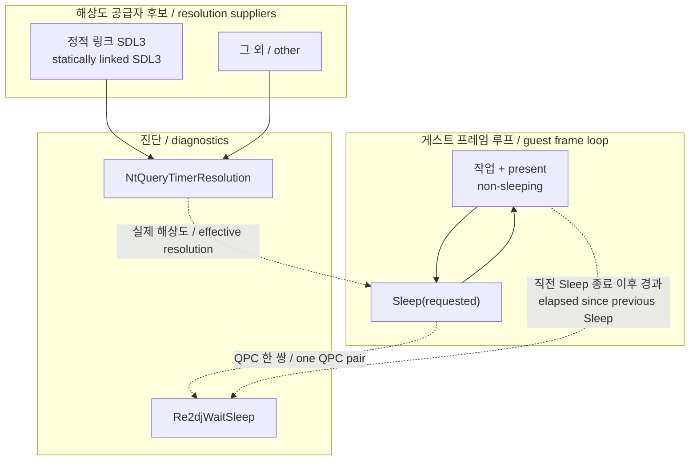

# 작업 291 설계 — 타이머 해상도 의존성 / Task 291 design — The timer-resolution dependency

선행: [작업 290 게스트 대기 계정](20260915-290-guest-wait-accounting.md)

작업 지시: [20260915-291-timer-resolution-dependency.md](../work-orders/20260915-291-timer-resolution-dependency.md)

## 한국어

### 배경

작업 290은 `ez2dj3rd` 프레임 17.8 ms 중 16.8 ms가 게스트 `Sleep` 안이고 요청값 평균이 16.3 ms임을 확정했다. 남은 질문 두 개를 이 작업이 맡는다.

1. 이 프로세스의 타이머 해상도는 **누가** 올리는가. 아무도 올리지 않았다면 NT 기본 15.6 ms에서 16.3 ms 요청은 약 31 ms로 올림되어 32 fps가 나와야 하는데 실측은 56 fps다.
2. 게스트의 16.3 ms는 **고정 상수**인가 `목표 - 경과` **피드백**인가.

### 관찰 대상과 도구의 관계



### 설계

#### 1. 타이머 해상도 probe

`NtQueryTimerResolution`은 문서화된 export가 아니므로 링크하지 않고 `ntdll.dll`에서 `GetProcAddress`로 해석한다. 해석에 실패하면 조용히 비활성화한다. 진단 하나 때문에 실행이 끊기면 안 된다.

해상도는 **프로세스 안에서** 읽어야 한다. Windows 10 2004 이후 타이머 해상도는 요청한 프로세스에만 적용되므로, 런처에서 읽은 값은 게스트의 값이 아니다. 따라서 probe는 주입 런타임 쪽에 둔다.

한 번만 읽지 않는다. 공급자가 SDL이라면 해상도는 프로세스 시작 시점이 아니라 **SDL 서브시스템이 초기화되는 시점**에 바뀐다. 그 전이를 보는 것이 곧 공급자 식별이므로, 요약 창마다 읽고 **값이 바뀌었을 때와 첫 회에만** 한 줄 낸다. 값이 안정되면 로그는 조용해진다.

```
re2dj:hle:timer-resolution:current_ms=..:minimum_ms=..:maximum_ms=..:source=..
```

`NtQueryTimerResolution`의 인자 이름은 직관과 반대다. `Minimum`이 가장 거친 간격(보통 15.6 ms), `Maximum`이 가장 고운 간격(보통 0.5 ms)이다. 로그에는 100 ns 단위를 ms로 바꿔 적고, 이름은 API 그대로 둔 채 `docs/kb/`에서 설명한다.

#### 2. 게스트 sleep 모델 계정

작업 290의 래퍼가 이미 요청값과 실제 소요를 잰다. 여기에 **직전 `Sleep` 종료부터 이번 `Sleep` 시작까지의 경과**를 더한다. 3rd는 프레임당 `Sleep`을 정확히 한 번 부르므로(작업 290에서 확인됨) 이 값이 곧 프레임의 non-sleeping 구간이다.

상관을 보기 위해 표본을 저장하지 않는다. 호출 경로에서는 **누적합 다섯 개**만 올린다.

| 누적 | 의미 |
| --- | --- |
| `n` | 쌍의 수 |
| `Σx`, `Σx²` | 요청값(x)의 평균과 분산 |
| `Σy`, `Σy²` | non-sleeping 구간(y)의 평균과 분산 |
| `Σxy` | 공분산, 곧 Pearson 상관 |

여기서 세 가지가 한 번에 나온다.

* `corr` — 음의 상관이면 피드백 루프다.
* `sd(x)` — 0에 가까우면 요청값이 고정 상수다.
* `sd(x+y)` — 0에 가까우면 게스트가 `x+y`를 일정하게 유지하고 있다는 뜻이고, 그 평균이 곧 **목표 주기**다. `sd(x+y) = sqrt(var(x) + var(y) + 2·cov)`로 같은 누적합에서 유도된다.

판정표는 이렇게 된다.

| `sd(x)` | `sd(x+y)` | 해석 |
| --- | --- | --- |
| ≈ 0 | ≈ `sd(y)` | 고정 상수 sleep. 목표 주기는 별도로 찾아야 한다 |
| > 0 | ≈ 0 | `목표 - 경과` 피드백. 목표 주기 = `mean(x+y)` |
| > 0 | > 0 | 둘 다 아님. 원본 코드를 봐야 한다 |

보고는 작업 289·290 요약과 같은 창에서 한 줄 더 낸다.

```
re2dj:hle:guest-sleep-model:pairs=..:req_mean=..:req_sd=..:awake_mean=..:awake_sd=..:period_mean=..:period_sd=..:corr=..
```

#### 3. 파일 배치

| 파일 | 책임 |
| --- | --- |
| `src/platform/windows/timer_resolution_probe.h/.cpp` | `ntdll` 동적 해석과 해상도 읽기. 신규 |
| `src/platform/windows/guest_wait_accounting.h/.cpp` | 누적합과 파생값. 기존 파일 확장 |
| `src/platform/windows/injected_runtime.cpp` | 래퍼에서 직전 종료 시각 유지 |
| `src/platform/windows/direct3d3_com_facade.cpp` | 두 줄 보고 |

`NtQueryTimerResolution`은 호스트 OS API이므로 공용 코어에 두지 않는다. 누적합 계산은 순수 산술이지만 계정기가 이미 Windows 전용 파일이므로 같은 자리에 둔다.

### 비목표

* `Sleep` 인자·반환값 변경.
* 우리가 타이머 해상도를 올리는 것. 실험 1의 판정이 먼저다.
* 프레임률 수정.

### 미확정

* SDL3가 해상도를 올린다면 그 시점이 video 초기화인지 audio 초기화인지. `RE2DJ_ENABLE_SDL3_AUDIO=OFF` 빌드가 이를 가른다.
* 3rd 외 타깃도 같은 전제를 가지는지.

## English

Prerequisite: [Task 290, guest wait accounting](20260915-290-guest-wait-accounting.md)

Work order: [20260915-291-timer-resolution-dependency.md](../work-orders/20260915-291-timer-resolution-dependency.md)

### Background

Task 290 established that 16.8 ms of `ez2dj3rd`'s 17.8 ms frame sits inside the guest's `Sleep` and that the average request is 16.3 ms. Two questions remain, and this task takes both.

1. **Who** raises this process's timer resolution? At the NT default of 15.6 ms a 16.3 ms request would round to about 31 ms and yield 32 fps, yet 56 fps is measured.
2. Is the guest's 16.3 ms a **fixed constant** or a `target - elapsed` **feedback** term?

### Design

#### 1. The timer-resolution probe

`NtQueryTimerResolution` is not a documented export, so it is resolved from `ntdll.dll` through `GetProcAddress` rather than linked. A failed resolution disables the probe silently: one diagnostic must never break a run.

The resolution has to be read **inside the process**. Since Windows 10 2004 a timer-resolution request applies to the requesting process, so a value read in the launcher is not the guest's value. The probe therefore lives in the injected runtime.

It is not read once. If the supplier is SDL, the resolution changes when the SDL subsystem initializes rather than at process start, and seeing that transition is exactly what identifies the supplier. So it is read once per summary window and a line is emitted **only on the first read and whenever the value changes**. Once it settles, the log goes quiet.

```
re2dj:hle:timer-resolution:current_ms=..:minimum_ms=..:maximum_ms=..:source=..
```

The API's parameter names run counter to intuition: `Minimum` is the coarsest interval (usually 15.6 ms) and `Maximum` the finest (usually 0.5 ms). The log converts the 100 ns units to milliseconds and keeps the API's own names, explained in `docs/kb/`.

#### 2. Guest sleep-model accounting

Task 290's wrapper already measures the request and the actual duration. This adds the **elapsed time from the previous `Sleep`'s return to this `Sleep`'s entry**. 3rd calls `Sleep` exactly once per frame (confirmed in task 290), so that value is the frame's non-sleeping segment.

No samples are stored to obtain the correlation. The call path increments **five running sums** only.

| Sum | Yields |
| --- | --- |
| `n` | pair count |
| `Σx`, `Σx²` | mean and variance of the request (x) |
| `Σy`, `Σy²` | mean and variance of the non-sleeping segment (y) |
| `Σxy` | covariance, hence the Pearson correlation |

Three readings fall out at once.

* `corr` — a negative correlation means a feedback loop.
* `sd(x)` — near zero means the request is a fixed constant.
* `sd(x+y)` — near zero means the guest holds `x+y` constant, and that mean **is** the target period. It derives from the same sums as `sqrt(var(x) + var(y) + 2·cov)`.

| `sd(x)` | `sd(x+y)` | Reading |
| --- | --- | --- |
| ≈ 0 | ≈ `sd(y)` | Fixed-constant sleep; the target period must be found elsewhere |
| > 0 | ≈ 0 | `target - elapsed` feedback; target period = `mean(x+y)` |
| > 0 | > 0 | Neither; the original code has to be read |

Reporting adds one more line to the window tasks 289 and 290 already report in.

```
re2dj:hle:guest-sleep-model:pairs=..:req_mean=..:req_sd=..:awake_mean=..:awake_sd=..:period_mean=..:period_sd=..:corr=..
```

#### 3. File placement

| File | Responsibility |
| --- | --- |
| `src/platform/windows/timer_resolution_probe.h/.cpp` | Dynamic `ntdll` resolution and the resolution read. New |
| `src/platform/windows/guest_wait_accounting.h/.cpp` | The running sums and their derived values. Existing file, extended |
| `src/platform/windows/injected_runtime.cpp` | Keeping the previous return time in the wrapper |
| `src/platform/windows/direct3d3_com_facade.cpp` | The two report lines |

`NtQueryTimerResolution` is a host OS API and stays out of the shared core. The running sums are pure arithmetic but belong beside the accounting they extend, which is already a Windows-only file.

### Non-goals

* Changing the `Sleep` argument or return value.
* Raising the timer resolution ourselves; experiment 1 decides first.
* Changing the frame rate.

### Unresolved

* If SDL3 raises the resolution, whether it happens in video or audio initialization. The `RE2DJ_ENABLE_SDL3_AUDIO=OFF` build separates the two.
* Whether targets other than 3rd share the assumption.
