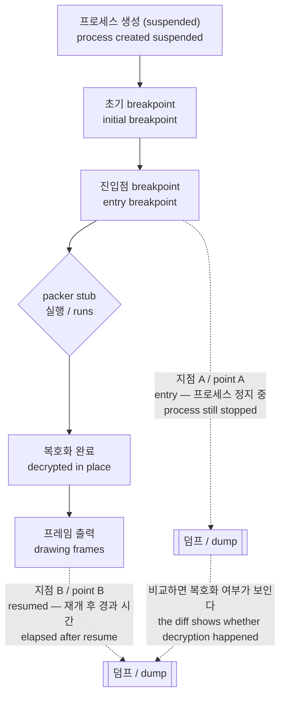

# 작업 292 설계 — 복호화된 주 이미지 덤프 경계 / Task 292 design — The decrypted main-image dump boundary

관련 분석: [EZ2DJ import 표면](../analysis/ez2dj-import-surface.md), [실행 파일 구조](../analysis/ez2dj-exe-structures.md)

## 한국어

### 배경

`ez2dj1st`, `ez2dj3rd`, `ez2dj4th`, `ez2dj5th`, `ez2d2m`은 `.protect` packer로 보호된 빌드다. 디스크 이미지에는 원본 코드도 문자열도 없다.

확인된 사례다. 3rd `EZ2DJ.EXE` 전체 바이트를 검색하면 그 게임이 자기 INI에 매 실행 기록하는 `TotalCoin`, `UseGameOver` 같은 문자열조차 **0건**이다. 같은 검색을 보호되지 않은 6th `EZ2DJ6th.EXE`에 하면 각각 1건씩 나온다.

그래서 현재 `docs/analysis/`의 여러 결론이 같은 벽에 걸려 있다.

| 벽에 걸린 항목 | 현재 상태 |
| --- | --- |
| 1st·2nd의 legacy I/O helper RVA | 다른 빌드에서 베껴 옴, 미확인 |
| 보호 빌드의 원본 코드 분석 전반 | 정적 분석 불가 |
| 게임별 설정·상태 변수 위치 | 실행 중 추적 외에는 수단 없음 |

그런데 우리는 이미 그 벽 너머에 도달해 있다. Hardlock HLE가 dongle 응답을 돌려주면 보호 계층이 **제자리에서 복호화**하고, 게스트는 그 상태로 실행된다. 3rd가 타이틀 화면을 그리고 있다면 그 프로세스의 주 이미지는 이미 복호화된 코드다.

이 설계는 그 상태를 파일로 남기는 경계 하나를 정의한다.

### 목표와 비목표

**목표.** 실행 중 프로세스의 주 이미지를 분석 가능한 형태로 저장한다. 어느 빌드의 어느 시점인지 증명 가능하게 한다.

**비목표.** 다시 실행 가능한 PE를 만드는 것. 덤프는 import가 해석된 주소로 바인딩되고 재배치가 적용된 virtual 레이아웃이라 그대로는 실행되지 않는다. 실행 복원은 import 재구성이 필요한 별개의 큰 작업이며, 정적 분석에는 필요 없다.

**비목표.** 게스트 동작 변경. 덤프는 읽기만 한다.

### 쟁점 — 어느 시점이 복호화된 상태인가

이것이 이 설계의 핵심이며, **현재 미확정이다.**

packer로 보호된 PE의 `AddressOfEntryPoint`는 원본 진입점이 아니라 packer stub을 가리킨다. 1st Tracks의 fingerprint가 그 증거다. `entry_point_rva`가 `0x0199b240`인데 `size_of_image`가 `0x019b6000`이므로 진입점이 이미지 거의 끝에 있다. 원본 코드가 아니라 뒤에 덧붙은 stub 섹션이다.

따라서 런처가 지금 거는 진입점 breakpoint가 stub **실행 전**인지 **후**인지에 따라 덤프 내용이 완전히 달라진다.

간접 증거는 갈린다. 진입점 도달 직후의 IAT 슬롯 패치가 1st SE에서는 동작하므로 그 시점에 import table이 이미 사용 가능한 상태다. 반면 작업 290은 3rd에서 정적 IAT 패치가 게스트 호출에 닿지 않아 동적 resolver가 필요했음을 확인했다. 두 관찰은 양립하므로 어느 쪽도 이 질문에 답하지 않는다.

**설계의 답: 시점을 하나로 고정하지 않고 이름 붙은 여러 지점을 지원한다.** 두 지점의 덤프를 비교하는 것 자체가 복호화가 일어났다는 증거이고, 어느 지점이 쓸 만한지에 대한 답이다.



지점 B는 게스트가 이미 자기 코드를 수 초간 실행한 뒤이므로 **복호화가 끝났음이 자명하다.** 지점 A는 검증 대상이다. 두 지점이 동일하면 진입점 시점에 이미 복호화되어 있다는 뜻이고, 그때는 이후 작업에서 A만 써도 된다.

### 설계

#### 덤프 주체는 런처다

처음에는 주입 런타임이 자기 주소 공간을 뜨는 쪽으로 정했다. 시점을 HLE 경계 어디에나 둘 수 있다는 것이 이유였다. **구현 지점을 확인하는 과정에서 그 전제가 깨졌으므로 결정을 바꾼다.**

깨진 전제는 이것이다. 프로파일마다 활성화되는 HLE 경계가 다르다. 3rd는 `DirectDrawCreate`를 IAT에 갖고 있지 않아 그 hook을 아예 주입하지 않으며, 1st SE와 3rd가 켜는 경계 집합이 서로 다르다. 따라서 **모든 프로파일에서 확실히 불리는 in-process 경계가 존재하지 않는다.** 경계마다 분기를 두면 프로파일이 늘 때마다 덤프가 조용히 동작하지 않는 조합이 생긴다.

런처는 그 문제가 없다.

| | 런처 (디버거) | 주입 런타임 (in-process) |
| --- | --- | --- |
| 프로파일별 경계 의존 | **없음** | 있음 — 결정적 결함 |
| 읽기 방법 | `ReadProcessMemory` | 자기 주소 공간 직접 읽기 |
| 게스트 정지 | 없음 | 수 MB 파일 쓰기만큼 멈춤 |
| 두 지점 모두 | 한 구현으로 처리 | 지점 A는 게스트 코드 전이라 불가 |

런처는 두 지점 모두에서 `child.hProcess`를 쥐고 있다. 지점 A는 진입점 breakpoint 복원 직후 프로세스가 아직 정지해 있을 때고, 지점 B는 `DebugActiveProcessStop` 뒤 `ResumeThread`로 게스트를 돌린 다음이다. **디버거를 분리해도 프로세스 핸들은 유효하므로** detached 실행에서도 그대로 읽힌다.

지점 B의 시점은 재개 후 경과 시간으로 잡는다. HLE 경계를 쓰지 않는 이유가 위와 같고, 경과 시간은 프로파일과 무관하게 성립한다. 기본값은 옵션으로 바꿀 수 있어야 한다. 복호화가 단계적일 가능성(미확정 항목)을 확인하려면 시점을 뒤로 밀어 가며 비교해야 하기 때문이다.

#### 범위와 형식

`[image_base, image_base + SizeOfImage)`를 **virtual 레이아웃 그대로** 한 파일로 쓴다.

이 선택이 중요하다. 파일 오프셋이 곧 RVA가 되므로, 진단 로그에 찍힌 주소나 프로파일의 helper RVA를 덤프에서 **그대로** 찾아볼 수 있다. 파일 오프셋으로 재배치하면 그 대응이 깨진다.

읽을 수 없는 페이지는 0으로 채우고 **그 범위를 sidecar에 기록한다.** 구멍을 숨긴 채 완전해 보이는 파일을 내놓으면 분석 근거로 쓸 수 없다.

크기는 빌드에 따라 4~27 MB다. 1st Tracks의 `size_of_image`가 `0x019b6000`으로 가장 크다. 자동으로 뜨지 않고 옵션이 있을 때만 뜨는 이유다.

#### Sidecar — 귀속이 없으면 근거가 아니다

덤프 옆에 JSON 한 파일을 같이 쓴다. **어느 빌드의 덤프인지 증명되지 않으면 `docs/analysis/`의 근거로 쓸 수 없다.**

| 항목 | 이유 |
| --- | --- |
| 타깃 id, 게스트 실행 파일 경로 | 어느 제품인지 |
| PE `TimeDateStamp`, `SizeOfImage`, `entry_point_rva` | 어느 빌드인지. 프로파일 fingerprint와 같은 값 |
| 디스크 실행 파일의 해시 | 같은 파일에서 나온 덤프임을 증명. `ez2dj-exe-structures.md`가 이미 파일 해시를 기록한다 |
| image base | 덤프 오프셋을 실행 중 주소로 환산 |
| 지점 이름 | `entry` / `resumed` |
| 읽기 실패 범위 | 구멍의 위치 |
| re2dj 버전, 실행 시각 | 재현 |

#### 스위치와 경로

작업 289·290·291과 같다. 런처 probe 옵션 `--image-dump[=<path>]`로만 켜지고, 지점 B의 시점은 `--image-dump-delay <milliseconds>`로 조정하며, 옵션이 없으면 아무것도 읽지 않는다. 제품 CLI에는 넣지 않는다.

경로를 주지 않으면 그 실행의 로그 디렉터리에 쓴다. `logs/`는 이미 gitignore 대상이고 실행별로 나뉘어 있어 덤프와 진단 로그가 같이 남는다.

파일 이름은 기존 관례를 따른다.

```
<stamp>.<point>.image.bin
<stamp>.<point>.image.json
```

#### 저장소 오염 방지

AGENTS.md가 금지하는 것은 커밋이다. `.gitignore`가 이미 `/logs/`, `/dump/`, `/dumps/`, `/roms/`, `/overlays/`를 막고 확장자로 `*.bin`도 막으므로 기본 경로와 관례적 경로가 모두 덮인다. 사용자가 지정한 임의 경로는 저장소 밖일 수 있으므로 추가 조치는 하지 않는다.

**분석 문서 규칙은 그대로다.** 덤프에서 알아낸 것을 문서에 쓸 때는 바이트 열이 아니라 구조, 오프셋, 관찰된 동작만 적는다.

### 검증 방법

* 보호되지 않은 6th를 기준으로 삼는다. 6th의 덤프에서 `UseGameOver`, `TotalCoin`, `AdvSound`가 나와야 하고, 이는 디스크 이미지 검색 결과와 일치해야 한다. 덤프 경로 자체가 옳은지를 **정답을 아는 대상으로** 확인하는 것이다.
* 3rd 덤프에서 같은 문자열을 찾는다. 디스크 이미지에서는 0건이므로, 덤프에서 나오면 복호화된 상태를 떴다는 증거다.
* 지점 A와 지점 B의 덤프를 비교해 진입점 시점의 복호화 여부를 판정한다.
* 옵션 없는 실행이 덤프 파일을 만들지 않고 진단 로그에 관련 줄을 남기지 않음을 확인한다.

### 미확정

* 진입점 breakpoint 시점에 `.protect`가 이미 복호화를 마쳤는지. 위 검증이 답을 낸다.
* 복호화가 단계적인지. stub이 필요한 코드만 그때그때 푸는 방식이라면 어느 한 시점의 덤프도 전체를 담지 못한다. 이 경우 지점 B를 더 뒤로 미루거나 여러 지점을 떠서 합쳐야 하며, 지점 A·B 비교에서 징후가 보인다.
* `ez2d2m`은 `.idata` 섹션 자체가 없어 다른 구조일 수 있다.

## English

Related analysis: [EZ2DJ import surface](../analysis/ez2dj-import-surface.md), [executable structures](../analysis/ez2dj-exe-structures.md)

### Background

`ez2dj1st`, `ez2dj3rd`, `ez2dj4th`, `ez2dj5th` and `ez2d2m` are `.protect`-packed builds whose disk images contain neither the original code nor its strings.

A confirmed example: searching the whole of 3rd's `EZ2DJ.EXE` finds **zero** occurrences of `TotalCoin` or `UseGameOver`, strings that game writes into its own INI on every run. The same search against the unprotected 6th `EZ2DJ6th.EXE` finds one of each.

Several conclusions in `docs/analysis/` are stuck behind that wall — the 1st and 2nd legacy-I/O helper RVAs carried over unverified from another build, static analysis of protected builds in general, and the location of any per-game setting or state variable.

Yet we already stand on the far side of the wall. Once the Hardlock HLE answers the dongle, the protection **decrypts in place** and the guest runs from that state. When 3rd is drawing its title screen, the main image in that process is decrypted code.

This design defines one boundary that saves that state to a file.

### Goals and non-goals

**Goal.** Save a running process's main image in a form that can be analyzed, provably attributed to one build at one point.

**Non-goal.** Producing a runnable PE. The dump has imports bound to resolved addresses and relocations applied in virtual layout, so it will not run as is. Restoring that needs import reconstruction — a separate, much larger task that static analysis does not require.

**Non-goal.** Changing guest behavior. The dump only reads.

### The open question — which point holds the decrypted state

This is the design's central issue, and it is **unresolved today**.

A packed PE's `AddressOfEntryPoint` names the packer stub, not the original entry. 1st Tracks' fingerprint shows it: an `entry_point_rva` of `0x0199b240` against a `size_of_image` of `0x019b6000` puts the entry at the very end of the image, in a stub section appended after the original code.

So whether the launcher's current entry breakpoint sits **before** or **after** the stub runs decides entirely what a dump would contain.

The indirect evidence cuts both ways. IAT slot patching right after the entry breakpoint works for 1st SE, so the import table is usable by then. Task 290, meanwhile, found that static IAT patching never reached 3rd's calls and needed the dynamic resolver. Both observations are compatible with either answer, so neither settles it.

**The design's answer is not to fix one point but to support named points.** Diffing two dumps is itself the evidence of whether decryption happened, and of which point is worth using.

Point B is self-evidently after decryption, since the guest is already calling graphics boundaries. Point A is what is under test: if the two agree, the image is already decrypted at the entry breakpoint and later work can use A alone.

### Design

#### The launcher takes the dump

The first decision was for the injected runtime to dump its own address space, on the grounds that it could place the dump at any HLE boundary. **Checking the implementation sites broke that premise, so the decision is reversed.**

The broken premise: which HLE boundaries a profile enables varies. 3rd has no `DirectDrawCreate` in its IAT and never gets that hook injected at all, and the set 1st SE enables differs from 3rd's. **There is no in-process boundary that is certain to be called under every profile.** Branching per boundary would leave combinations where the dump silently does nothing as profiles are added.

The launcher has no such problem: it holds `child.hProcess` at both points, is independent of which boundaries a profile enables, and stalls the guest not at all. Point A is immediately after the entry breakpoint is restored, while the process is still stopped; point B is after `DebugActiveProcessStop` and `ResumeThread` have let the guest run. **Detaching the debugger leaves the process handle valid**, so a detached run reads the same way. Point A is in any case impossible in-process, since no guest code has run.

Point B is timed from the resume rather than hung off a boundary, for the reason above, and elapsed time holds regardless of profile. The delay must be adjustable: checking whether decryption is staged — an unresolved item below — means moving the point later and comparing.

#### Range and format

`[image_base, image_base + SizeOfImage)` is written to one file **in virtual layout**.

That choice matters: the file offset then *is* the RVA, so an address from a diagnostic log or a profile's helper RVA can be looked up in the dump directly. Rewriting into file-offset layout would break that correspondence.

Unreadable pages are zero-filled and **the ranges are recorded in the sidecar**. A file that hides its holes while looking complete cannot serve as evidence.

Sizes run 4-27 MB depending on the build, the largest being 1st Tracks at `0x019b6000`. That is why nothing is dumped without the option.

#### Sidecar — without attribution it is not evidence

A JSON file is written beside the dump. **A dump that cannot be tied to a build cannot support anything in `docs/analysis/`.**

It carries the target id and guest executable path; the PE `TimeDateStamp`, `SizeOfImage` and `entry_point_rva`, the same values the profile fingerprints use; a hash of the on-disk executable, proving the dump came from that file, as `ez2dj-exe-structures.md` already records file hashes; the image base, for converting dump offsets to runtime addresses; the point name (`entry` or `resumed`); any ranges that failed to read; and the re2dj version and run time.

#### Switch and path

As in tasks 289, 290 and 291: enabled only by the launcher probe option `--image-dump[=<path>]`, with point B's timing set by `--image-dump-delay <milliseconds>`, reading nothing without it, and absent from the product CLI. With no path it writes into that run's log directory, which is already gitignored and already separates runs, keeping the dump beside its diagnostic log. Filenames follow the existing convention: `<stamp>.<point>.image.bin` and `<stamp>.<point>.image.json`.

#### Keeping it out of the repository

What AGENTS.md forbids is committing. `.gitignore` already covers `/logs/`, `/dump/`, `/dumps/`, `/roms/` and `/overlays/`, and `*.bin` by extension, so the default and conventional paths are all covered. A user-supplied path may lie outside the repository, so nothing further is done.

**The analysis-document rule is unchanged**: findings go in as structure, offsets and observed behavior, never byte dumps.

### Verification

* The unprotected 6th is the control. Its dump must contain `UseGameOver`, `TotalCoin` and `AdvSound`, matching what its disk image already shows — checking the dump path itself **against a target whose answer is known**.
* The same strings are then searched in a 3rd dump. The disk image has zero, so finding them proves a decrypted state was captured.
* Dumps from points A and B are compared to decide whether the entry breakpoint is already past decryption.
* A run without the option must produce no dump file and no related diagnostic line.

### Unresolved

* Whether `.protect` has finished decrypting by the entry breakpoint. The verification above answers it.
* Whether decryption is staged. If the stub decrypts code on demand, no single point's dump holds everything, and point B would have to move later or several points be merged. The A-versus-B comparison would show the symptom.
* `ez2d2m` has no `.idata` section at all and may be structured differently.
