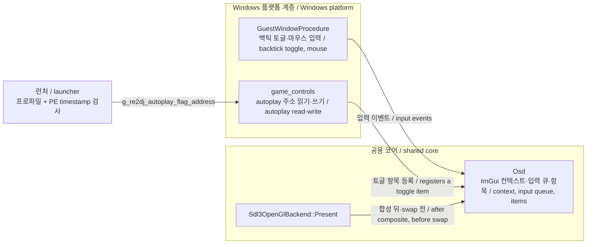

# 작업 297 설계 — Dear ImGui OSD와 autoplay 토글 / Task 297 design — Dear ImGui OSD with an autoplay toggle

선행: [작업 296 autoplay 쓰기 시험](../work-logs/20260917-296-autoplay-write-test.md)
분석: [EZ2DJ 3rd 데모 플레이와 설정 레지스트리](../analysis/ez2dj3rd-demo-play.md)

## 한국어

### 요구사항

* Dear ImGui로 OSD를 만든다.
* OSD는 **기본으로 꺼져 있고**, 백틱(`` ` ``) 키를 누를 때마다 켜지고 꺼진다.
* 타깃 프로파일이 `ez2dj3rd`일 때 OSD에 autoplay 상태를 보여 주고 토글할 수 있게 한다.

### 근거가 되는 확인 사실

| 사실 | 출처 | 상태 |
| --- | --- | --- |
| `[0x00a29508]`을 1로 쓰면 게임이 노트를 친다 | 작업 296 쓰기 시험 | 확인됨 |
| 값은 **곡 시작 때 고정**되어 도중 변경은 다음 곡부터 반영된다 | 작업 296 | 확인됨 |
| 데모 부작용이 없다 | 작업 296 사용자 관찰 | 확인됨 |
| 이 주소는 TimeDateStamp `0x3bca98a3` 빌드 전용이다 | 작업 295 | 확인됨 |
| 게임 자신도 입력 슬롯 `0x1b`로 이 값을 뒤집는다 | 작업 295 | 확인됨 (물리 바인딩 미확정) |

### 원칙 검토

AGENTS.md는 원본 게임 로직 보존을 최우선으로 한다. 이 기능은 게임 로직을 새로 쓰지 않고, **게임이 이미 갖고 있고 스스로도 토글하는 플래그 하나**의 값을 바꾼다. 판정·연출은 전부 원본 코드가 수행한다. 원본 실행 파일의 코드 바이트도 바꾸지 않는다. 따라서 원칙과 충돌하지 않는다고 판단한다.

### 전체 구조



### 설계

#### 1. 서드파티 — Dear ImGui

* 저장소: `https://github.com/ocornut/imgui`, 태그 `v1.92.9`를 고정 commit으로 FetchContent 한다. SDL3·SDL_mixer와 같은 방식이다.
* 라이선스: MIT. 허용 라이선스이므로 AGENTS.md 정책과 맞는다. 구현 시 받은 소스의 `LICENSE.txt`를 확인하고 `THIRD_PARTY_NOTICES.md`에 추가한다.
* 쓰는 파일: 코어(`imgui.cpp`, `imgui_draw.cpp`, `imgui_tables.cpp`, `imgui_widgets.cpp`)와 렌더러 backend `imgui_impl_opengl3.cpp`. **플랫폼 backend(`imgui_impl_win32`, `imgui_impl_sdl3`)는 쓰지 않는다.** 이유는 3절.
* `re2dj_imgui` 정적 라이브러리로 묶는다.

#### 2. 렌더링 — backend의 Present에 overlay 지점을 연다

`Sdl3OpenGlBackend::Present`는 640×480 게스트 렌더 타깃을 창 크기로 합성한 뒤 `SDL_GL_SwapWindow`를 부른다. **합성 직후, swap 직전**에 overlay 콜백을 부르게 한다.

* OSD는 게스트 이미지에 섞이지 않고 창 픽셀 크기에 그려진다. 배율(기본 2배)과 무관하게 글자가 선명하다.
* backend는 ImGui를 모른다. `graphics::PresentOverlay` 같은 작은 인터페이스만 받는다. OSD가 없으면 동작이 지금과 같다.
* 컨텍스트는 OpenGL 2.1 compatibility(웹은 GLES 2.0)다. `imgui_impl_opengl3`은 GLSL 버전 문자열로 GL 2.x와 GLES 2.0을 지원하므로 `"#version 120"`(웹 `"#version 100"`)으로 초기화한다. GL 2.1에서 VAO 없이 동작하는지는 **구현 시 실제 실행으로 확인**한다.
* OSD가 꺼져 있으면 ImGui 프레임을 만들지 않는다. 비용이 0에 가깝다.

#### 3. 입력 — 플랫폼 backend 대신 직접 공급한다

ImGui의 플랫폼 backend를 쓰지 않고, 공용 `Osd`가 작은 입력 큐를 받아 `ImGuiIO::AddMousePosEvent`, `AddMouseButtonEvent`, `AddKeyEvent`로 넣는다.

* `imgui_impl_sdl3`은 SDL 이벤트가 필요한데 현재 `Present`가 SDL 이벤트를 비우고 있고, SDL 창은 게스트 HWND를 감싼 것이라 메시지 소유권이 게스트에 있다.
* `imgui_impl_win32`는 Windows 전용이라 공용 코어에 둘 수 없다.
* 직접 공급하면 공용 코어는 플랫폼 API를 부르지 않고, 각 플랫폼은 자기 방식으로 큐만 채우면 된다. 이번 작업은 Windows만 채운다.

Windows에서는 기존 `GuestWindowProcedure`가 다음을 처리한다.

| 메시지 | 처리 |
| --- | --- |
| `WM_KEYDOWN` 백틱(`VK_OEM_3`), 반복 제외 | OSD 표시 토글. 게스트에 전달하지 않는다 |
| 마우스 이동·버튼 (OSD가 켜져 있을 때) | 클라이언트 좌표를 창 픽셀 좌표로 바꿔 큐에 넣는다 |

창 프로시저와 `Present`가 다른 스레드일 수 있으므로 큐는 SRW lock으로 보호한다.

**게임 입력과의 관계.** 게임은 키 상태를 `GetAsyncKeyState`로 직접 읽으므로 창 프로시저에서 메시지를 삼켜도 게임 입력을 막을 수는 없다. 그래서 OSD 단축키는 게임이 쓰지 않는 키여야 하고, 백틱은 예제 `config/ez2dj-io.example.ini`에 쓰이지 않는다. 마우스는 게임이 쓰지 않으므로 OSD 조작이 게임에 영향을 주지 않는다.

#### 4. 게임 제어 — 프로파일 선언과 빌드 검사

주소를 런타임에 하드코딩하지 않는다. 프로파일이 선언하고, 런처가 실제 실행 파일을 검사한 뒤에만 런타임에 넘긴다.

| 계층 | 내용 |
| --- | --- |
| 프로파일 (`ez2dj3rd`) | `game_controls.autoplay_flag_rva = 0x00629508`, `game_controls.build_timestamp = 0x3bca98a3` |
| 런처 | 실행 파일 PE `timestamp`가 선언값과 **같을 때만** `g_re2dj_autoplay_flag_address = image_base + rva`를 쓴다. 다르면 쓰지 않고 진단에 남긴다 |
| 주입 런타임 | 주소가 0이 아니면 OSD에 autoplay 토글 항목을 등록한다. 읽기·쓰기는 같은 프로세스 안의 4바이트 접근이다 |

다른 빌드에서 잘못된 주소에 쓰는 일을 구조적으로 막기 위한 것이다. 같은 이름의 3rd라도 빌드가 다르면 항목이 나타나지 않는다.

#### 5. OSD 화면

```
┌ re2DJ ─────────────────────────┐
│ ez2dj3rd                       │
│ [x] Autoplay                   │
│     다음 곡부터 적용 / next song │
└────────────────────────────────┘
```

* 체크박스는 매 프레임 실제 메모리 값을 읽어 표시한다. 게임 자신의 슬롯 `0x1b` 토글이나 데모가 값을 바꿔도 화면이 따라간다.
* "곡 시작 때 고정된다"는 작업 296의 결과를 문구로 알린다.
* 항목이 하나도 없는 프로파일에서는 타깃 이름만 보인다.

### 구현 중 바뀐 것

사용자 확인을 거치며 다음이 바뀌었다. 아래 절의 원래 서술보다 이 목록이 우선한다.

* **키 입력은 호스트 창 프로시저에서 받는다.** 게스트 창은 우리 호스트 창의 `WS_CHILD`이고 키보드 포커스는 최상위 호스트 창에 있다. 게스트 창 프로시저에만 연결한 첫 빌드에서는 키 메시지가 한 건도 도착하지 않았다. 마우스는 게스트 영역 위에서 게스트 창으로 가므로 게스트 쪽 연결을 유지한다.
* **OSD 내용은 정보 세 줄과 토글이다.** 제목 한 줄과 "다음 곡부터 적용" 문구 대신 `re2DJ v{버전} {빌드 날짜}`, `Target Profile : {id}`, `Executable : {파일 이름}`을 보이고, autoplay 토글은 무장됐을 때만 구분선 아래에 둔다. 버전·날짜는 창 제목과 같은 값이다.
* **OSD는 창 폭 전체를 채운다.** 왼쪽 위에 고정하고 너비를 창 폭으로 제한하며 높이는 내용에 맞춘다. 이동과 크기 조절은 막는다.
* **글자 크기는 논리 배율의 0.75배다.** 기본 2배 창에서 1.5배.
* **마우스 커서를 항상 보이게 한다.** 3rd는 `ShowCursor`/`SetCursor`로 커서를 숨긴다. 클라이언트 영역의 `WM_SETCURSOR`에서 화살표 커서를 설정하고, 창 스레드의 표시 카운트가 음수면 되돌린다. 커서는 게임 로직이 아니라 창 표시이므로 이 경계에서 처리한다.

### 파일 배치

| 파일 | 책임 |
| --- | --- |
| `CMakeLists.txt` | ImGui FetchContent, `re2dj_imgui` |
| `include/re2dj/graphics/present_overlay.h` | backend가 받는 overlay 인터페이스 |
| `src/graphics/sdl3_opengl_backend.cpp` | Present에서 overlay 호출 |
| `include/re2dj/ui/osd.h`, `src/ui/osd.cpp` | 공용 OSD: ImGui 컨텍스트, 표시 상태, 입력 큐, 토글 항목 |
| `src/platform/windows/host_window_shell.cpp` | 백틱과 마우스를 OSD 큐로 |
| `src/platform/windows/game_controls.h/.cpp` | autoplay 주소 전역과 토글 항목 등록 |
| `include/re2dj/target/target_profile.h`, `src/target/target_profile.cpp` | `game_controls` 선언과 3rd 값 |
| 런처 probe | timestamp 검사와 전역 쓰기 |
| `THIRD_PARTY_NOTICES.md` | Dear ImGui 추가 |

### 검증 계획

* 빌드: Windows x86 Debug·Release. 공용 OSD가 플랫폼 API를 쓰지 않는지 확인한다.
* 단위 테스트: 프로파일 `game_controls` 값, timestamp 불일치 시 주소를 넘기지 않는 판정.
* 실행 (사용자 조작):
  1. 시작 시 OSD가 보이지 않는다.
  2. 백틱으로 켜고 끈다. 게임 입력에 영향이 없다.
  3. 곡 선택 화면에서 체크하고 곡을 시작하면 autoplay가 된다.
  4. 데모가 돌면 체크박스가 1로 따라간다.
* 프레임 비용: OSD를 끈 상태의 present 비용이 작업 289의 기준과 같은지 `present-interval`로 확인한다.

### 비목표

* 3rd 외 타깃의 autoplay. 빌드별 주소 확인이 먼저다.
* Linux·Web 입력 공급. 공용 OSD는 빌드되지만 입력은 Windows만 채운다.
* 키보드로 OSD 항목 조작. 마우스로 한다.
* 슬롯 `0x1b`의 물리 바인딩.

### 미확정

* `imgui_impl_opengl3`이 이 GL 2.1 compatibility 컨텍스트에서 VAO 없이 문제없이 그리는지.
* 게스트 창 프로시저와 `Present`가 같은 스레드인지. 다르더라도 lock으로 처리하지만 실제 구성을 확인한다.

## English

Prerequisite: [Task 296, autoplay write test](../work-logs/20260917-296-autoplay-write-test.md)
Analysis: [EZ2DJ 3rd demo play and the settings registry](../analysis/ez2dj3rd-demo-play.md)

### Requirements

* Build an OSD with Dear ImGui.
* The OSD is **off by default** and toggles each time the backtick (`` ` ``) key is pressed.
* When the target profile is `ez2dj3rd`, the OSD shows the autoplay state and lets it be toggled.

### Facts this rests on

Writing `1` to `[0x00a29508]` makes the game hit notes, the value is **latched at song start** so a mid-song change applies from the next song, and no demo side effects appear — all confirmed by task 296. The address belongs only to the TimeDateStamp `0x3bca98a3` build, and the game flips the same value itself through input slot `0x1b` — both confirmed by task 295, the slot's physical binding unresolved.

### Principle check

AGENTS.md puts preserving original game logic first. This feature writes no game logic: it changes **one flag the game already has and toggles itself**, while every judgement and effect is still performed by the original code, and no code byte of the original executable changes. It is judged not to conflict.

### Design

#### 1. Third party — Dear ImGui

Fetched with FetchContent from `https://github.com/ocornut/imgui` at tag `v1.92.9` pinned to its commit, as SDL3 and SDL_mixer are. It is MIT-licensed, a permissive license consistent with the AGENTS.md policy; the fetched `LICENSE.txt` is checked during implementation and added to `THIRD_PARTY_NOTICES.md`. The core (`imgui.cpp`, `imgui_draw.cpp`, `imgui_tables.cpp`, `imgui_widgets.cpp`) and the renderer backend `imgui_impl_opengl3.cpp` are built as a `re2dj_imgui` static library. **No platform backend (`imgui_impl_win32`, `imgui_impl_sdl3`) is used**, for the reasons in section 3.

#### 2. Rendering — an overlay point in the backend's Present

`Sdl3OpenGlBackend::Present` composites the 640×480 guest render target to the window and then calls `SDL_GL_SwapWindow`. An overlay callback is invoked **right after compositing and right before the swap**. The OSD therefore draws at window pixel size, separate from the guest image and sharp at any scale. The backend does not know ImGui: it takes only a small `graphics::PresentOverlay` interface, and without an OSD behaves exactly as today. The context is OpenGL 2.1 compatibility (GLES 2.0 on the web); `imgui_impl_opengl3` supports GL 2.x and GLES 2.0 through its GLSL version string, so it is initialized with `"#version 120"` (`"#version 100"` on the web), and whether it draws correctly on GL 2.1 without VAOs is **verified by an actual run during implementation**. When the OSD is off no ImGui frame is built, so the cost is close to zero.

#### 3. Input — fed directly instead of through a platform backend

The shared `Osd` accepts a small input queue and feeds it through `ImGuiIO::AddMousePosEvent`, `AddMouseButtonEvent` and `AddKeyEvent`. `imgui_impl_sdl3` needs SDL events, but `Present` currently drains them and the SDL window wraps the guest's HWND, whose messages the guest owns; `imgui_impl_win32` is Windows-only and cannot live in the shared core. Feeding directly keeps platform APIs out of the shared core and lets each platform fill the queue its own way; this task fills it on Windows only.

On Windows the existing `GuestWindowProcedure` toggles the OSD on a non-repeat `WM_KEYDOWN` of backtick (`VK_OEM_3`), not passing it to the guest, and while the OSD is visible converts mouse moves and buttons from client coordinates to window pixels and queues them. The window procedure and `Present` may run on different threads, so the queue is guarded by an SRW lock.

**Relationship to game input.** The game reads key state directly with `GetAsyncKeyState`, so swallowing a message in the window procedure cannot hide a key from the game. The OSD key must therefore be one the game does not use, and backtick is unused in the example `config/ez2dj-io.example.ini`. The game does not use the mouse, so operating the OSD does not affect the game.

#### 4. Game control — declared by the profile, checked against the build

The address is never hardcoded in the runtime. The `ez2dj3rd` profile declares `game_controls.autoplay_flag_rva = 0x00629508` and `game_controls.build_timestamp = 0x3bca98a3`; the launcher writes `g_re2dj_autoplay_flag_address = image_base + rva` **only when the executable's PE `timestamp` equals the declared value**, recording a diagnostic otherwise; and the injected runtime registers an autoplay toggle item with the OSD when that address is non-zero, reading and writing four bytes inside its own process. This structurally prevents writing a wrong address in a different build: a different 3rd build simply shows no item.

#### 5. The OSD

A small window titled `re2DJ` shows the target id and an `Autoplay` checkbox with a "applies from the next song" note. The checkbox reads the real memory value every frame, so it follows the game's own slot `0x1b` toggle and the demo. A profile with no items shows only the target name.

### Verification plan

* Build: Windows x86 Debug and Release, checking that the shared OSD uses no platform API.
* Unit tests: the profile's `game_controls` values, and the decision not to pass the address on a timestamp mismatch.
* Run, driven by the user: the OSD is hidden at start; backtick shows and hides it without affecting game input; ticking it at song select and starting a song gives autoplay; the checkbox follows the value to 1 when a demo runs.
* Frame cost: with the OSD off, present cost matches task 289's baseline in `present-interval`.

### Changed during implementation

These changed through the user's checks and take precedence over the original text of the sections above.

* **Keys are received in the host window procedure.** The guest window is a `WS_CHILD` of our host window and keyboard focus stays on the top-level host; the first build, hooked only to the guest window procedure, received no key message at all. Mouse messages over the guest area go to the guest window, so that hook stays.
* **The OSD shows three information lines and the toggle.** Instead of a title line and a "applies from the next song" note it shows `re2DJ v{version} {build date}`, `Target Profile : {id}` and `Executable : {file name}`, with the autoplay toggle below a separator only when armed. Version and date match the window title.
* **The OSD spans the full window width**, pinned top-left with its width constrained to the window and its height following the content; moving and resizing are disabled.
* **Font size is 0.75 of the logical scale**, 1.5 on the default 2× window.
* **The mouse cursor stays visible.** 3rd hides it through `ShowCursor` and `SetCursor`. `WM_SETCURSOR` over the client area sets the arrow cursor and brings the window thread's display count back up if it went negative; the cursor is window presentation rather than game logic, so this boundary handles it.

### Non-goals

* Autoplay on targets other than 3rd, which needs per-build address confirmation first.
* Linux and Web input feeding: the shared OSD builds there, but only Windows fills the input.
* Operating OSD items from the keyboard; the mouse does it.
* Slot `0x1b`'s physical binding.

### Unresolved

* Whether `imgui_impl_opengl3` draws correctly without VAOs on this GL 2.1 compatibility context.
* Whether the guest window procedure and `Present` share a thread; a lock covers either case, but the actual arrangement is to be checked.
