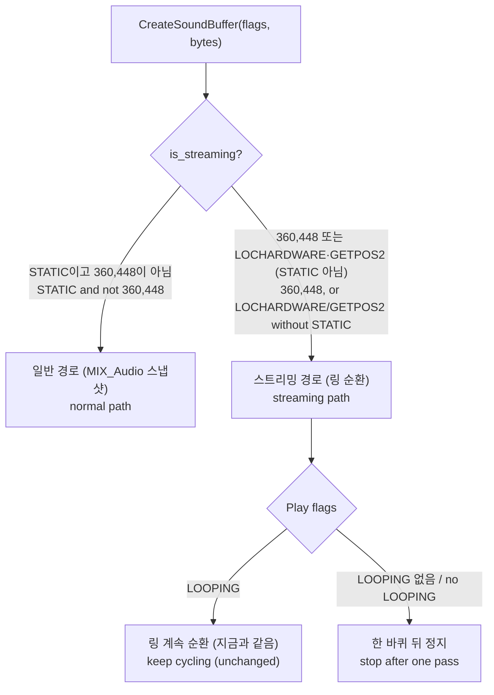

# 작업 303 설계 — 일회성 DirectSound 버퍼의 스트리밍 오분류 / Task 303 design — One-shot DirectSound buffers misclassified as streaming

선행: [작업 302 1st SE autoplay](../work-logs/20260918-302-ez2dj1stse-autoplay-hunt.md), [작업 189 4th DirectSound HLE](20260905-189-ez2dj4th-directsound-hle.md), [작업 083 스트리밍 링 버퍼](20260828-083-directsound-streaming-ring-buffer.md)

## 한국어

### 증상

`ez2dj1stse`에서 동전 효과음 같은 소리가 끝없이 반복된다. autoplay와 무관하게 재현된다(사용자 확인, 작업 302).

### 확인된 사실

**버퍼 생성 플래그.** 기존 `--audio-volume-trace` 로그를 타깃별로 대조했다.

| 타깃 | 링 버퍼 (360,448 바이트) | 일회성 효과음 버퍼 | 현재 효과음 분류 |
| --- | --- | --- | --- |
| `ez2dj1stse` | `0x140c6` (LOCHARDWARE·STATIC·GETCURRENTPOSITION2 등) | **`0x140e2`** (STATIC·GETCURRENTPOSITION2 등) | **스트리밍** |
| `ez2dj4th` | `0x140c0` (GETCURRENTPOSITION2 등) | `0x40e0` (GETCURRENTPOSITION2 없음) | 일반 |
| `ez2d2m` | `0x140c0` | `0x40c0` (GETCURRENTPOSITION2 없음) | 일반 |

**재생 플래그.** 같은 로그의 `Play` 호출이다.

| 타깃 | 링 버퍼 재생 | 일회성 버퍼 재생 |
| --- | --- | --- |
| `ez2dj1stse` | `looping=1` 3회 | `looping=0` 6회 |
| `ez2dj4th` | `looping=1` 2회 | — |
| `ez2d2m` | `looping=1` 83회 | `looping=0` 178회 |

관찰된 모든 링 버퍼는 반복 재생이고, 모든 일회성 버퍼는 반복 없이 재생된다.

**분류 규칙의 경위.** 작업 083의 규칙은 `LOCHARDWARE`였다. 작업 189가 4th의 링 버퍼(`0x140c0`, LOCHARDWARE 없음)를 잡기 위해 `GETCURRENTPOSITION2` 또는 크기 360,448을 추가했다. 1st SE는 효과음에도 `GETCURRENTPOSITION2`를 붙이므로 이때부터 효과음이 스트리밍으로 분류됐다.

```cpp
return (flags_ & (DSBCAPS_LOCHARDWARE | DSBCAPS_GETCURRENTPOSITION2)) != 0 ||
       buffer_.byte_count() == 360448;
```

**스트리밍 경로는 반복 여부를 무시한다.** `Sdl3MixerAudioBackend::Play`는 스트리밍이면 SDL 스트림 콜백이 링을 순환해 읽게 하고 `MIX_PROP_PLAY_HALT_WHEN_EXHAUSTED_BOOLEAN = false`로 재생한다. `buffer.looping()`은 스트리밍이 아닐 때만 `MIX_PROP_PLAY_LOOPS_NUMBER`에 반영된다. 따라서 반복 없이 재생한 버퍼도 스트리밍으로 분류되면 끝나지 않는다.

**DirectSound의 의미.** `IDirectSoundBuffer::Play`에 `DSBPLAY_LOOPING`이 없으면 버퍼는 끝에 도달했을 때 멈춘다. 생성 플래그와 무관하다.

근거는 DirectX SDK의 `IDirectSoundBuffer::Play`(`DSBPLAY_LOOPING`)와 `DSBUFFERDESC`(`DSBCAPS_STATIC`) 설명이다. 구현 시 Microsoft Learn의 해당 페이지 링크를 확인해 `docs/kb/legacy-directsound-buffer.md`에 추가한다.

### 설계

두 층을 함께 고친다. 하나는 분류, 하나는 의미다.



#### 1. 분류 — `DSBCAPS_STATIC` 일회성 버퍼를 스트리밍에서 뺀다

```cpp
const bool ring_size = buffer_.byte_count() == 360448;
const bool position_flags = (flags_ & (DSBCAPS_LOCHARDWARE | DSBCAPS_GETCURRENTPOSITION2)) != 0;
return ring_size || (position_flags && (flags_ & DSBCAPS_STATIC) == 0);
```

* 1st SE 효과음 `0x140e2`: STATIC이고 360,448이 아니므로 **일반 경로**로 간다. 4th·`ez2d2m` 효과음이 이미 쓰는 검증된 경로다.
* 1st SE·3rd 링 버퍼 `0x140c6`: STATIC이지만 크기 규칙으로 **스트리밍 유지**.
* 4th·`ez2d2m` 링 버퍼 `0x140c0`: 크기 규칙과 플래그 규칙 둘 다로 **스트리밍 유지**.

#### 2. 의미 — 스트리밍 경로가 `DSBPLAY_LOOPING`을 따른다

스트리밍 버퍼가 반복 없이 재생되면 시작 위치부터 링 한 바퀴를 내보낸 뒤 더 공급하지 않고, 상태 조회(`GetStatus`)와 재생 위치가 정지를 보고한다. 반복 재생이면 지금과 같다.

1절만으로 증상은 사라지지만, 2절이 없으면 분류 규칙이 다시 어긋나는 순간 같은 증상이 돌아온다. 관찰된 링 버퍼 재생은 모두 반복 재생이므로 2절은 기존 타깃의 동작을 바꾸지 않는다.

### 영향 범위

| 타깃 | 1절 영향 | 2절 영향 |
| --- | --- | --- |
| `ez2dj1stse` | 효과음이 일반 경로로 이동 — **의도한 변경** | 없음(링은 반복 재생) |
| `ez2dj4th`, `ez2d2m` | 없음(효과음에 GETPOS2 없음, 링에 STATIC 없음) | 없음 |
| `ez2dj1st`, `ez2dj2nd`, `ez2dj3rd`, `ez2dj5th`, `ez2dj6th` | **미확정** — 오디오 로그가 없다 | 반복 없이 재생되는 스트리밍 버퍼가 있으면 그 버퍼가 끝에서 멈춘다 |

미확정 타깃은 검증 단계에서 로그를 수집해 확정한다. 3rd는 링 플래그가 1st SE와 같으므로(작업 083) 효과음도 `0x140e2`일 가능성이 있고, 그렇다면 같은 증상이 이미 있을 것이다.

### 검증 계획

1. **변경 전 수집.** 실행 가능한 모든 타깃(`ez2dj1st`, `ez2dj1stse`, `ez2dj2nd`, `ez2dj3rd`, `ez2dj4th`, `ez2dj5th`, `ez2d2m`)을 `--audio-volume-trace`로 실행해 버퍼 생성·재생 플래그를 표로 만든다. 표가 위 가정과 어긋나면 구현 전에 설계를 고친다.
2. **단위 테스트.** 분류 규칙을 플랫폼 공용 함수로 빼서 표의 플래그 조합마다 기대 분류를 검사한다. 스트리밍 경로의 한 바퀴 정지를 `re2dj_audio_stream_progress_test`에 추가한다.
3. **변경 후 수집.** 같은 타깃을 다시 실행해 분류만 의도대로 바뀌었는지 비교한다.
4. **사용자 청취.** 1st SE 효과음 반복이 사라졌는지, 4th·5th·`ez2d2m` JAM 배경음이 이전처럼 끊김 없이 나오는지.

오디오 로그가 4,096줄에서 잘리는 한계가 있으므로, 수집은 타깃을 켠 직후부터 어트랙트·곡 선택 구간까지로 짧게 잡는다.

### 비목표

* 360,448 크기 규칙을 없애는 것. 관찰된 링 버퍼를 모두 설명하는 가장 확실한 기준이라 유지한다.
* 오디오 로그 줄 수 제한 변경.
* `ez2dj6th` 자식 프로세스 오디오.

### 검증 뒤 정정 (구현 시 추가)

* **영향 범위.** 변경 전 수집 결과 위 표의 미확정 칸이 정해졌다. 영향을 받은 것은 1st SE와 **1st Tracks**(`ez2dj1st`, 효과음 `0x140c2`)이고, **3rd는 영향이 없었다.** 3rd의 링은 1st SE와 같은 `0x140c6`이 아니라 `0x140c0`이고 효과음은 `0x40e0`이다. 2nd·5th도 3rd와 같다. `ez2dj6th`는 비목표대로 수집하지 않았다.
* **`DSBCAPS_STATIC`의 의미.** 문서 확인 결과 이 플래그는 사운드 카드 메모리 배치 요청이며 "한 번만 재생"을 뜻하지 않는다. 1절 규칙은 관찰에 맞춘 휴리스틱으로 기록한다([KB](../kb/legacy-directsound-buffer.md)). 2절이 규칙 이탈에 대한 안전장치 역할을 한다.

## English

Prerequisites: [Task 302, 1st SE autoplay](../work-logs/20260918-302-ez2dj1stse-autoplay-hunt.md), [Task 189, 4th DirectSound HLE](20260905-189-ez2dj4th-directsound-hle.md), [Task 083, streaming ring buffer](20260828-083-directsound-streaming-ring-buffer.md)

### Symptom

In `ez2dj1stse` a coin-like sound effect repeats endlessly, independently of autoplay (user-confirmed, task 302).

### Confirmed facts

**Creation flags**, from the existing `--audio-volume-trace` logs: 1st SE rings are `0x140c6` and its one-shot effects **`0x140e2`** (STATIC with GETCURRENTPOSITION2), currently **classified streaming**; 4th rings are `0x140c0` with effects `0x40e0`, and `ez2d2m` rings `0x140c0` with effects `0x40c0` — neither effect flag has GETCURRENTPOSITION2, so both classify normal.

**Play flags** from the same logs: every ring play is `looping=1` (1st SE 3, 4th 2, `ez2d2m` 83) and every one-shot play `looping=0` (1st SE 6, `ez2d2m` 178).

**How the rule came about.** Task 083's rule was `LOCHARDWARE`. Task 189 added `GETCURRENTPOSITION2` or a size of 360,448 to catch 4th's ring (`0x140c0`, no LOCHARDWARE). 1st SE also puts `GETCURRENTPOSITION2` on its effects, so from then on they classified as streaming.

**The streaming path ignores looping.** For streaming, `Sdl3MixerAudioBackend::Play` has an SDL stream callback cycle through the ring and plays with `MIX_PROP_PLAY_HALT_WHEN_EXHAUSTED_BOOLEAN = false`; `buffer.looping()` reaches `MIX_PROP_PLAY_LOOPS_NUMBER` only when not streaming. A buffer played without looping but classified streaming therefore never ends.

**DirectSound semantics.** Without `DSBPLAY_LOOPING`, `IDirectSoundBuffer::Play` stops at the end of the buffer regardless of creation flags. The basis is the DirectX SDK description of `IDirectSoundBuffer::Play` (`DSBPLAY_LOOPING`) and `DSBUFFERDESC` (`DSBCAPS_STATIC`); the Microsoft Learn page links are to be verified during implementation and added to `docs/kb/legacy-directsound-buffer.md`.

### Design

Both layers are fixed together: classification and semantics.

#### 1. Classification — exclude `DSBCAPS_STATIC` one-shots from streaming

Streaming becomes "size 360,448, or `LOCHARDWARE`/`GETCURRENTPOSITION2` without `STATIC`". 1st SE effects (`0x140e2`) move to the normal path 4th and `ez2d2m` effects already use; 1st SE/3rd rings (`0x140c6`) stay streaming by size; 4th/`ez2d2m` rings (`0x140c0`) stay streaming by both rules.

#### 2. Semantics — the streaming path honors `DSBPLAY_LOOPING`

A streaming buffer played without looping delivers one pass of the ring from its start position and then stops feeding, with `GetStatus` and the play position reporting it stopped; looping plays are unchanged. Section 1 alone removes the symptom, but without section 2 the symptom returns the moment classification drifts again. Every observed ring play is looping, so section 2 changes no existing target's behavior.

### Impact

For `ez2dj1stse`, section 1 moves effects to the normal path — the intended change — and section 2 changes nothing (rings loop). For `ez2dj4th` and `ez2d2m`, neither section changes anything (effects lack GETPOS2, rings lack STATIC). For `ez2dj1st`, `ez2dj2nd`, `ez2dj3rd`, `ez2dj5th` and `ez2dj6th` the impact is **unresolved**, since no audio logs exist; any non-looping streaming play there would stop at its end under section 2. Verification collects those logs first. 3rd shares 1st SE's ring flags (task 083), so its effects may also be `0x140e2`, in which case it already has the symptom.

### Verification plan

1. **Collect before changing.** Run every runnable target (`ez2dj1st`, `ez2dj1stse`, `ez2dj2nd`, `ez2dj3rd`, `ez2dj4th`, `ez2dj5th`, `ez2d2m`) with `--audio-volume-trace` and tabulate creation and play flags; if the table contradicts the assumptions above, revise the design before implementing.
2. **Unit tests.** Move the classification rule into a platform-neutral function and check the expected classification for each flag combination in the table; add the one-pass stop to `re2dj_audio_stream_progress_test`.
3. **Collect after changing** and compare, confirming only the intended classifications changed.
4. **User listening.** The 1st SE repeat is gone, and 4th, 5th and `ez2d2m` JAM backgrounds play as seamlessly as before.

Audio logs stop at 4,096 lines, so each collection covers only start-up through attract and song select.

### Non-goals

* Dropping the 360,448 size rule, the surest criterion covering every observed ring.
* Changing the audio log line limit.
* `ez2dj6th` child-process audio.

### Corrections after verification (added during implementation)

* **Impact.** The before-change collection settled the unresolved rows: 1st SE and **1st Tracks** (`ez2dj1st`, effects `0x140c2`) were affected, and **3rd was not**. Its rings are `0x140c0`, not 1st SE's `0x140c6`, with effects `0x40e0`, as in 2nd and 5th. `ez2dj6th` was not collected, as a non-goal.
* **What `DSBCAPS_STATIC` means.** The documentation defines it as a request for on-board sound card memory, not a promise of one-shot playback. Section 1's rule is recorded as a heuristic fitted to observation ([KB](../kb/legacy-directsound-buffer.md)), with section 2 as the safeguard should it drift.
