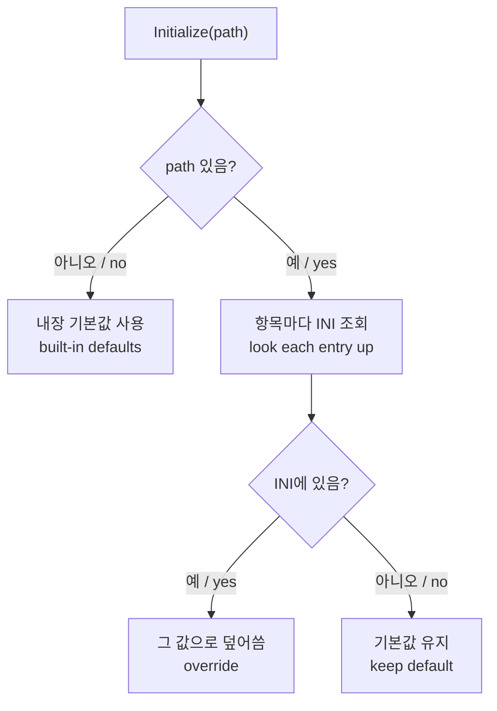

# 작업 306 설계 — 기본 키 매핑 내장과 `--io-config` 덮어쓰기 / Task 306 design — Built-in key mapping with `--io-config` as an override

선행: [작업 267 EZ2Dancer coin 입력 바인딩](20260913-267-ez2dancer-coin-binding.md), [키보드 입력 가이드](../guides/windows-x86-runtime.md)

## 한국어

### 문제

지금은 `--io-config <ini>`를 주어야만 키보드 입력이 동작한다. 주입 런타임은 `g_re2dj_io_config_path`가 비어 있으면 키보드 입력을 초기화하지 않고, 초기화할 때도 INI에 없는 항목은 `NONE`(바인딩 없음)이 된다. 그래서 옵션 없이 실행하면 게임에 아무 입력도 들어가지 않고, 저장소의 예제 INI 두 개는 사실상 필수 파일이다.

### 목표

* 옵션 없이 실행해도 예제 INI와 같은 키 매핑이 동작한다. INI 파일은 필요 없다.
* `--io-config`를 주면 그 파일에 **적힌 항목만** 기본값을 덮어쓴다. 적지 않은 항목은 기본값을 유지한다.
* 기본값과 예제 INI가 어긋나지 않도록 테스트로 묶는다.

### 확인된 현재 구조

| 경계 | 지금 동작 |
| --- | --- |
| CLI `--io-config` | 절대 경로로 정규화. legacy I/O가 없는 프로파일이면 경고 후 무시 |
| `original_process_backend` | 경로가 있을 때만 런처 인자에 `--io-config`를 붙임 |
| 런처 probe | 경로가 있을 때만 주입 런타임의 `g_re2dj_io_config_path`에 씀. `--io-config`는 detached 또는 follow-child 실행에서만 허용 |
| 주입 런타임 | port read 트랩에서 `g_re2dj_io_config_path[0] != '\0'`일 때만 키보드 입력을 초기화·폴링 |
| `Ez2DjKeyboardInput` / `Ez2DancerKeyboardInput` | `Initialize(path, error)`가 항목마다 `GetPrivateProfileStringA(..., "NONE", ...)`로 읽음. 없으면 바인딩 없음 |

키 이름 문자열은 `keyboard_input_common.cpp`의 `ParseKey` 하나가 해석한다.

### 설계

#### 1. 기본값을 바인딩 표에 함께 둔다

각 입력 클래스의 바인딩 표에 기본 키 **이름**을 추가한다. 값이 아니라 이름을 두는 이유는, 기본값도 INI 값과 똑같이 `ParseKey`를 통과시켜 해석 경로를 하나로 유지하기 위해서다.

```cpp
struct ButtonBinding
{
    const char* name;
    re2dj::input::Ez2DjButton button;
    const char* default_key;  // "Z", "NUMPAD1", "NONE" …
};
```

턴테이블 네 항목과 `step`(기본 4)도 같은 방식으로 기본값을 갖는다. 값은 `config/ez2dj-io.example.ini`와 `config/ez2dancer-io.example.ini`의 현재 내용을 그대로 옮긴다.

#### 2. `Initialize`는 경로를 선택 인자로 받는다



* 경로가 없거나 비어 있으면 모든 항목이 기본값이다. 성공으로 끝난다.
* 경로가 있으면 항목마다 INI를 조회한다. **항목이 없으면 기본값을 유지**한다. 지금처럼 `NONE`으로 떨어지지 않는다.
* `NONE`이라고 **적혀 있으면** 그 항목만 바인딩 없음이다. 기본 키를 끄고 싶을 때 쓴다.
* 알 수 없는 키 이름은 지금처럼 오류다.

"항목 없음"은 `GetPrivateProfileStringA`의 기본값 인자에 보통 키 이름으로 나올 수 없는 표식을 넘겨 구분한다. 이 판정은 `ReadKeyboardKeyBinding`을 바꿔 한 곳에 둔다.

```cpp
// 반환: 오류 없음. *present 로 INI에 항목이 있었는지 알린다.
bool ReadKeyboardKeyBinding(const char* path, const char* section, const char* name,
                            int* key, bool* present, std::string* error);
```

#### 3. 주입 런타임이 경로 없이도 초기화한다

port read 트랩의 조건에서 경로 요구를 뺀다. 경로가 있으면 넘기고, 없으면 `nullptr`을 넘긴다. legacy I/O 트랩이 걸리는 실행은 곧 이 게임 입력이 필요한 실행이므로 별도 스위치는 두지 않는다. 진단 로그의 `io-config` 상태 문자열에 `source=default` 또는 `source=file`을 더해 어느 쪽인지 남긴다.

런처 probe와 CLI는 그대로다. 경로가 없으면 아무것도 쓰지 않고, 런타임이 기본값을 쓴다.

### 영향 범위

| 대상 | 영향 |
| --- | --- |
| 옵션 없이 실행 | **키 입력이 동작한다(의도한 변경).** 지금까지는 입력이 없었다 |
| `--io-config` 전체 INI | 모든 항목이 적혀 있으므로 지금과 같다 |
| `--io-config` 일부 INI | 적지 않은 항목이 **바인딩 없음에서 기본값으로 바뀐다.** 끄려면 `NONE`을 적어야 한다 |
| legacy I/O 없는 프로파일 | 그대로. 트랩 자체가 없다 |
| Linux·Web | 그대로. 이 경로는 Windows 전용이다 |

### 검증 계획

1. **단위 테스트**
   * 경로 없이 초기화하면 성공하고, 예제 INI로 초기화한 결과와 **모든 항목이 같다**. 기본값과 예제 파일이 어긋나면 실패한다.
   * 항목 하나만 적은 INI로 초기화하면 그 항목만 바뀌고 나머지는 기본값이다.
   * `NONE`을 적은 항목은 바인딩이 없다.
   * 알 수 없는 키 이름은 여전히 오류다.
   * 두 게임(EZ2DJ·EZ2Dancer) 모두에 대해 검사한다.
2. **실행 확인.** `--io-config` 없이 `ez2dj3rd`를 실행해 코인·시작·키 입력이 동작하는지 사용자와 확인한다. 예제 INI를 준 실행이 기존과 같은지도 확인한다.

### 비목표

* 키 이름 문법 확장(`ParseKey`는 그대로).
* 게임패드나 재매핑 UI.
* 프로파일별로 다른 기본 매핑(EZ2DJ 계열 하나, EZ2Dancer 하나로 충분하다).
* 예제 INI 파일 삭제. 덮어쓰기 예시로 남긴다.

## English

Prerequisites: [Task 267, EZ2Dancer coin input binding](20260913-267-ez2dancer-coin-binding.md), [the Windows runtime guide](../guides/windows-x86-runtime.md)

### Problem

Keyboard input works only when `--io-config <ini>` is passed: the injected runtime skips keyboard initialization while `g_re2dj_io_config_path` is empty, and any entry missing from the INI becomes `NONE` (unbound). Running without the option therefore delivers no input at all, which makes the two example INIs effectively mandatory files.

### Goals

Running with no option gives the same mapping as the example INIs, with no INI file needed; `--io-config` overrides **only the entries it lists**, leaving the rest at their defaults; and a test ties the built-in defaults to the example files so the two cannot drift apart.

### Current structure (confirmed)

The CLI normalizes `--io-config` to an absolute path and ignores it, with a note, for profiles without legacy I/O. `original_process_backend` forwards the option only when a path is set, and the launcher probe writes `g_re2dj_io_config_path` only then, accepting `--io-config` only for detached or follow-child runs. In the injected runtime, the port-read trap initializes and polls keyboard input only while that path is non-empty. Both input classes read every entry with `GetPrivateProfileStringA(..., "NONE", ...)`, so a missing entry is unbound. One function, `ParseKey` in `keyboard_input_common.cpp`, interprets every key name.

### Design

**1. Defaults live in the binding table.** Each binding entry gains a default key *name* rather than a value, so defaults pass through `ParseKey` exactly as INI values do and there is one interpretation path. The turntable entries and `step` (default 4) gain defaults the same way, copied from today's `config/ez2dj-io.example.ini` and `config/ez2dancer-io.example.ini`.

**2. `Initialize` takes the path as optional.** With no path every entry is its default and initialization succeeds. With a path, each entry is looked up: **an entry missing from the INI keeps its default** instead of falling back to `NONE`, an entry written as `NONE` unbinds that one key, and an unknown key name is still an error. "Missing" is distinguished by passing a marker no key name can produce as `GetPrivateProfileStringA`'s default, decided in one place inside `ReadKeyboardKeyBinding`, which gains a `bool* present` output.

**3. The injected runtime initializes without a path.** The port-read trap drops its path requirement and passes `nullptr` when no path was written. A run that traps legacy I/O is a run that needs this input, so no separate switch is added; the diagnostic `io-config` status string gains `source=default` or `source=file`. The launcher probe and CLI are unchanged: with no path they write nothing and the runtime uses its defaults.

### Impact

Running with no option **now delivers key input — the intended change**. A complete INI behaves as before. A partial INI changes meaningfully: entries it omits move from unbound to the built-in default, and unbinding now requires writing `NONE`. Profiles without legacy I/O are unaffected, as are Linux and Web, where this path does not exist.

### Verification plan

Unit tests cover both games: initializing with no path succeeds and **matches the example INI entry for entry** (so drift between code and example fails the build), a one-entry INI overrides only that entry, `NONE` unbinds, and an unknown key name still errors. Then a run of `ez2dj3rd` **without** `--io-config` is checked with the user for coin, start and key input, along with a run that still passes the example INI.

### Non-goals

Extending the key-name syntax, gamepads or a remapping UI, per-profile default mappings beyond one per game family, and removing the example INIs, which stay as override samples.
