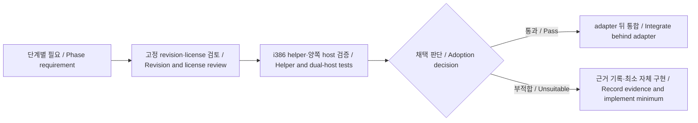
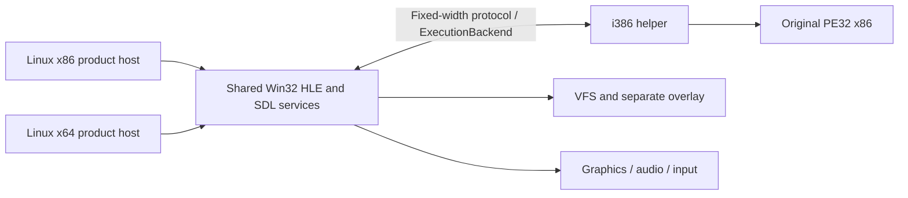

# Linux x86·x64 지원 설계 / Linux x86 and x64 Support Design

## 상태와 범위 / Status and scope

계획 단계다. Linux 제품 호스트를 x86(i386)과 x64(x86-64) 양쪽으로 확장하고 WSL에서 개발한다. 이번 작업은 문서화만 수행하며 구현·패키지 설치·게임 실행은 하지 않는다. 기존 [Linux 실행 설계](20260827-077-linux-original-execution.md)의 x64 전용 호스트 정책과 bring-up 순서는 이 문서로 대체한다. 원본 PE32 x86 코드, import HLE 경계, Windows/Web 지원 원칙은 유지한다.

*Planning only. Extend Linux product hosts to both x86 (i386) and x64 (x86-64), developing under WSL. This task changes documentation only, without implementation, package installation, or game execution. This document supersedes the x64-only host policy and bring-up sequence in the [earlier Linux design](20260827-077-linux-original-execution.md). Original PE32 x86 execution, import HLE boundaries, and Windows/Web goals remain intact.*

## 2026-09-18 갱신 — 외부 구현 재사용 / Update — External implementation reuse

작업 314에서 사용자가 승인한 재사용 방침을 반영한다. 이 절은 아래 초기 조사 시점의 상태와 충돌하면 우선한다. 현재 지원 범위는 Windows와 Linux x86/x64이며 작업 310에 따라 Web 지원은 제거됐다. 작업 309의 양쪽 host 검증과 작업 311~320의 memory transport·dispatcher·연속 import event loop·중지 제어·동적 메모리 수명·기능 협상·기능 거부 순서·page 하위 범위 보호까지 진행했으며, 실제 Win32 API binding과 공식 target의 Linux 게임 실행은 후속이다.

*Task 314 records the user-approved reuse policy. This section takes precedence over conflicting initial observations below. Current scope is Windows and Linux x86/x64; Task 310 removed Web support. Work has reached dual-host validation in Task 309 and memory transport, dispatch, continuous import event loop, stop control, dynamic-memory lifecycle, capability negotiation, capability-rejection ordering, and page subrange protection in Tasks 311–320. Actual Win32 API bindings and official-target Linux gameplay remain future work.*

| 영역 / Area | 결정·적용 시점 / Decision and timing | 남는 책임 / Remaining responsibility |
| --- | --- | --- |
| SDL3 / SDL_mixer | 기존 backend를 공용화하고 L4~L6에서 Linux 창·입력·오디오에 재사용 / Share existing backends for Linux window, input, and audio in L4–L6 | USER32 message와 DirectSound buffer/cursor 의미 / USER32 messages and DirectSound buffer/cursor semantics |
| dyncall / dyncallback | L4 callback 구현 전에 i386 helper에서 비교 검증 후 채택 여부 결정 / Evaluate in the i386 helper before L4 callbacks, then decide adoption | guest stack·FS, IPC와 nested import 제어 / Guest stack/FS, IPC, nested-import control |
| Zydis | Linux raw-I/O decoder 확장 전에 검증; 보호 blocker가 나타나면 해당 단계로 앞당김 / Evaluate before extending Linux raw-I/O decoding; pull forward for protection blockers | decoded I/O의 보드 의미와 signal 처리 / Board semantics and signal handling |
| ICU | 실제 CP949 변환 요구가 확인되면 필요한 converter/data만 검토 / Evaluate required converters/data when a concrete CP949 need is confirmed | Win32 변환 flags·오류·길이 및 VFS 경로 정책 / Win32 conversion flags, errors, lengths, and VFS path policy |

새 의존성은 아직 채택하거나 설치하지 않는다. dyncall은 같은 프로세스의 ABI 호출 도구이므로 x64 host에서 PE32 함수를 직접 호출하는 수단으로 사용하지 않는다. 기존 import thunk를 즉시 교체하지 않고 i386 helper 안의 callback 호출 경계부터 실험한다. Zydis가 명령어를 해석해도 원본 실행 주체와 보드 모델은 유지한다. ICU 도입 전에는 원본 문자열을 무조건 UTF-8로 해석하거나 변환하지 않는다.

*No new dependency is adopted or installed yet. dyncall performs ABI calls within a process; it is not a way to call PE32 functions directly from the x64 host. Evaluate the callback boundary inside the i386 helper before replacing existing import thunks. Zydis decoding preserves original-code execution and the board model. Do not assume original strings are UTF-8 or convert them unconditionally before evaluating ICU.*

후보별 고정 revision, 사용 source/data 및 전이 의존성의 라이선스, 빌드 옵션, 크기와 성능을 기록한 뒤 채택한다. 기존 copyleft 제외 정책을 유지한다. SDL과 SDL_mixer는 zlib, dyncall은 ISC 계열, Zydis는 MIT, ICU는 Unicode 허용적 라이선스를 기준으로 조사했으며 실제 도입 revision의 파일별 조건을 다시 확인한다. 출처: [SDL3](https://wiki.libsdl.org/SDL3/FAQLicensing), [SDL_mixer](https://wiki.libsdl.org/SDL3_mixer/FrontPage), [dyncall 라이선스](https://dyncall.org/license)·[호출 규약](https://dyncall.org/docs/manual/manualse11.html), [Zydis](https://github.com/zyantific/zydis), [ICU 라이선스](https://github.com/unicode-org/icu/blob/main/LICENSE)·[Windows-949 데이터](https://github.com/unicode-org/icu/blob/main/icu4c/source/data/mappings/windows-949-2000.ucm).

*Adoption records a pinned revision, licenses of selected sources/data and transitive dependencies, build options, size, and performance. Keep the existing copyleft exclusion. The investigated license baselines are zlib for SDL/SDL_mixer, ISC-style for dyncall, MIT for Zydis, and the permissive Unicode license for ICU; recheck file-specific terms at the actual selected revision using the sources above.*

Win32 process/module/handle/last-error/TLS/SEH, guest memory reserve/commit/protect, COM facade, 파일/INI/overlay 의미는 공용 HLE와 플랫폼 adapter가 계속 소유한다. 외부 allocator나 ABI 도구가 이 계약을 대신하지 않는다. 전체 Win32 호환 계층이나 실행 엔진 교체는 이 계획의 채택 항목이 아니다.

*Shared HLE and platform adapters retain Win32 process/module/handle/last-error/TLS/SEH, guest memory reserve/commit/protect, COM facades, and file/INI/overlay semantics. External allocators and ABI tools do not replace those contracts. This plan does not adopt a replacement full Win32 compatibility layer or execution engine.*

## 초기 조사 근거 / Initial investigation evidence

- 코드 확인: `CMakeLists.txt`는 Linux backend를 64비트에만 연결하며 x86 preset은 helper 전용이다. CLI의 Linux 실행 분기는 비트 폭으로 구분하지 않으므로 x86 제품 target 전체 링크도 확인해야 한다.
- 코드 확인: `original_runner.cpp`는 첫 import·fault·exit에서 정지한다. 완성된 게임 실행 경로는 아니다. 파일 읽기 완료 판정도 합성 파일로 재검증한다.
- 과거 검증: [작업 078](../work-logs/20260827-078-linux-guest-process-bootstrap.md)은 WSL Ubuntu 24.04에서 relocation·TLS·import 결과 51과 SIGILL 보고를 확인했다. 이번 작업에서 재실행하지 않았다.
- 코드 확인: SDL3/OpenGL·legacy graphics/audio·VFS·보드 정책은 재사용 후보지만 Win32/COM facade, 창, 키 입력 연결은 Windows 디렉터리에 남아 있다. Linux SDL audio와 mixer는 현재 CMake에서 활성화되지 않는다.
- 코드 확인: protocol v5는 `LoadImage` 전에 required feature를 확인하고, 단일 pending event에서 image·stack과 registry 기반 anonymous mapping의 제한된 memory transfer 및 lifecycle 요청을 사용한다. CI는 Linux x64 GCC/Clang 단위 테스트를 구성하지만 i386 helper 실행 검증은 별도 스크립트에 있다.
- 환경 관찰: 2026-09-18 `wsl --list --verbose`에서 `Ubuntu-24.04`, WSL 2, Stopped를 확인했다. 현재 toolchain, i386 실행, WSLg, GPU·오디오는 미확인이다.

*Source inspection shows a 64-bit-only Linux backend, helper-only x86 preset, and a bitness-independent Linux CLI branch requiring full x86 link checks. The runner stops at the first import/fault/exit; its file-read completion check also needs a synthetic regression. [Task 078](../work-logs/20260827-078-linux-guest-process-bootstrap.md) previously verified result 51 and SIGILL under WSL, but was not rerun here. Shared graphics/audio policies, VFS, and board models are reuse candidates; Windows facades/window/input adapters still need separation, and Linux SDL audio/mixer are disabled. Protocol v3 remains serialized with limited memory transfers. CI covers x64 GCC/Clang unit tests; helper integration lives in a separate script. The installed Ubuntu-24.04 distribution was observed stopped under WSL 2; toolchains, i386 execution, WSLg, GPU, and audio remain unverified.*

## 실행 구조 / Execution structure

> 2026-09-24 갱신: 아래 helper 전용 구조는 이후 결정으로 대체되었다. Linux x86은 in-process runner([작업 330](20260919-330-linux-x86-in-process-runner.md))를, Linux x64는 같은 프로세스의 compatibility-mode 전환([작업 353](20260924-353-linux-x64-compat-mode-adapter.md))을 제품 경로로 쓴다. i386 helper는 진단 fallback으로 남는다.
>
> *Update 2026-09-24: the helper-only structure below was superseded. Linux x86 uses the in-process runner ([Task 330](20260919-330-linux-x86-in-process-runner.md)) and Linux x64 uses same-process compatibility-mode transitions ([Task 353](20260924-353-linux-x64-compat-mode-adapter.md)) as their product paths; the i386 helper remains a diagnostic fallback.*

두 제품 호스트 모두 별도 i386 helper를 사용한다. x86도 같은 프로세스 안에서 실행하는 별도 경로를 만들지 않는다. 호스트는 공용 HLE와 SDL 서비스를, helper는 PE mapping·원본 x86 실행·guest ABI 상태를 소유한다. 이는 기존 경계를 재사용하고 비트 폭별 동작 차이를 줄이는 설계 선택이며 아직 x86 제품으로 검증되지 않았다.

*Both product hosts use a separate i386 helper. The x86 host does not introduce a second, in-process execution path. Hosts own shared HLE and SDL services; the helper owns PE mapping, original x86 execution, and guest ABI state. This choice reuses the existing boundary and reduces architecture-specific behavior; it is not yet verified as an x86 product.*

| 구성 / Component | Linux x86 | Linux x64 |
| --- | --- | --- |
| 제품 CLI·HLE·SDL / Product CLI, HLE, SDL | ELF32 i386 | ELF64 x86-64 |
| 게스트 실행 helper / Guest execution helper | ELF32 i386 | ELF32 i386 |
| 원본 게임 / Original game | PE32 x86 | PE32 x86 |
| 그래픽·오디오 라이브러리 / Graphics and audio libraries | 32-bit | 64-bit |

게스트 주소·handle·COM vtable은 항상 32비트다. 호스트 포인터와 `long`/`size_t`를 wire ABI에 넣지 않고 고정 폭 필드·명시적 packing·크기 검증을 사용한다. x86 호스트도 guest pointer를 직접 참조하지 않는다. 32비트 호스트의 자산 cache·대용량 파일 offset·메모리 예산은 별도 검증하며 파일 전체 상주를 전제로 하지 않는다. helper는 SDL에 의존하지 않지만 x86 제품 호스트는 32비트 SDL 및 관련 개발·런타임 의존성이 필요하다.

*Guest addresses, handles, and COM vtables remain 32-bit. Wire contracts use fixed-width fields and explicit layout/size checks, never host pointers or host-sized integers. Even the x86 host accesses guest memory through the backend. Validate cache budgets, large-file offsets, and memory pressure on 32-bit hosts without assuming whole-file residency. The helper remains SDL-free; the x86 product host requires 32-bit SDL and its development/runtime dependencies.*

## 이식 경계와 순서 / Porting boundaries and order

Windows 코드를 통째로 옮기지 않고 API별 의미·상태를 공용 HLE로 추출한다. Win32 HWND/COM 구현, POSIX process/signal 구현, SDL 서비스는 각 adapter 뒤에 둔다. 먼저 memory·ABI·import dispatch를 완성하고 동기 callback·중첩 import를 지원한 뒤 창/message 경로를 진행한다. thread/TLS/wait는 thread별 event context와 함께 추가한다. 그래픽 surface lock과 PCM buffer도 guest memory 계약을 따른다.

*Extract API semantics/state into shared HLE rather than copying the Windows runtime wholesale. Keep Win32 HWND/COM, POSIX process/signal, and SDL implementations behind adapters. Establish memory/ABI/import dispatch first, then synchronous callbacks and nested imports before window/message bring-up. Add threading/TLS/waits with per-thread event contexts. Surface locks and PCM buffers obey the same guest-memory contract.*

정식 target profile의 실행 파일을 성공 기준으로 삼고 같은 사용자 제공 HDD·빌드 해시·설정으로 Windows와 비교한다. 이전 문서의 `ez2dj1.exe`와 고정 import 개수는 전체 제품 기준으로 사용하지 않는다. 진단용 비보호 실행 파일은 제공된 경우에만 보조 fixture로 쓰며, 보호 경계가 시작을 막으면 해당 단계에서 필요한 환경 HLE를 먼저 해결한다. 기존 [import 분석](../analysis/ez2dj-import-surface.md)과 [ABI 설명](../kb/win32-hle-boundary.md)을 기준으로 미구현 API를 기록하고, 조용히 성공시켜 진행하지 않는다.

*Acceptance uses official target-profile executables and comparison against Windows with identical user-supplied HDD, build hash, and configuration. The older design's ez2dj1.exe and fixed import count are not universal product baselines. An unprotected diagnostic binary is optional only when supplied. If protection blocks startup, implement the required environment boundary at that stage. Use the existing [import analysis](../analysis/ez2dj-import-surface.md) and [ABI notes](../kb/win32-hle-boundary.md); report unsupported APIs instead of silently succeeding.*

## 환경과 완료 기준 / Environment and acceptance

WSL은 개발·검증 환경이며 제품의 필수 실행 의존성이 아니다. WSL2 Ubuntu 24.04에서 x64와 i386 사용자 공간 프로그램을 각각 검증한다. WSL에서 ELF32가 동작해도 순수 32비트 커널·배포판 지원이 확인된 것은 아니다. 별도 실제 Linux x86 환경 검증 전에는 그 항목을 미확인으로 유지한다. WSLg의 X11·Wayland·OpenGL 가능성과 실제 설치 상태도 구분한다. 근거와 제한은 [WSL 검증 범위](../kb/wsl-linux-validation.md)에 둔다.

*WSL is a development/validation environment, not a product runtime dependency. Validate x64 and i386 userspace programs separately under WSL2 Ubuntu 24.04. ELF32 success under WSL does not establish support for a native 32-bit kernel/distribution; keep that unverified until tested on actual Linux x86. Distinguish WSLg capabilities from the local installation's readiness. See [WSL validation scope](../kb/wsl-linux-validation.md).*

각 단계는 두 host에서 같은 합성 fixture를 통과해야 한다. 최종적으로 같은 공식 target이 부팅·타이틀·데모/곡 실행·종료에 도달하고 화면, 입력, 오디오, overlay 의미가 Windows 기준과 일치해야 한다. 비교는 ASLR 주소·host timestamp가 아닌 guest API 의미·장면 상태로 한다. WSLg의 frame pacing·음성 지연 측정은 native Linux 성능 보증과 구분한다. Windows 회귀를 유지한다.

*Every phase must pass identical synthetic fixtures on both hosts. Ultimately, the same official target must reach boot, title, demo/song execution, and exit with matching visual/input/audio/overlay semantics against Windows. Compare guest API semantics and scene state, not ASLR addresses or host timestamps. WSLg pacing/audio latency measurements do not certify native Linux performance. Preserve Windows regressions.*
