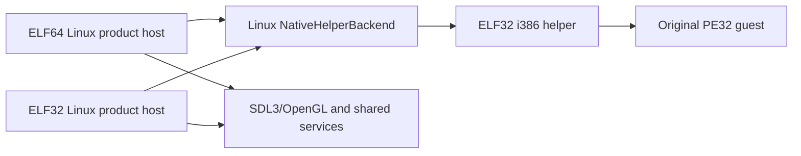

# Linux x86 제품 호스트 빌드 설계 / Linux x86 Product Host Build Design

## 상태 / Status

L1 구현 단계다. Linux x86 제품 호스트를 별도 32비트 빌드로 추가하고, 원본 PE32를 실행하는 i386 helper는 기존 helper 전용 빌드로 유지한다. x64 제품 호스트의 동작과 공용 `ExecutionBackend` protocol은 바꾸지 않는다.

*L1 implementation phase. Add a separate 32-bit Linux product-host build while keeping the i386 original-PE32 helper in its existing helper-only build. Preserve the x64 product-host behavior and shared `ExecutionBackend` protocol.*

## 구조 / Structure

일반 Linux x64/x86 preset은 SDL3/OpenGL, ImGui, OSD와 Linux native backend를 함께 빌드한다. `linux-x86-helper` preset은 SDL을 빌드하지 않고 helper만 만들며, x86 제품 host가 실행할 helper는 이 별도 산출물을 사용한다. 따라서 `CMAKE_SIZEOF_VOID_P=4`인 제품 build를 helper-only 구성으로 오인하지 않는다.

*Normal Linux x64/x86 presets build SDL3/OpenGL, ImGui, OSD, and the Linux native backend. The `linux-x86-helper` preset omits SDL and builds only the helper; the x86 product host uses that separate artifact. A 32-bit product build is therefore distinct from the helper-only configuration.*

Guest addresses, protocol fields, and handle tokens remain fixed-width 32-bit values. Host `size_t`, pointers, and POSIX handles do not cross the protocol. The x86 host still launches the helper as a separate process, even though both are ELF32.

## 변경 / Changes

1. CMake의 Linux backend와 product CLI 링크 조건에서 x64 제한을 제거하고 helper-only 구성만 제외한다.
2. 32비트 Linux product Debug/Release configure·build·test preset을 추가한다. `-m32` flags are explicit so the preset is reproducible on an x86-64 WSL kernel with multilib. The preset disables optional SDL XScreenSaver and XTest integrations until their i386 development packages are installed.
3. Linux helper probe script가 x64 host와 x86 host 각각에서 동일한 i386 helper를 상대로 실행되도록 확장한다.
4. Build guide에 32비트 dependency와 ELF verification command를 기록한다.

*Changes: remove the x64-only condition from Linux backend and product-CLI linkage while excluding helper-only builds; add reproducible 32-bit product Debug/Release configure/build/test presets with explicit `-m32`; run the helper probe from both x64 and x86 hosts; and document 32-bit dependencies and ELF verification.*

## 비범위 / Out of scope

Linux Win32 HLE, guest callback/thread dispatch, audio activation, official HDD execution, native 32-bit kernel validation, and performance claims remain later phases. A successful ELF32 product build proves compilation and synthetic backend linkage only.

*Linux Win32 HLE, guest callback/thread dispatch, audio activation, official HDD execution, native 32-bit-kernel validation, and performance claims remain later phases. A successful ELF32 product build proves compilation and synthetic backend linkage only.*

## 완료 기준 / Acceptance

- x86 Debug product target, unit tests, and host probe build and run against the existing i386 helper.
- x64 baseline remains green with the same helper probe result and OpenGL regression.
- `file` reports ELF32 product/helper and ELF64 product as expected.
- Windows shared-core build remains green.
