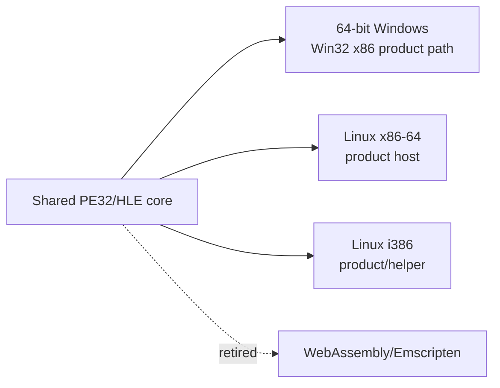

# Web 지원 범위 폐기 설계

## 상태

승인된 방향 변경을 구현하는 설계입니다. 이 문서는 현재 지원 범위를 Linux x86/x86-64와 64비트 Windows로 고정하고 WebAssembly 경로를 활성 계획에서 제거하는 기준 문서입니다.

*Status*

This design implements an approved direction change. It fixes the active host scope to Linux x86/x86-64 and 64-bit Windows and removes the WebAssembly path from the active plan.

## 결정

re2DJ의 지원 목표 호스트는 다음 두 계열로 한정합니다.

* Linux x86(i386)와 Linux x86-64
* 64비트 Windows에서 실행되는 Win32 x86 제품 경로

WebAssembly, Emscripten, WebGL 및 브라우저용 x86 실행 엔진은 현재 제품·CI·프리셋·플랫폼 디렉터리에서 제거합니다. 브라우저에서 PE32 원본 코드를 실행하기 위해 별도 CPU 실행 계층과 브라우저 I/O 경계를 유지해야 하므로, 현재 목표 성능과 검증 가능성을 충족하지 못할 위험이 큽니다. 이 결정은 원본 x86 코드를 보존한다는 원칙을 바꾸지 않으며, 데스크톱의 네이티브 32비트 실행 경로에 집중하기 위한 범위 조정입니다.

*Decision*

The active re2DJ host scope is limited to these two families:

* Linux x86 (i386) and Linux x86-64
* The Win32 x86 product path running on 64-bit Windows

WebAssembly, Emscripten, WebGL, and browser x86 execution engines are removed from the active product, CI, presets, and platform directories. Running the original PE32 code in a browser would require a separate CPU execution layer and browser I/O boundary whose performance and verification risk do not fit the current target. The decision preserves the original x86 code as the executing subject and narrows the scope to desktop native 32-bit execution.

## 영향 범위

다음 항목은 현재 구성에서 제거하거나 Windows/Linux 기준으로 갱신합니다.

* `web` CMake configure/build preset과 Emscripten toolchain 참조
* Web 전용 GitHub Actions job
* `src/platform/web/`의 빈 backend 안내 파일
* CMake의 `EMSCRIPTEN` 분기와 WebGL 전용 조건
* README, 헌장, 아키텍처, 코딩 규칙의 활성 호스트 표기
* `AGENTS.md`의 지원 호스트와 실행 backend 정책

기존 설계·작업 로그에 남아 있는 Web 계획은 과거 의사결정의 증거이므로 삭제하지 않습니다. 새 문서와 현재 활성 문서가 그 계획을 더 이상 실행 대상으로 보지 않는다는 사실을 명시합니다.

*The following active configuration is removed or updated for Windows/Linux only: the `web` CMake configure/build presets and Emscripten toolchain reference, the Web GitHub Actions job, the empty `src/platform/web/` guide, CMake `EMSCRIPTEN` branches and WebGL-only conditions, active host tables in README/charter/architecture/coding rules, and the supported-host/execution policy in `AGENTS.md`.*

Historical design and work-log entries that describe the former Web plan are retained as decision evidence rather than deleted. The new design and active documents state that those plans are no longer implementation targets.

## 불변 조건

* 공용 코어는 Windows와 Linux에서 계속 빌드되어야 합니다.
* Linux x86 제품 host, Linux x86-64 제품 host, 공통 i386 helper의 실행 경계는 유지합니다.
* 64비트 Windows의 Win32 x86 경로와 기존 SDL3/OpenGL 데스크톱 backend는 유지합니다.
* 원본 자산은 저장소에 추가하지 않습니다.
* Web 지원 제거는 게임 로직 재구현이나 원본 바이너리 수정으로 이어지지 않습니다.

*Invariants*

The shared core must continue to build on Windows and Linux. Linux x86 and x86-64 product hosts and the common i386 helper remain. The 64-bit Windows Win32 x86 path and the existing desktop SDL3/OpenGL backend remain. No original assets are added, and removing Web support does not rewrite game logic or modify the original binary.

## 완료 기준

1. `cmake --list-presets`에 Web/Emscripten preset이 없습니다.
2. CI에 Web job과 Emscripten setup 단계가 없습니다.
3. 현재 소스와 활성 문서의 지원 호스트가 Windows/Linux로 일치합니다.
4. Linux x86-64와 Linux x86 product/helper를 재구성·빌드하고 테스트합니다.
5. Windows x86 preset의 구성 파일이 유지되고, 가능한 범위에서 기존 검증을 반복합니다.
6. 변경 내용과 과거 Web 계획의 보존 범위를 작업 로그에 기록합니다.

*Acceptance criteria*

There is no Web/Emscripten preset in `cmake --list-presets`, no Web job or Emscripten setup in CI, and active source/documentation consistently names Windows/Linux hosts. Linux x86-64 and Linux x86 product/helper are reconfigured, built, and tested; the Windows x86 preset remains valid and existing feasible checks are repeated. The work log records the change and why historical Web plans remain in the repository.
