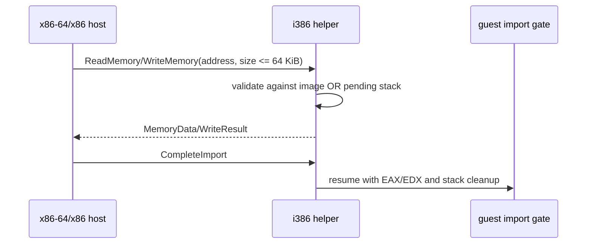

# Linux guest memory transport 확장 설계

## 상태

L2의 첫 구현 단계입니다. Linux x86-64와 Linux i386 product host가 공통 i386 helper의 import gate에서 게스트 stack뿐 아니라 현재 매핑된 PE 이미지도 읽고 쓸 수 있도록 transport 범위를 확장합니다.

*Status*

This is the first L2 implementation step. It expands the transport used by Linux x86-64 and Linux i386 product hosts so an import gate in the common i386 helper can access the mapped PE image as well as the guest stack.

## 문제

현재 protocol v3는 host의 `ReadMemory`와 `WriteMemory` 요청을 pending import의 4KiB stack window 안에서만 허용합니다. 다음 ABI/HLE 단계에서 import 인자의 문자열, 구조체, IAT와 guest object를 읽으려면 image-backed guest memory에 접근할 수 있어야 합니다. helper가 임의의 host 주소를 노출해서는 안 되므로, 허용 범위는 현재 실행 image와 pending stack의 두 명시적 영역으로 제한합니다.

*Problem*

Protocol v3 currently allows host `ReadMemory` and `WriteMemory` requests only inside the 4KiB stack window of a pending import. The next ABI/HLE stage must read import strings, structures, IAT entries, and guest objects from image-backed guest memory. The helper must not expose arbitrary host addresses, so access is limited to two explicit regions: the current image and the pending stack.

## 계약

* 단일 memory transfer 상한을 4KiB에서 64KiB로 확장합니다.
* `ReadMemory`와 `WriteMemory`는 pending import 중에만 처리합니다.
* 요청 범위 전체가 현재 PE image `[load_base, load_base + size_of_image)` 또는 pending stack window 안에 있어야 합니다.
* 두 영역과 겹치지 않는 주소, 32비트 덧셈 overflow, helper image 밖의 주소는 거부합니다.
* protocol packet layout과 version은 그대로 유지하고, 상한은 공용 protocol header의 상수로 공유합니다.
* `CompleteImport` 뒤에는 pending stack 범위만 지우고, 실행 중인 image 범위는 다음 import에서도 유지합니다. process exit/fault 뒤에는 두 범위를 지웁니다.

*Contract*

The single memory-transfer limit becomes 64 KiB. Requests are handled only while an import is pending, and the complete range must lie inside either the current PE image `[load_base, load_base + size_of_image)` or the pending stack window. Overflows and all other addresses are rejected. Packet layouts and the protocol version remain unchanged; the limit is shared as a constant in the protocol header. The helper clears only the pending stack after completion; the active image range remains available for the next import. Both regions are cleared after process exit or fault.

## 안전성 및 비범위

이 단계는 guest allocator, page protection, handle registry, callback, thread 또는 Win32 API 결과를 구현하지 않습니다. image mapping이 현재 모두 읽기·쓰기·실행으로 생성되는 사실도 바꾸지 않습니다. 목적은 다음 dispatcher가 안전하게 문자열과 구조체를 조회할 수 있는 transport 경계만 고정하는 것입니다.

*Safety and non-goals*

This step does not implement a guest allocator, page protection, handle registry, callbacks, threads, or Win32 API results. It also does not change the current RWX image mapping. It fixes only the transport boundary needed for the next dispatcher to inspect strings and structures safely.

## 완료 기준

1. x64와 x86 host가 같은 i386 helper에서 64KiB 이하 image read/write를 성공시킵니다.
2. stack read/write와 기존 import completion 결과가 유지됩니다.
3. image·stack 밖의 요청과 64KiB 초과 요청은 실패합니다.
4. Linux x64/x86 CTest와 native helper probe가 통과합니다.

*Acceptance criteria*

Both host widths successfully perform an image read/write of up to 64 KiB through the same i386 helper. Existing stack access and import completion remain valid; out-of-range and oversized requests fail; Linux x64/x86 CTest and the native helper probe pass.
