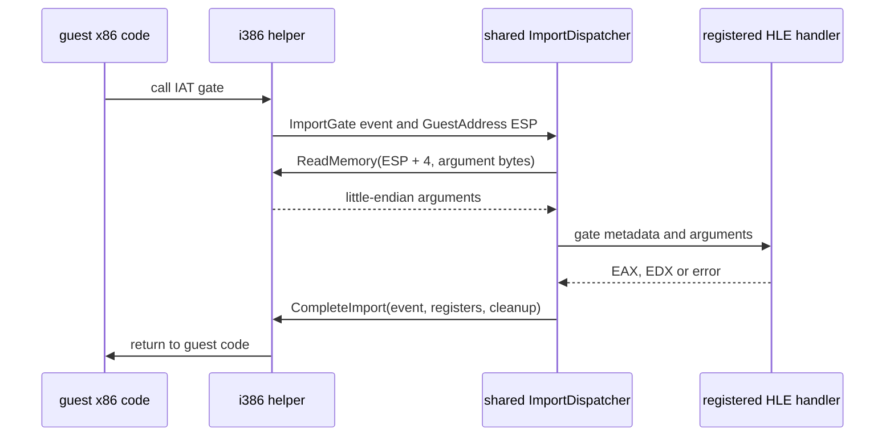

# Linux import dispatcher와 x86 ABI marshalling 설계

## 상태

이 설계는 작업 311의 64KiB guest-memory transport 다음 L2 구현 단위를 정의합니다. 원본 게임 API의 의미를 추정하여 구현하지 않고, 공용 dispatcher·안전한 stack argument marshalling·completion 연결을 합성 import로 먼저 검증합니다.

*Status*

This design defines the next L2 implementation unit after Task 311's 64 KiB guest-memory transport. It does not guess original-game API behavior. It first validates a shared dispatcher, safe stack-argument marshalling, and completion routing with synthetic imports.

## 경계

`ImportDispatcher`는 공용 `src/hle/`에 두며 host OS API, POSIX handle, Linux helper protocol을 알지 않습니다. 입력은 loader가 확인한 `ImportGate`, import gate `ExecutionEvent`, `ExecutionBackend`뿐입니다. dispatcher는 등록된 `{module, name 또는 ordinal, calling convention, argument count, handler}`를 찾아 guest stack에서 인자를 읽고, handler의 `EAX`·`EDX` 결과와 stack cleanup을 `ImportCompletion`으로 보냅니다.

모듈 이름 비교는 ASCII 대소문자를 구분하지 않습니다. import 이름은 PE export 이름 규칙대로 정확히 비교합니다. `__stdcall`은 `argument_count * 4`만큼 helper가 stack을 정리하고, `__cdecl`은 cleanup을 0으로 남겨 caller가 정리합니다. 현재 지원하지 않는 convention, 64개 초과 인자, stack-address overflow, memory read 오류, handler 실패, 등록되지 않은 import는 completion을 보내지 않고 오류로 반환합니다. Linux runner는 이를 통제 정지 사유로 보고할 수 있습니다.

*Boundary*

`ImportDispatcher` lives in shared `src/hle/` and knows no host OS APIs, POSIX handles, or Linux-helper protocol. Its inputs are only the loader-confirmed `ImportGate`, an import-gate `ExecutionEvent`, and an `ExecutionBackend`. It finds a registered `{module, name or ordinal, calling convention, argument count, handler}`, reads arguments from the guest stack, and sends the handler's `EAX`/`EDX` result and stack cleanup as an `ImportCompletion`.

Module names compare ASCII case-insensitively; import names compare exactly according to PE export-name rules. `__stdcall` asks the helper to clean `argument_count * 4` bytes, while `__cdecl` leaves cleanup at zero for the caller. Unsupported conventions, more than 64 arguments, stack-address overflow, memory-read failure, handler failure, and unregistered imports return an error without sending completion. The Linux runner can report that as a controlled stop reason.

## 등록과 검증

binding 등록은 비어 있지 않은 module, name/ordinal 형식, handler, 지원 calling convention과 최대 인자 수를 검증하고 중복 key를 거부합니다. handler는 host pointer나 platform type 대신 gate metadata와 `std::span<const std::uint32_t>` argument만 받습니다. dispatcher는 guest memory를 직접 역참조하지 않고 `ExecutionBackend::ReadMemory()`만 사용하며 little-endian dword를 명시적으로 조립합니다.

합성 native probe는 `probe.dll!ProbeGate`와 `probe.dll!#7` binding을 등록합니다. 첫 호출은 `41 -> EAX 42`, 두 번째는 `42 -> EAX 43, EDX 1`을 반환합니다. 이 probe는 64KiB image read/write와 범위 거부 검사 뒤 dispatcher completion으로 guest를 계속 실행해 최종 process status 51을 확인합니다. 단위 테스트는 named/ordinal lookup, module case folding, `__stdcall`/`__cdecl` cleanup, duplicate·unknown binding, stack overflow, backend read failure와 handler failure를 검증합니다.

*Registration and verification*

Binding registration validates a nonempty module, a valid name/ordinal form, a handler, a supported calling convention, and the maximum argument count, and rejects duplicate keys. A handler receives gate metadata and a `std::span<const std::uint32_t>` only; it receives no host pointer or platform type. The dispatcher never dereferences guest memory directly: it uses `ExecutionBackend::ReadMemory()` and explicitly assembles little-endian dwords.

The synthetic native probe registers `probe.dll!ProbeGate` and `probe.dll!#7`. The first returns `41 -> EAX 42`; the second returns `42 -> EAX 43, EDX 1`. After its 64 KiB image read/write and range-rejection checks, the probe resumes guest execution through dispatcher completion and confirms final process status 51. Unit tests cover named/ordinal lookup, module case folding, `__stdcall`/`__cdecl` cleanup, duplicate and unknown bindings, stack overflow, backend-read failure, and handler failure.

## 제외 범위

이 단위에는 실제 `kernel32`, `USER32`, DirectX, allocator, guest handle registry, callback, thread, dynamic `GetProcAddress` 또는 원본 HDD 실행을 넣지 않습니다. 이들은 import 표면과 원본 실행 증거를 기준으로 후속 binding 단위에서 추가합니다. dispatcher가 존재한다고 해서 등록되지 않은 API를 성공으로 반환하지 않습니다.

*Non-goals*

This unit does not add actual `kernel32`, `USER32`, DirectX, allocation, guest handle registry, callbacks, threads, dynamic `GetProcAddress`, or original-HDD execution. Subsequent binding units add them from import-surface and original-execution evidence. The existence of a dispatcher never makes an unregistered API succeed.
