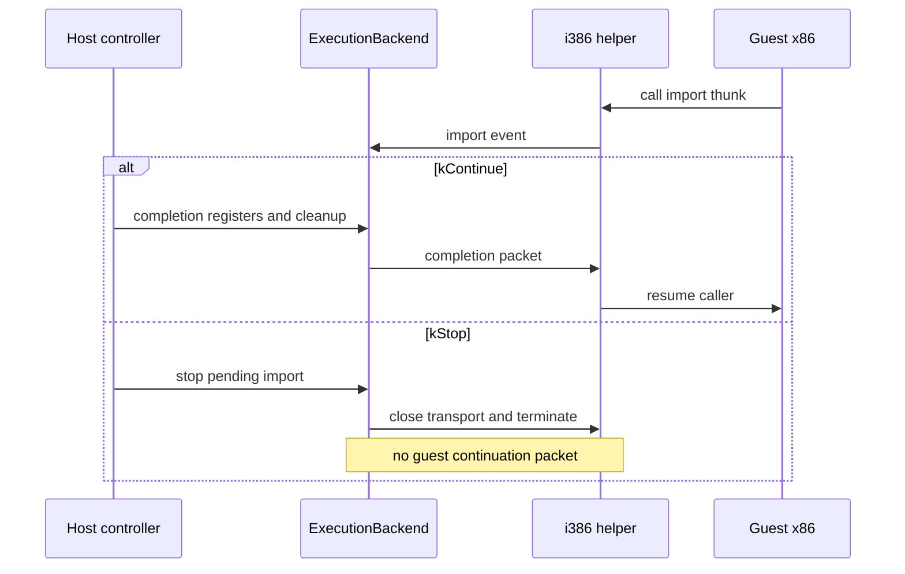

# Linux import 중지 제어 계약

## 상태

이 설계는 작업 312의 import dispatcher 뒤에 남은 `ImportCompletionAction::kStop`의 Linux backend 의미를 확정합니다. 현재 enum은 공용 runtime에 있지만 Linux backend는 `kStop` packet을 i386 helper로 보내고 계속 실행 상태로 남습니다. helper는 그 packet을 continuation으로 허용하지 않으므로, 이 경로는 의도한 통제 중지가 아닙니다.

*Status*

*This design fixes the Linux-backend meaning of `ImportCompletionAction::kStop` left after Task 312's import dispatcher. The enum exists in the shared runtime, but the Linux backend currently sends a `kStop` packet to the i386 helper and remains running. The helper does not accept that packet as a continuation, so this path is not a controlled stop.*

## 계약

`kStop`은 host controller가 pending import에서 helper 실행을 취소하는 동작입니다. backend는 completion packet을 보내지 않고 pipe를 닫은 뒤 helper process를 종료하며 terminal `Stopped` 상태가 됩니다. 그 뒤 `WaitForEvent()`와 guest-memory 요청은 실패해야 합니다. `kContinue`만 helper가 EAX·EDX·stack cleanup을 적용해 guest 코드를 재개하는 packet으로 보냅니다.

이 계약은 guest의 `ExitProcess` HLE가 아닙니다. `ExitProcess`는 guest가 요청한 종료 code를 `kProcessExit` event로 보고해야 하며, 그 handler와 protocol 확장은 실제 import 호출 근거 및 process service와 함께 후속 작업에서 정의합니다. observer나 미구현 API 정책이 host 판단으로 실행을 멈출 때만 `kStop`을 사용합니다.

*Contract*

*`kStop` is a host-controller action that cancels helper execution at a pending import. The backend sends no completion packet, closes the pipes, terminates the helper process, and enters terminal `Stopped` state. Later `WaitForEvent()` and guest-memory requests fail. Only `kContinue` sends a packet through which the helper applies EAX, EDX, and stack cleanup and resumes guest code.*

*This contract does not implement guest `ExitProcess`. `ExitProcess` must report the guest-requested exit code as a `kProcessExit` event; its handler and protocol extension will be defined later with actual import-call evidence and a process service. `kStop` is only for host decisions such as an observer or an unimplemented-import policy.*

## 범위와 검증

Linux native helper backend가 pending `kStop`을 host-side terminal control로 처리하게 합니다. Windows의 별도 legacy helper backend는 현재 제품 build 대상이 아니므로 변경하지 않습니다. Linux native IPC probe는 pending import에 `kStop`을 요청한 뒤 backend가 즉시 terminal state가 되어 후속 wait를 거부하는지 확인합니다. 기존 continue dispatcher probe, Linux x64/x86 CTest와 i386 helper build로 회귀를 확인합니다.

helper wire format의 version이나 layout, 실제 Win32 API handler, guest allocator/handle registry, callback/thread, 원본 HDD 실행은 바꾸지 않습니다.

*Scope and verification*

*The Linux native-helper backend will treat pending `kStop` as host-side terminal control. The separate Windows legacy-helper backend is not a current product-build target and is not changed. The Linux native IPC probe requests `kStop` at a pending import and verifies that the backend immediately becomes terminal and rejects a later wait. Existing continue-dispatcher probe coverage, Linux x64/x86 CTest, and the i386 helper build provide regression coverage.*

*This does not change helper wire-format version or layout, add an actual Win32 API handler, or add guest allocation/handle registry, callbacks/threads, or original-HDD execution.*
