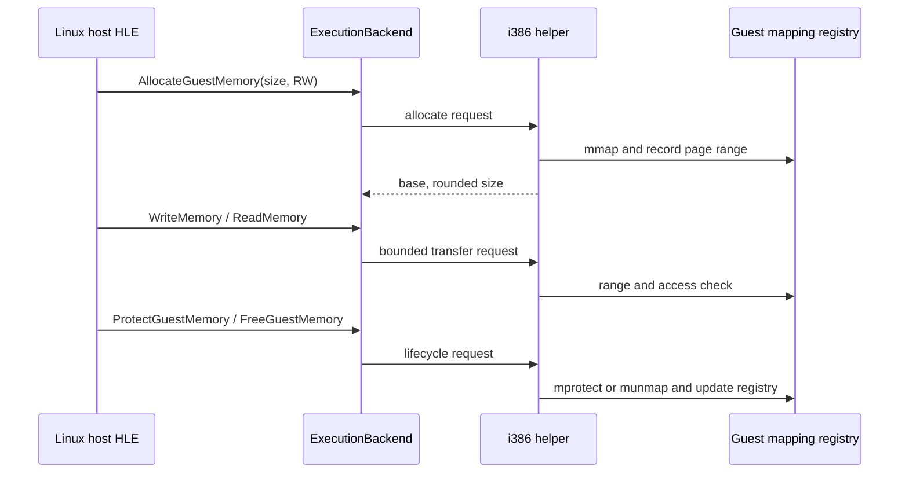

# Linux guest memory lifecycle contract / Linux 게스트 메모리 수명 계약

## 목적 / Purpose

Linux x86 및 x64 product host가 동일한 i386 helper 안에 게스트가 볼 수 있는 익명 메모리 영역을 만들고, import 처리 중 읽기·쓰기·보호 변경·해제를 요청할 수 있는 고정 폭 전송 계약을 정의합니다. 이 문서는 기존 [guest memory window 설계](20260918-311-linux-guest-memory-window.md)의 image/stack 전송 범위를 확장합니다.

*Define a fixed-width transport contract through which Linux x86 and x64 product hosts create guest-visible anonymous mappings inside the common i386 helper and request reads, writes, protection changes, and release while handling an import. This extends the image/stack transfer range in the existing [guest memory window design](20260918-311-linux-guest-memory-window.md).*

원본 실행 파일에서 확인하지 않은 `VirtualAlloc` 호출 형식, reserve/commit 분리, 주소 힌트, `MEM_RELEASE` 세부 규칙을 이 단계에서 확정하지 않습니다. 이 계약은 향후 확인된 Win32 HLE가 사용할 execution-backend 수단이며, 그 자체가 Win32 API 구현은 아닙니다.

*This step does not establish unverified `VirtualAlloc` call shapes, reserve/commit separation, address hints, or `MEM_RELEASE` details. The contract is an execution-backend facility for future confirmed Win32 HLE; it is not itself a Win32 API implementation.*

## 계약 / Contract

`ExecutionBackend`는 `GuestMemoryAccess` 비트 집합과 다음 세 연산을 제공합니다. 모든 주소와 크기는 32비트 게스트 값이며 host pointer나 host-sized integer를 wire ABI에 넣지 않습니다.

*`ExecutionBackend` exposes a `GuestMemoryAccess` bit set and the following three operations. Every address and size is a 32-bit guest value; no host pointer or host-sized integer enters the wire ABI.*

| 연산 / Operation | 입력 / Input | 성공 결과 / Success result | 초기 제약 / Initial restriction |
| --- | --- | --- | --- |
| `AllocateGuestMemory` | 0이 아닌 size, access | page-aligned guest base와 rounded size | helper가 정한 빈 주소에 anonymous committed mapping을 생성 |
| `ProtectGuestMemory` | allocation base, allocation size, access | 이전 access | 전체 allocation만 변경 |
| `FreeGuestMemory` | allocation base | 성공 여부 | 정확한 allocation base만 해제 |

`ReadMemory`는 read 권한, `WriteMemory`는 write 권한을 요구합니다. image와 pending stack은 기존처럼 전송 가능하지만 동적 영역은 helper registry에 기록된 접근 권한을 추가로 검사합니다. 이 검사는 `mprotect` 후 잘못된 host 복사가 helper를 fault 내는 일을 막습니다.

*`ReadMemory` requires read access and `WriteMemory` requires write access. The image and pending stack remain transferable as before, while dynamic mappings also check the access rights recorded in the helper registry. This prevents an invalid host copy after `mprotect` from faulting the helper.*

## 범위와 수명 / Scope and lifetime

세 lifecycle 연산과 모든 dynamic-memory read/write는 import gate가 pending인 동안에만 허용합니다. 성공한 allocation은 해당 import completion 뒤에도 남아 다음 import에서 다시 접근할 수 있고, exact free 또는 helper process 종료·fault·load 실패 때 해제합니다. 현재 helper는 image 하나를 처리한 뒤 종료하므로, multi-image reload 수명은 아직 별도 계약이 필요합니다.

*The three lifecycle operations and all dynamic-memory reads/writes are allowed only while an import gate is pending. A successful allocation remains after that import completes and is available at later imports; it is released by exact free or on helper process exit, fault, and load failure. The current helper processes one image and then exits, so multi-image reload lifetime needs a separate contract.*

초기 구현은 requested base, partial protect, reserve-only 영역, decommit, guard page, copy-on-write, section별 PE protection 변경을 지원하지 않습니다. 이것들은 실제 guest import 관찰과 shared Win32 memory-policy 설계 뒤에 별도로 추가합니다.

*The initial implementation does not support requested bases, partial protection, reserve-only ranges, decommit, guard pages, copy-on-write, or per-section PE-protection changes. Add those separately after observing real guest imports and designing shared Win32 memory policy.*

## protocol과 검증 / Protocol and verification

공유 native-helper protocol에는 allocate/protect/free request와 result packet을 뒤에 추가합니다. 현 helper와 host는 같은 소스 revision에서 함께 빌드되어 header version을 이미 엄격히 비교하므로, 이 호환 불가능 확장은 protocol version 4로 올립니다.

*Append allocate/protect/free request and result packets to the shared native-helper protocol. The helper and host are built from the same source revision and already compare the header version strictly, so this incompatible extension raises the protocol version to 4.*

동일 synthetic import fixture에서 두 product host가 2-page RW 영역을 allocate, read/write round-trip, read-only protect 후 write 거부, RW 복원, free 후 read 거부를 검증합니다. Linux x64와 x86 CTest, i386 helper build, 두 host probe 및 `git diff --check`를 실행합니다.

*Using the same synthetic import fixture, both product hosts verify allocation of a two-page RW region, a read/write round trip, rejected write after read-only protection, RW restoration, and rejected read after free. Run Linux x64 and x86 CTest, the i386 helper build, both host probes, and `git diff --check`.*
