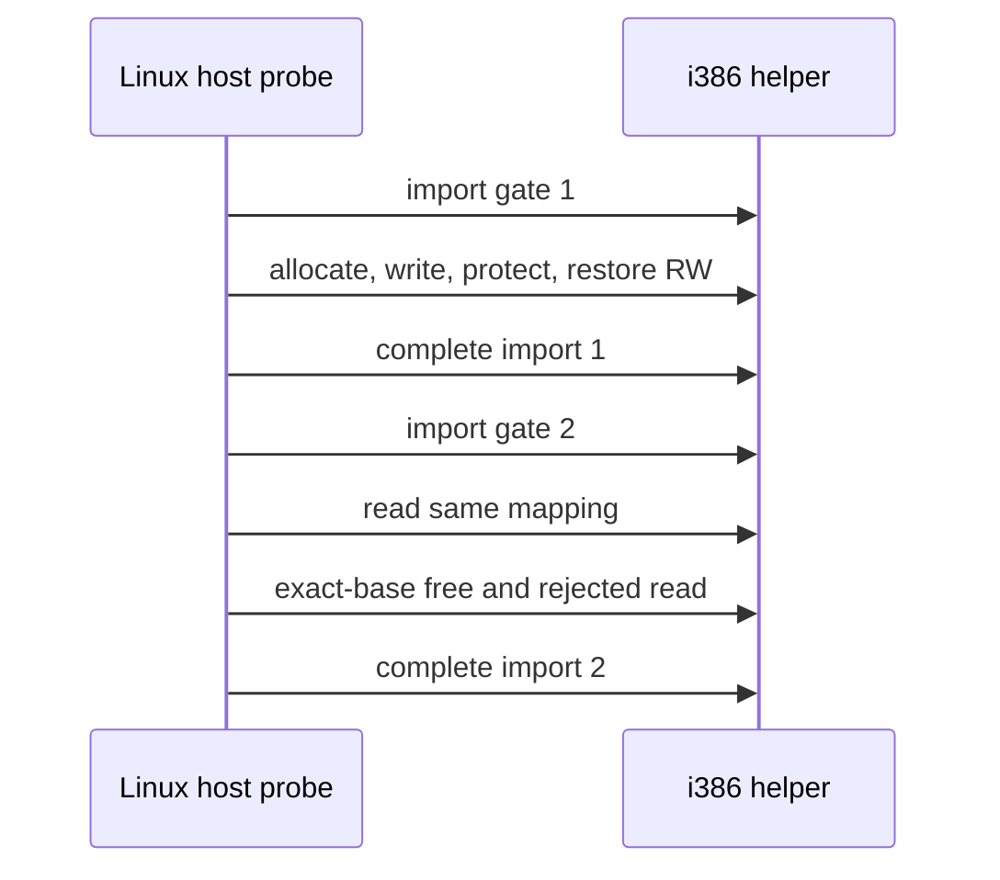

# Linux guest memory cross-import persistence / Linux 게스트 메모리 import 간 유지

## 목적 / Purpose

작업 315의 dynamic guest mapping은 import completion 뒤에도 helper process가 살아 있는 동안 유지되도록 설계됐지만, 기존 fixture는 첫 import 안에서 바로 free했습니다. 이 설계는 두 import gate를 넘겨 같은 mapping을 읽고 해제하는 검증 계약을 추가합니다.

*Task 315 designs dynamic guest mappings to remain available while the helper process lives after import completion, but its fixture freed the mapping within the first import. This design adds a verification contract that reads and frees one mapping across two import gates.*

## 계약 / Contract

첫 import gate는 5,000-byte RW allocation을 받아 8 KiB로 반올림된 mapping에 pattern을 쓰고, read-only protect와 write 거부를 확인한 뒤 RW로 되돌립니다. 이 gate의 completion은 mapping을 해제하지 않습니다.

*The first import gate receives a 5,000-byte RW allocation, writes a pattern into the rounded 8 KiB mapping, verifies read-only protection and rejected write, then restores RW. Its completion does not release the mapping.*

두 번째 import gate는 첫 gate에서 받은 동일 32비트 base로 pattern을 다시 읽어 registry가 completion 때 지워지지 않았음을 확인합니다. 그 뒤 exact-base free를 수행하고 read가 거부되는지 검사한 뒤 completion을 보냅니다.

*The second import gate reads the pattern again through the same 32-bit base returned by the first gate, proving that completion did not clear the registry. It then performs exact-base free, verifies rejected read, and sends completion.*

이 작업은 persistent allocation을 guest code에 직접 전달하거나 Win32 allocator API를 구현하지 않습니다. mapping의 process-exit cleanup, requested-base allocation, partial protection, reserve/commit/decommit은 작업 315의 범위대로 후속입니다.

*This task does not expose the persistent allocation directly to guest code or implement a Win32 allocator API. Process-exit cleanup, requested-base allocation, partial protection, and reserve/commit/decommit remain follow-up scope from Task 315.*

## 검증 / Verification

동일 fixture와 helper로 Linux x64 및 x86 host probe를 실행하고, 각 CTest와 i386 helper build를 다시 수행합니다. `git diff --check`도 실행합니다.

*Run Linux x64 and x86 host probes with the same fixture and helper, then rerun each CTest and the i386 helper build. Also run `git diff --check`.*
