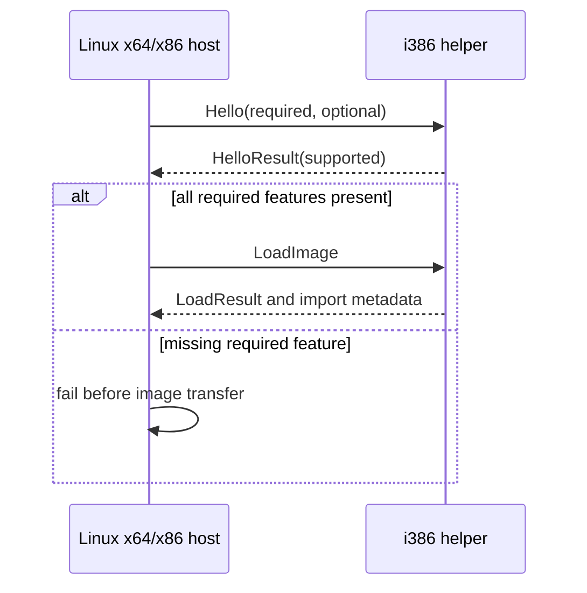

# Linux native-helper capability handshake / Linux native-helper 기능 협상

## 목적 / Purpose

현재 native-helper protocol은 header version이 같다는 사실만 확인합니다. L2 이후 memory lifecycle, callback, thread, dynamic import처럼 선택적으로 늘어나는 기능을 host와 helper가 시작 전에 명시적으로 합의하도록 capability handshake를 추가합니다.

*The current native-helper protocol verifies only that header versions match. Add a capability handshake so the host and helper explicitly agree at startup on features that can grow independently after L2, such as memory lifecycle, callbacks, threads, and dynamic imports.*

## wire 계약 / Wire contract

protocol v5는 `Hello` request와 `HelloResult` response를 `LoadImage` 전에 교환합니다. request는 host가 반드시 요구하는 bit와 선택적으로 사용할 수 있는 bit를 담고, response는 helper가 지원하는 bit를 담습니다. host는 모든 required bit가 response에 있을 때만 `LoadImage`를 전송합니다.

*Protocol v5 exchanges a `Hello` request and `HelloResult` response before `LoadImage`. The request carries bits the host requires and may optionally use; the response carries bits the helper supports. The host sends `LoadImage` only when the response contains every required bit.*

초기 feature bit는 import metadata, bounded memory transfer, guest-memory lifecycle입니다. 세 bit 모두 현재 Linux host/helper가 이미 사용하므로 required 집합에 넣습니다. 이 handshake는 version 검사보다 느슨하지 않으며, 서로 다른 header version은 기존처럼 packet header에서 먼저 거부됩니다.

*Initial feature bits are import metadata, bounded memory transfer, and guest-memory lifecycle. Put all three in the required set because the current Linux host/helper already use them. This handshake is not looser than version checking: different header versions remain rejected first by the existing packet header.*

## 범위 / Scope

이 작업은 feature discovery와 시작 실패만 정의합니다. runtime에 feature를 켜거나 끄는 정책, optional feature별 fallback, callback/thread 구현은 포함하지 않습니다. Windows legacy helper의 runtime 기능을 새로 구현하지 않고, Linux product host와 i386 helper의 계약을 검증합니다.

*This task defines feature discovery and startup failure only. It does not define runtime feature enablement, optional-feature fallbacks, or callback/thread implementation. It does not add new runtime features to the Windows legacy helper; it validates the Linux product-host/i386-helper contract.*

## 검증 / Verification

동일 synthetic fixture로 Linux x64와 x86 host가 i386 helper와 handshake를 마친 뒤 기존 import, memory lifecycle, fault, terminal-stop fixture를 모두 통과하는지 확인합니다. 각 CTest, helper build, `git diff --check`도 실행합니다.

*Using the same synthetic fixture, verify that Linux x64 and x86 hosts complete the handshake with the i386 helper before passing existing import, memory-lifecycle, fault, and terminal-stop fixtures. Also run each CTest, the helper build, and `git diff --check`.*
