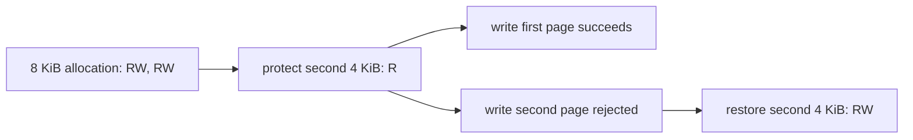

# Linux guest-memory subrange protection / Linux 게스트 메모리 하위 범위 보호

## 목적 / Purpose

현재 Linux guest-memory lifecycle은 allocation 전체와 정확히 같은 base·size에만 protection을 적용합니다. 실제 Win32 API binding을 추가하기 전에, helper transport가 하나의 anonymous allocation 안에서 page-aligned 하위 범위를 독립적으로 보호할 수 있게 합니다.

*The current Linux guest-memory lifecycle applies protection only to an allocation's exact base and full size. Before adding an actual Win32 API binding, make helper transport protect a page-aligned subrange independently within one anonymous allocation.*

## 범위 계약 / Range contract

allocation은 원래 base와 전체 size를 계속 소유하므로 free는 기존처럼 그 base에서만 허용합니다. 각 4 KiB page는 별도 access 상태를 가지며, read/write 요청은 닿는 모든 page가 필요한 access를 허용할 때만 통과합니다. protect 요청은 allocation 내부의 page-aligned address·size여야 합니다.

*An allocation retains its original base and full size, so free remains permitted only at that base. Each 4 KiB page has independent access state, and a read/write request succeeds only when every touched page permits the needed access. A protect request must use a page-aligned address and size inside the allocation.*

protocol의 `ProtectMemoryResult`에는 하나의 previous-access 값만 있으므로, 요청 범위의 이전 page access가 모두 같을 때만 protect를 허용합니다. 혼합된 이전 access 범위는 명시적 error로 거부합니다. 이 제한은 wire format을 바꾸지 않고 결과를 모호하지 않게 유지합니다.

*Because `ProtectMemoryResult` carries one previous-access value, allow protect only when every page in the requested range had the same prior access. Reject a range with mixed prior access explicitly. This keeps the result unambiguous without changing the wire format.*

## 범위와 한계 / Scope and limits

이것은 helper의 anonymous mapping transport 계약입니다. `VirtualProtect`, reserve/commit/decommit, guard pages, requested-base allocation, Win32 last-error 또는 원본 실행 파일의 호출 인자·실패 동작을 구현하거나 확정하지 않습니다.

*This is an anonymous-mapping transport contract in the helper. It does not implement or establish `VirtualProtect`, reserve/commit/decommit, guard pages, requested-base allocation, Win32 last-error, or the original executable's arguments and failure behavior.*

## 검증 / Verification

동일한 8 KiB allocation에서 두 번째 4 KiB만 read-only로 바꿉니다. x64와 x86 host probe는 첫 page write 성공, 두 번째 page write 거부, restore 후 전체 lifecycle·cross-import persistence·free를 검증합니다.

*Change only the second 4 KiB of one 8 KiB allocation to read-only. The x64 and x86 host probes verify first-page write success, second-page write rejection, restore, then the existing full lifecycle, cross-import persistence, and free checks.*
