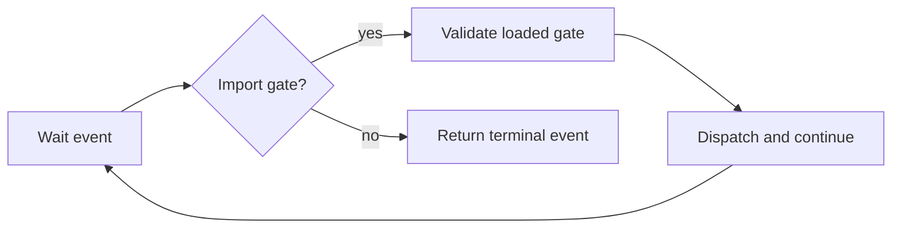

# Import event loop / Import event loop

## 목적 / Purpose

공용 `ImportDispatcher`는 하나의 import gate를 ABI에 맞춰 completion할 수 있지만, 제품 실행 경로는 현재 첫 gate를 관찰하고 멈춥니다. 이 설계는 backend event stream에서 등록된 import를 연속 처리하고 terminal event를 돌려주는 플랫폼 중립 event loop를 추가합니다.

*The shared `ImportDispatcher` can complete one import gate according to its ABI, but the product execution path currently observes the first gate and stops. This design adds a platform-neutral event loop that processes registered imports continuously from a backend event stream and returns a terminal event.*

## 계약 / Contract

loop는 `LoadedPeImage`의 gate address를 확인한 뒤 `ImportDispatcher`에만 dispatch합니다. dispatcher 성공은 continue completion을 보낸 뒤 다음 event를 기다립니다. 등록되지 않은 import, 알려지지 않은 gate, dispatch 실패 또는 import budget 초과는 backend에 terminal stop을 요청하고 오류로 반환합니다. process exit, fault, thread exit와 stopped event는 completion을 만들지 않고 결과로 반환합니다.

*The loop verifies a gate address from `LoadedPeImage` and dispatches only through `ImportDispatcher`. Successful dispatch sends a continue completion and waits for the next event. An unregistered import, unknown gate, dispatch failure, or exhausted import budget requests terminal stop from the backend and returns an error. Process exit, fault, thread exit, and stopped events create no completion and return as results.*

## 범위 / Scope

이 loop는 API binding, callback/thread 재진입, guest process 종료 의미를 구현하지 않습니다. Linux CLI의 기존 first-boundary 관찰 동작도 바꾸지 않습니다. 실제 API binding이 생기면 Linux runner는 이 공용 loop를 사용해 별도 제품 실행 정책을 구성합니다.

*This loop does not implement API bindings, callback/thread reentrancy, or guest process-termination semantics. It also does not change the Linux CLI's existing first-boundary observation behavior. When actual API bindings exist, the Linux runner can use this shared loop to form a separate product execution policy.*
