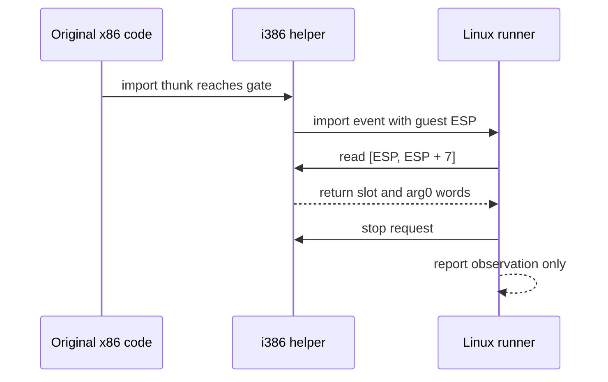

# Linux import 경계 스택 관찰 / Linux import-boundary stack observation

## 목적 / Purpose

Linux original-process runner가 첫 import gate에서 멈췄을 때, helper가 제공하는 guest ESP 위치의 첫 두 32비트 워드를 관찰한다. 첫 워드는 import thunk가 복귀할 guest 주소이고, 두 번째 워드는 호출자 스택에 놓인 첫 워드이다. 이 관찰은 실제 `ez2dj4th`의 `kernel32.dll!GetModuleHandleA` 호출 형태를 확인하여 다음 HLE binding 설계의 근거를 만든다.

*When the Linux original-process runner stops at its first import gate, observe the first two 32-bit words at the guest ESP supplied by the helper. The first is the guest address to which the import thunk returns, and the second is the first word on the caller stack. This observation establishes evidence for the next HLE-binding design by determining the form of the actual `ez2dj4th` `kernel32.dll!GetModuleHandleA` call.*

## 경계와 계약 / Boundary and contract

`RunOriginalUntilBoundary`는 알려진 import gate를 수신한 뒤 completion을 보내기 전에 `ExecutionBackend::ReadMemory`로 `ESP`부터 정확히 8바이트를 읽는다. little-endian으로 해석한 두 값은 `OriginalRunResult`의 관찰 전용 필드에 보관한다. 읽기에 실패하면 helper를 중지하고 실행 실패를 보고한다. 따라서 관찰값이 없는데 API 의미를 추정하거나 binding을 진행하지 않는다.

*After receiving a known import gate and before sending any completion, `RunOriginalUntilBoundary` reads exactly eight bytes from `ESP` through `ExecutionBackend::ReadMemory`. It stores the little-endian values in observation-only `OriginalRunResult` fields. On read failure it stops the helper and reports execution failure. An absent observation therefore cannot be used to infer API meaning or proceed with a binding.*

이 단계는 문자열 포인터 역참조, API 반환값 결정, calling convention 확정, import completion, 동적 import 또는 보호 우회 구현을 포함하지 않는다. 반환 슬롯과 첫 워드가 실제 ABI의 어떤 의미를 갖는지는 관찰 결과와 다음 설계에서만 판정한다.

*This step excludes string-pointer dereference, API-return selection, calling-convention confirmation, import completion, dynamic imports, and protection bypasses. The meaning of the return slot and first word in the actual ABI is determined only from the observation and a subsequent design.*

## 검증 / Validation

로컬의 사용자가 제공한 `roms/ez2dj4th/4thTrax.chd`로 Linux x64 및 Linux x86 CLI를 각각 실행한다. 두 실행은 image base, entry point, first gate, return slot, arg0를 보고해야 한다. 별도로 기존 synthetic native-helper probe를 두 호스트 아키텍처에서 실행하여 8바이트 관찰이 IPC 상태 전이를 깨지 않았는지 확인한다. 원본 CHD와 materialized PE는 저장소에 추가하지 않는다.

*Run the Linux x64 and Linux x86 CLIs separately against the locally user-provided `roms/ez2dj4th/4thTrax.chd`. Each run must report image base, entry point, first gate, return slot, and arg0. Separately run the existing synthetic native-helper probe on both host architectures to confirm that the eight-byte observation did not disturb IPC state transitions. Do not add the original CHD or materialized PE to the repository.*
