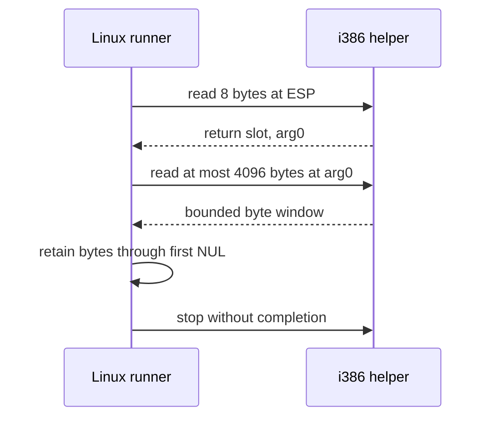

# Linux first-import argument text observation / Linux 첫 import 인자 텍스트 관찰

## 목적 / Purpose

작업 322에서 확인한 첫 import `arg0=0x00ae0f2c`가 가리키는 NUL 종료 바이트열을 제한된 guest-memory read로 관찰한다. 관찰한 텍스트가 API의 module-name 의미를 갖는지, API 반환값이 무엇이어야 하는지, 또는 calling convention이 무엇인지는 이 단계에서 확정하지 않는다.

*Observe the NUL-terminated byte sequence addressed by the first-import `arg0=0x00ae0f2c` confirmed in Task 322, through a bounded guest-memory read. This step does not establish whether the observed text has API module-name meaning, what the API must return, or the calling convention.*

## 경계와 계약 / Boundary and contract

첫 known import gate에서 return slot과 arg0를 읽은 뒤, arg0가 0이 아니면 `ExecutionBackend::ReadMemory`로 최대 4096바이트를 한 번 읽는다. 4096바이트 안의 첫 NUL까지를 observation text로 기록한다. 읽기 실패 또는 NUL 부재는 helper 중지와 오류가 되며, 해당 주소를 무제한으로 따라가거나 host pointer로 변환하지 않는다.

*After reading return slot and arg0 at the first known import gate, when arg0 is nonzero, read at most 4096 bytes once through `ExecutionBackend::ReadMemory`. Record bytes through the first NUL as observation text. A failed read or absent NUL stops the helper and returns an error; never chase the address without a bound or convert it to a host pointer.*

텍스트는 raw guest observation이다. ANSI/Unicode encoding, printable-character policy, API-specific interpretation, HLE module registry, API binding과 original-code continuation은 범위 밖이다.

*The text is a raw guest observation. ANSI/Unicode encoding, printable-character policy, API-specific interpretation, HLE module registry, API binding, and original-code continuation are out of scope.*

## 검증 / Validation

Linux x64와 x86에서 로컬 `ez2dj4th` CHD를 실행해 같은 first gate, arg0, bounded text를 기록한다. 두 product build CTest도 실행한다. 원본 파일이나 extracted byte dump는 저장소에 기록하지 않는다.

*Run the local `ez2dj4th` CHD on Linux x64 and x86 and record the same first gate, arg0, and bounded text. Run CTest for both product builds. Do not record original files or extracted byte dumps in the repository.*
