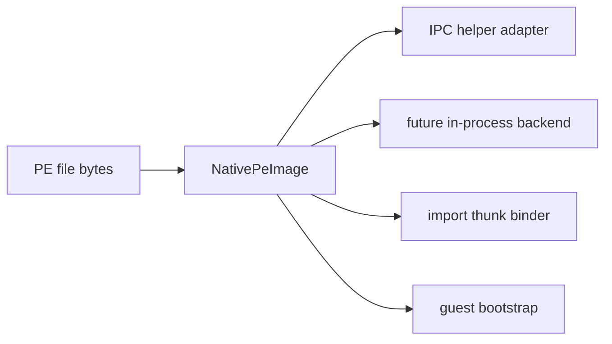

# Linux native PE image 수명주기 분리 / Linux native PE image lifecycle extraction

## 목적 / Purpose

Linux i386 helper 안에 있던 PE32 image mapping, section copy, base relocation, unmap 수명주기를 `NativePeImage` Linux platform component로 분리한다. 이 component는 helper IPC adapter와 이후 in-process execution backend가 함께 사용할 수 있는 guest image 소유 경계다.

*Extract PE32 image mapping, section copy, base relocation, and unmap lifecycle from the Linux i386 helper into a `NativePeImage` Linux platform component. This component is a guest-image ownership boundary shared by the helper IPC adapter and the later in-process execution backend.*

## 계약 / Contract

`NativePeImage`은 요청한 32-bit guest base에 `mmap`한 image memory, mapped size, entry point를 소유한다. mapping은 PE32 executable, headers/sections bounds, requested-base arithmetic, relocation directory를 기존과 같은 조건으로 검증한다. 실패하면 mapping을 release하고 빈 상태로 돌아간다. guest address는 `std::uint32_t`와 `GuestAddress` 경계를 유지하며 host pointer로 공용 코어에 노출하지 않는다.

*`NativePeImage` owns image memory mapped by `mmap` at requested 32-bit guest base, mapped size, and entry point. Mapping validates PE32 executable, header/section bounds, requested-base arithmetic, and relocation directory under the same conditions as before. Failure releases mapping and returns to an empty state. Guest addresses retain `std::uint32_t` and `GuestAddress` boundaries without exposing host pointers to shared core.*

이 단계는 helper protocol, import thunk, TLS execution, dynamic guest memory, API binding 또는 actual game execution을 바꾸지 않는다.

*This step does not change helper protocol, import thunk, TLS execution, dynamic guest memory, API bindings, or actual game execution.*

## 검증 / Validation

기존 full Linux helper probe를 x64/x86 host에서 실행한다. shared ELF32 helper가 normal import, fault, stop, capability rejection을 이전과 같이 통과해야 한다.

*Run the existing full Linux helper probe from x64/x86 hosts. The shared ELF32 helper must preserve normal import, fault, stop, and capability-rejection results.*
