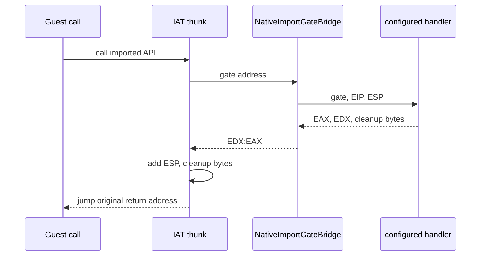

# Linux native import bridge 분리 / Linux native import bridge extraction

## 목적 / Purpose

Linux i386 native PE 실행에서 import thunk가 호출하는 x86 bridge ABI를 IPC adapter에서 분리한다. bridge는 gate 주소, 게스트 EIP, 게스트 ESP를 동기 handler에 전달하고, handler가 반환한 EAX, EDX, callee stack 정리 바이트 수로 thunk가 원본 호출 지점으로 복귀하게 한다.

*Separate the x86 bridge ABI invoked by import thunks during Linux i386 native PE execution from the IPC adapter. The bridge passes gate address, guest EIP, and guest ESP to a synchronous handler, then lets the thunk return to the original call site using the handler's EAX, EDX, and callee-stack cleanup byte count.*

이 단계는 실제 Win32 API binding이나 Linux x86 단일 프로세스 product backend를 추가하지 않는다. 기존 IPC handler는 새 bridge 계약의 첫 adapter로 유지한다.

*This step does not add an actual Win32 API binding or a Linux x86 single-process product backend. The existing IPC handler remains the first adapter for the new bridge contract.*

## 설계 / Design

`NativeImportGateBridge`는 i386 `stdcall` entry다. 기존 thunk ABI를 유지하므로 guest에서 보이는 IAT thunk 기계어와 반환 규칙은 바뀌지 않는다. bridge는 자신의 frame에서 thunk가 보존한 원래 guest return slot을 계산하고, 그 값과 gate 주소 및 stack 시작 주소를 `NativeImportGateEvent`로 만든다.

*`NativeImportGateBridge` is an i386 `stdcall` entry. It preserves the existing thunk ABI, so the IAT thunk machine code and return convention visible to the guest do not change. From its frame, the bridge finds the original guest return slot preserved by the thunk and forms a `NativeImportGateEvent` with that value, the gate address, and stack start address.*

handler는 같은 guest 실행 thread에서 동기적으로 호출된다. 성공 handler는 결과 register와 `stack_bytes_to_pop`을 설정한다. bridge는 thread-local cleanup storage에 그 값을 기록하고 EDX:EAX로 결과를 반환한다. emitted thunk는 cleanup storage를 읽어 ESP를 조정한 뒤 원래 return address로 jump한다. handler가 없거나 실패하면 bridge는 0을 반환하며 adapter는 실행 실패 상태를 기록한다.

*The handler runs synchronously on the guest execution thread. A successful handler sets result registers and `stack_bytes_to_pop`. The bridge writes that value to thread-local cleanup storage and returns the result in EDX:EAX. The emitted thunk reads cleanup storage, adjusts ESP, then jumps to the original return address. If no handler is configured or it fails, the bridge returns zero and the adapter records execution failure.*

## 구성 및 수명 / Configuration and lifetime

handler와 context는 thread-local configuration이다. session을 준비하기 전에 helper가 IPC handler를 등록하고, session 및 guest 실행이 끝나면 scope cleanup이 configuration을 제거한다. 따라서 helper의 protocol state가 platform-neutral image/session component로 새어 들어가지 않으며, 후속 in-process backend는 같은 bridge에 자체 HLE handler를 등록할 수 있다.

*The handler and context are thread-local configuration. Before preparing the session, the helper registers the IPC handler; scope cleanup removes the configuration after session and guest execution end. Thus helper protocol state does not leak into the platform-neutral image/session component, and a later in-process backend can register its own HLE handler with the same bridge.*

## 검증 / Validation

기존 Linux native helper probe를 x86-64 및 x86 host에서 실행한다. 정상 import 결과, fault 전달, terminal stop, capability rejection이 유지되어야 한다. 실제 `ez2dj4th` API completion은 이번 단계의 범위 밖이다.

*Run the existing Linux native helper probe on x86-64 and x86 hosts. Normal import result, fault propagation, terminal stop, and capability rejection must remain intact. Actual `ez2dj4th` API completion is outside this step.*
