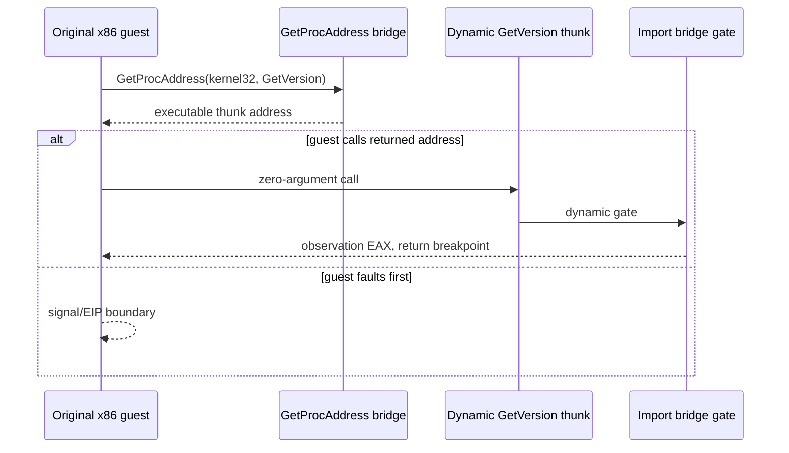

# Linux x86 GetVersion thunk 연속 실행 진단 / Linux x86 GetVersion thunk continuation diagnostic

`GetProcAddress(kernel32, "GetVersion")`가 반환한 주소를 원본 코드가 실제로 호출하는지 확인하기 위해, Linux x86 프로세스 안에 실행 전용 동적 thunk를 만듭니다. thunk는 기존 import bridge ABI로 고유 dynamic gate를 전달하고, gate에 도달하면 인자가 없는 `GetVersion` 호출의 원래 복귀 주소에 `INT3`를 둡니다.

*To determine whether the original code calls the value returned by `GetProcAddress(kernel32, "GetVersion")`, create an executable dynamic thunk inside the Linux x86 process. The thunk forwards a unique dynamic gate through the existing import-bridge ABI. On arrival, the gate puts `INT3` at the original return address of the zero-argument `GetVersion` call.*

동적 resolver가 반환한 주소를 호출하기 전에 guest가 다른 fault로 멈추면, 진단은 호출 성공으로 해석하지 않고 `kGetVersionCallNotReached` 경계와 signal/EIP를 보고합니다. 이 경계는 resolver 반환값이 제공된 뒤의 실행 중단을 재현하는 용도이며, `GetVersion`의 OS 버전 의미나 실제 kernel32 주소를 모사하지 않습니다.

*If the guest stops at another fault before it calls the dynamic resolver result, the diagnostic reports `kGetVersionCallNotReached` with its signal and EIP instead of treating the call as successful. This boundary reproduces a stop after providing the resolver result; it does not emulate `GetVersion` OS-version semantics or a real kernel32 address.*

