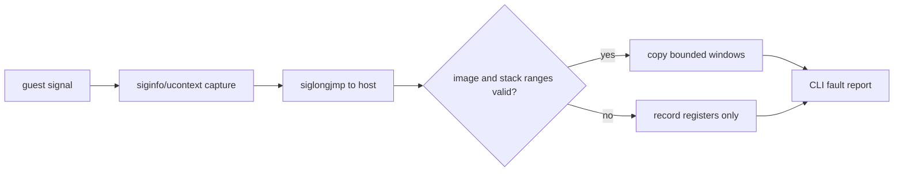

# Linux x86 fault context 관측 / Linux x86 fault-context observation

Linux x86 in-process 실행이 `SIGSEGV`로 중단될 때 EIP만으로 원인을 판정하지 않습니다. signal handler가 `siginfo_t`의 fault address와 signal code, x86 `ucontext_t`의 page-fault error code 및 일반 레지스터를 보존합니다. guest 실행이 signal handler에서 복귀한 뒤에만 안전하게 범위를 확인한 instruction window와 guarded guest-stack words를 복사합니다.

*Do not determine the cause of a Linux x86 in-process `SIGSEGV` from EIP alone. The signal handler preserves the fault address and signal code from `siginfo_t`, plus the x86 page-fault error code and general registers from `ucontext_t`. Only after guest execution returns from the signal handler are a range-checked instruction window and guarded guest-stack words copied safely.*

fault handler는 원본 이미지나 CHD 내용을 파일로 저장하지 않습니다. 관측은 최대 24개의 실행 중 instruction bytes와 최대 네 개의 stack word로 제한되며, EIP가 mapped image 범위 밖이거나 ESP가 guarded guest-stack 범위 밖이면 해당 window를 기록하지 않습니다.

*The fault handler does not write original-image or CHD contents to files. Observation is limited to at most 24 live instruction bytes and four stack words. A window is omitted when EIP lies outside the mapped image or ESP lies outside the guarded guest stack.*

