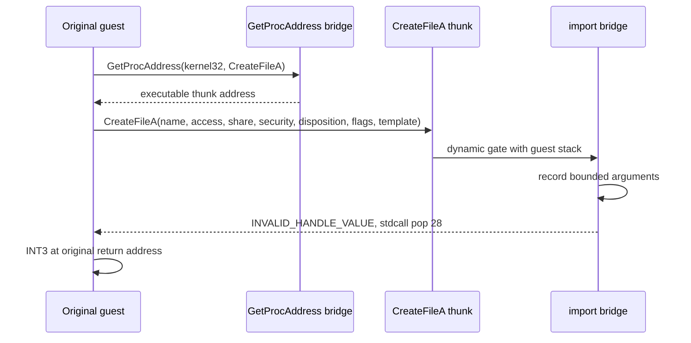

# Linux x86 CreateFileA 동적 thunk 관측 / Linux x86 dynamic CreateFileA thunk observation

## 목적 / Purpose

Task 338은 4th Trax의 두 번째 `GetProcAddress(kernel32, "CreateFileA")` 요청이 현재 Linux x86 최소 진단에서 처리되지 않아 `EAX=0`을 반환하고, 그 값이 `0x00af0c22`의 null read로 이어짐을 확인했습니다. 다음 경계는 resolver가 실행 가능한 `CreateFileA` thunk를 반환했을 때 원본 코드가 실제로 그 주소를 호출하는지와 어떤 Win32 인자를 전달하는지 확인하는 것입니다.

*Task 338 confirmed that the second `GetProcAddress(kernel32, "CreateFileA")` request is unhandled by the current minimum Linux x86 diagnostic, returns `EAX=0`, and leads to the null read at `0x00af0c22`. The next boundary is to determine whether the original code actually calls an executable `CreateFileA` thunk returned by the resolver and which Win32 arguments it supplies.*

## 설계 / Design

Linux i386 전용 `--linux-in-process-createfile-call` 진단은 기존 GetVersion 연속 실행 경계를 유지하면서 `CreateFileA` 전용 process-local thunk를 추가합니다. resolver는 확인된 pseudo kernel32 identity와 정확한 ANSI 이름에만 thunk 주소를 반환합니다. thunk가 호출되면 import bridge는 복귀 주소와 7개 stdcall 인자를 기록하고, bounded guest-image 문자열 검사로 파일 이름을 복사합니다.

*The Linux i386-only `--linux-in-process-createfile-call` diagnostic retains the existing GetVersion continuation boundary and adds a process-local thunk dedicated to `CreateFileA`. The resolver returns the thunk address only for the confirmed pseudo-kernel32 identity and exact ANSI name. When called, the import bridge records the return address and seven stdcall arguments and copies the file name through a bounded guest-image string check.*

이번 진단은 파일이나 장치를 열지 않습니다. 호출을 관측한 뒤 `INVALID_HANDLE_VALUE`와 28바이트 stdcall cleanup을 반환하고 원래 guest 복귀 주소의 process-local `INT3`에서 멈춥니다. 따라서 실제 VFS routing, guest handle 수명, last-error 의미, 보호 장치 응답은 별도 후속 작업입니다.

*This diagnostic does not open a file or device. After observing the call, it returns `INVALID_HANDLE_VALUE` with 28-byte stdcall cleanup and stops at a process-local `INT3` placed at the original guest return address. Actual VFS routing, guest-handle lifetime, last-error semantics, and protection-device responses remain separate follow-up work.*

## 안전 경계 / Safety boundary

진단은 Linux i386 host와 명시적 CLI 옵션에서만 활성화합니다. 원본 CHD와 materialized executable은 수정하지 않습니다. breakpoint는 process-local mapped image의 복귀 주소 한 바이트만 임시 변경하며 mapping 수명과 함께 폐기됩니다. 문자열은 mapped guest image 또는 bootstrap이 소유한 guarded guest stack 범위 안에 있는 경우에만 제한된 길이로 읽습니다.

*The diagnostic is enabled only on a Linux i386 host through an explicit CLI option. It does not modify the original CHD or materialized executable. The breakpoint temporarily changes only one byte at the return address in the process-local mapped image and is discarded with that mapping's lifetime. A string is read with a fixed bound only when it remains inside either the mapped guest image or the guarded guest stack owned by the bootstrap.*

## 검증 / Validation

1. synthetic i386 probe에서 별도 dynamic thunk가 7개 인자를 전달하고 28바이트를 정리하는지 검증합니다.
2. Linux x86 제품 빌드와 synthetic probe를 실행합니다.
3. 사용자 제공 4th CHD에서 실제 `CreateFileA` thunk 호출, 파일 이름, scalar 인자, 복귀 주소를 확인합니다.
4. Linux x64 제품 빌드가 i386 전용 진단을 명시적으로 거절하는지 확인합니다.

*1. Verify with the synthetic i386 probe that a separate dynamic thunk passes seven arguments and cleans 28 bytes.
2. Build the Linux x86 product and run the synthetic probe.
3. Confirm the actual `CreateFileA` thunk call, file name, scalar arguments, and return address with the user-provided 4th CHD.
4. Verify that the Linux x64 product build explicitly rejects the i386-only diagnostic.*
