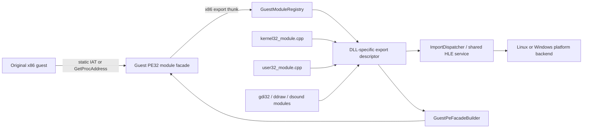

# 작업 340: 게스트 PE 호환 모듈 설계 / Task 340: Guest PE compatibility module design

## 결정 / Decision

`kernel32`, `user32`, `gdi32`, `ddraw`, `dsound` 같은 Win32 DLL 경계를 하나의 resolver 파일에 누적하지 않습니다. 각 DLL은 독립된 export 명세와 구현 파일을 갖는 **게스트 PE32 호환 모듈**로 모델링합니다. 공용 module registry가 이름·별칭·ordinal·수명과 guest-visible identity를 관리하고, PE facade builder가 같은 명세로 실제 DOS/NT header와 export directory, x86 thunk를 갖는 PE32 이미지를 만듭니다.

*Do not accumulate Win32 DLL boundaries such as `kernel32`, `user32`, `gdi32`, `ddraw`, and `dsound` in one resolver file. Model each DLL as an independent **guest PE32 compatibility module** with its own export declaration and implementation files. A shared module registry owns names, aliases, ordinals, lifetime, and guest-visible identity, while a PE facade builder emits a PE32 image with DOS/NT headers, an export directory, and x86 thunks from the same declaration.*

여기서 호환 DLL은 호스트 운영체제의 시스템 DLL을 교체하는 파일이 아닙니다. 원본 x86 코드가 보는 Win32 ABI와 PE module identity를 제공하는 re2DJ 소유 facade입니다. 게임 로직은 계속 원본 실행 파일에서 실행되고, facade는 import 경계만 공용 HLE service로 전달합니다.

*A compatibility DLL is not a replacement file for a host operating system DLL. It is a re2DJ-owned facade that presents the Win32 ABI and PE module identity seen by the original x86 code. Game logic continues to execute in the original executable; the facade forwards only import boundaries to shared HLE services.*

## 근거와 현재 경계 / Evidence and current boundary

실제 4th CHD에서 Linux i386 경로는 `GetModuleHandleA("kernel32")`, `GetProcAddress(kernel32, "GetVersion")`, `GetProcAddress(kernel32, "CreateFileA")`, 그리고 반환된 `CreateFileA` thunk의 `\\.\NTICE` 호출까지 확인했습니다. 현재 진단은 `kernel32`에 `0x7F000001`을 반환하고 API별 process-local thunk를 직접 관리합니다. 이 값은 실제 PE module base가 아니며, static import와 dynamic resolution의 단일 identity도 제공하지 않습니다.

*The Linux i386 path has confirmed `GetModuleHandleA("kernel32")`, `GetProcAddress(kernel32, "GetVersion")`, `GetProcAddress(kernel32, "CreateFileA")`, and the returned `CreateFileA` thunk call for `\\.\NTICE` against the real 4th CHD. The current diagnostic returns `0x7F000001` for `kernel32` and manages process-local thunks per API. That value is not a real PE module base and does not provide one identity shared by static imports and dynamic resolution.*

확인된 실행 사실은 [Linux in-process 첫 import 분석](../analysis/ez2dj4th-linux-inprocess-first-import.md)에 둡니다. 이 문서는 그 증거에서 출발하는 구현 설계이며, 아직 실행으로 검증하지 않은 facade layout과 Windows adapter 동작은 계획입니다.

*Confirmed execution facts remain in the [Linux in-process first-import analysis](../analysis/ez2dj4th-linux-inprocess-first-import.md). This document is an implementation design derived from that evidence; the facade layout and Windows adapter behavior not yet exercised are plans.*

## Wine에서 참고하는 개념과 차이 / Concepts taken from Wine and differences

현대 Wine은 애플리케이션에 PE module을 보이고, 필요한 모듈에서는 PE 부분과 Unix library 부분을 분리하며 정해진 전환 경계로 호출합니다. Wine 7.0은 PE module과 연관 Unix library 사이의 표준 NT system-call 경계를 설명하고, Wine 8.0은 전체 모듈의 PE 전환 완료와 PE→Unix dispatcher를 설명합니다. 이 구조에서 얻는 원칙은 **guest-visible PE identity와 host service 구현을 분리한다**는 점뿐입니다. [Wine 7.0 release notes](https://www.winehq.org/pipermail/wine-devel/2022-January/204682.html), [Wine 8.0 release notes](https://list.winehq.org/hyperkitty/list/wine-announce%40list.winehq.org/2023/1/)

*Modern Wine exposes PE modules to applications and, where needed, separates the PE part from an associated Unix library across a defined transition boundary. Wine 7.0 describes the standard NT-system-call boundary between a PE module and its Unix library, and Wine 8.0 describes completion of the PE-module conversion plus a PE-to-Unix dispatcher. The only principle adopted here is to **separate guest-visible PE identity from host-service implementation**. [Wine 7.0 release notes](https://www.winehq.org/pipermail/wine-devel/2022-January/204682.html), [Wine 8.0 release notes](https://list.winehq.org/hyperkitty/list/wine-announce%40list.winehq.org/2023/1/)*

re2DJ는 Wine loader, wineserver, NTDLL, Unix library ABI, spec 파일 도구나 Wine 소스를 포함하지 않습니다. BSD-3-Clause 정책에 맞춰 현재 PE loader, `ExecutionBackend`, `ImportDispatcher` 위에 필요한 최소 계약을 독립 구현합니다. Wine 수준의 일반 Windows 호환성이 아니라 확인된 EZ2DJ import 표면과 실행 순서를 범위로 삼습니다.

*re2DJ does not include the Wine loader, wineserver, NTDLL, Unix-library ABI, spec-file tools, or Wine source. Under the BSD-3-Clause policy, it independently implements the minimum contract on the existing PE loader, `ExecutionBackend`, and `ImportDispatcher`. The scope is the confirmed EZ2DJ import surface and execution order, not general Windows compatibility at Wine's breadth.*

## 구조 / Structure



### 1. DLL별 명세와 구현 / Per-DLL declarations and implementations

각 DLL은 별도 header/source pair를 갖습니다. 예상 위치는 다음과 같습니다.

*Each DLL has a separate header/source pair. The intended locations are:*

```text
include/re2dj/hle/modules/
  guest_module.h
  guest_module_registry.h
  guest_pe_facade.h
  kernel32_module.h
  user32_module.h
  gdi32_module.h
  ddraw_module.h
  dsound_module.h

src/hle/modules/
  guest_module_registry.cpp
  guest_pe_facade.cpp
  kernel32_module.cpp
  user32_module.cpp
  gdi32_module.cpp
  ddraw_module.cpp
  dsound_module.cpp
```

초기 커밋은 실제 binding이 있는 `kernel32`와 공용 기반만 추가합니다. `user32` 등은 첫 확인 export를 연결하는 작업에서 각각 파일을 추가합니다. 이름만 있는 빈 DLL이나 성공 stub을 미리 만들지 않습니다.

*The initial implementation adds only the shared foundation and `kernel32`, which has observed bindings. Add `user32` and the remaining files individually when their first confirmed exports are connected. Do not pre-create name-only DLLs or success stubs.*

각 `GuestExportDescriptor`는 최소한 export 이름, 선택적 ordinal, 호출 규약, 인자 수, 공용 handler identity를 가집니다. descriptor 목록 하나를 source of truth로 사용하여 registry lookup, PE export address/name/ordinal table, static IAT binding과 dynamic lookup이 서로 어긋나지 않게 합니다.

*Each `GuestExportDescriptor` contains at least an export name, optional ordinal, calling convention, argument count, and shared handler identity. One descriptor list is the source of truth for registry lookup, PE export address/name/ordinal tables, static IAT binding, and dynamic lookup so those paths cannot drift.*

### 2. 공용 module registry / Shared module registry

`GuestModuleRegistry`는 다음 책임만 가집니다.

*`GuestModuleRegistry` has only these responsibilities:*

- ASCII 대소문자를 무시하고 `kernel32`와 `kernel32.dll` 같은 확인된 별칭을 정규화합니다.
  *Normalize confirmed aliases such as `kernel32` and `kernel32.dll` case-insensitively in ASCII.*
- module descriptor와 mapping 결과를 등록하고, 이름 또는 guest handle로 같은 module identity를 찾습니다.
  *Register module descriptors and mapping results, and find the same module identity by name or guest handle.*
- export를 이름 또는 ordinal로 찾으며 중복 이름·ordinal과 범위 오류를 거절합니다.
  *Resolve exports by name or ordinal and reject duplicate names, duplicate ordinals, and range errors.*
- module base, image size, export thunk guest address를 32비트 `GuestAddress`로 보존합니다.
  *Store module base, image size, and export-thunk guest addresses as 32-bit `GuestAddress` values.*

registry는 host pointer나 호스트 DLL handle을 공용 core에 노출하지 않습니다. `LoadLibrary` search order, refcount와 unload는 첫 단계 범위가 아니며, 시작 시 등록된 module은 process lifetime 동안 고정됩니다.

*The registry exposes neither host pointers nor host DLL handles to the shared core. `LoadLibrary` search order, reference counting, and unload are outside the first stage; modules registered at startup remain fixed for the process lifetime.*

### 3. PE32 facade와 thunk / PE32 facades and thunks

`GuestPeFacadeBuilder`는 descriptor에서 최소 유효 PE32 image를 생성합니다. image에는 DOS header, NT headers, section table, read-only export data, executable thunk section이 포함됩니다. export address table은 각 thunk RVA를 가리키며 `HMODULE`은 facade image base입니다. 생성물은 원본 자산이 아니며 build output 또는 process memory에서 생성하고 저장소에는 binary로 커밋하지 않습니다.

*`GuestPeFacadeBuilder` generates a minimally valid PE32 image from the descriptors. The image contains a DOS header, NT headers, section table, read-only export data, and an executable thunk section. The export address table points to each thunk RVA, and `HMODULE` is the facade image base. This is not an original asset; generate it in build output or process memory and do not commit a binary artifact.*

thunk는 module/API identity를 기존 import bridge로 전달합니다. ABI cleanup은 descriptor의 `__stdcall`/`__cdecl`과 argument count에서 결정하고 실제 API 의미는 `ImportDispatcher` 뒤의 HLE handler가 담당합니다. facade code는 파일 시스템, X11, Win32 같은 host API를 직접 호출하지 않습니다.

*A thunk passes module/API identity to the existing import bridge. ABI cleanup is derived from the descriptor's `__stdcall`/`__cdecl` convention and argument count, while the HLE handler behind `ImportDispatcher` owns API semantics. Facade code does not call host APIs such as file-system, X11, or Win32 services directly.*

페이지 보호는 작성 중 RW, 완성 후 header/export는 R, thunk는 RX로 전환하여 W+X를 남기지 않습니다. base 선택은 겹침 검사와 4 GiB 미만 조건을 적용하며, 할당 실패를 다른 임의 identity로 숨기지 않습니다.

*Use RW pages while building, then change headers/exports to R and thunks to RX so no W+X mapping remains. Base selection checks collisions and stays below 4 GiB; allocation failure is not hidden behind another arbitrary identity.*

### 4. 정적 import와 동적 resolver의 합류 / Convergence of static imports and dynamic resolution

정적 PE import binder는 `(module, name/ordinal)`을 registry에서 찾아 facade export thunk 주소를 IAT에 씁니다. `GetModuleHandleA`는 등록된 이름이면 facade base를 반환하고, `GetProcAddress`는 전달된 facade base와 export name/ordinal을 같은 registry에서 찾아 같은 thunk 주소를 반환합니다.

*The static PE import binder resolves `(module, name/ordinal)` through the registry and writes the facade export-thunk address into the IAT. `GetModuleHandleA` returns the facade base for a registered name, and `GetProcAddress` uses the same registry with that facade base plus an export name/ordinal to return the same thunk address.*

따라서 Linux처럼 re2DJ가 module facade를 직접 mapping하는 backend 안에서는 아래 불변식을 지킵니다.

*The following invariants hold in a backend, such as Linux, where re2DJ directly maps the module facades:*

```text
GetModuleHandleA("kernel32") == kernel32 facade image base
GetProcAddress(kernel32, "CreateFileA") == kernel32 EAT CreateFileA address
static IAT(kernel32!CreateFileA) == dynamic CreateFileA address
```

forwarded export는 실제 필요가 확인될 때까지 지원하지 않습니다. 미등록 module/export는 null 또는 해당 Win32 실패 계약을 반환하고 구조화된 진단을 남기며, 자동으로 호스트 동명 API를 호출하지 않습니다.

*Forwarded exports are unsupported until a real need is confirmed. An unregistered module or export returns null or the applicable Win32 failure contract and leaves a structured diagnostic; it does not automatically call a same-named host API.*

## 플랫폼별 적용 / Platform-specific application

### Linux x86

현재 i386 in-process backend가 facade PE32를 guest image와 같은 process의 충돌 없는 32비트 주소에 mapping합니다. 기존 `native_create_file_observation.cpp`의 `0x7F000001`과 API별 조건문은 registry 기반 `kernel32` module로 이동합니다. 확인된 첫 vertical slice는 `GetModuleHandleA`, `GetProcAddress`, `GetVersion`, `CreateFileA`입니다.

*The current i386 in-process backend maps facade PE32 images at collision-free 32-bit addresses in the same process as the guest image. The `0x7F000001` value and per-API conditionals in `native_create_file_observation.cpp` move into the registry-backed `kernel32` module. The first confirmed vertical slice is `GetModuleHandleA`, `GetProcAddress`, `GetVersion`, and `CreateFileA`.*

### Linux x64

공용 descriptor와 PE image 형식은 그대로 사용하지만, 실행 thunk는 아직 설계 중인 compatibility-mode trampoline을 거쳐야 합니다. facade와 stack은 4 GiB 미만에 둡니다. trampoline이 검증되기 전에는 x64 제품이 facade 실행을 명시적으로 unsupported로 거절하며, x86 helper 경로를 진단 fallback으로 유지합니다.

*Use the same descriptors and PE image format, but executable thunks must cross the planned compatibility-mode trampoline. Keep facades and stacks below 4 GiB. Until the trampoline is validated, the x64 product explicitly rejects facade execution as unsupported and retains the x86 helper as a diagnostic fallback.*

2026-09-24: trampoline 설계와 1단계 전환 runtime은 [작업 353](20260924-353-linux-x64-compat-mode-adapter.md)에 있다. 합성 probe가 진입·복귀, TEB FS, import 콜백, fault 포착을 검증했다. facade 실행은 그 설계의 3단계에서 연결한다.

*2026-09-24: the trampoline design and its stage-1 transition runtime are in [Task 353](20260924-353-linux-x64-compat-mode-adapter.md). A synthetic probe validated entry/return, the TEB FS, import callbacks, and fault capture; facade execution is connected in stage 3 of that design.*

### Windows x64 host와 WoW64 runtime

Windows에서는 `kernel32.dll` 또는 `user32.dll`이라는 re2DJ 파일을 애플리케이션 옆에 두어 시스템 DLL을 shadow하지 않습니다. 지원 경로는 OS WoW64가 호스팅하는 32비트 runtime이며, Windows loader가 이미 적재한 system module identity를 유지합니다. 공용 DLL별 descriptor와 HLE handler는 재사용하되, Windows adapter가 static IAT patch와 hooked `GetProcAddress`를 같은 descriptor에 연결합니다. HLE로 등록하지 않은 export의 native fallback 여부는 module별 명시 정책으로 제한합니다.

*On Windows, do not place re2DJ files named `kernel32.dll` or `user32.dll` beside the application to shadow system DLLs. The supported path is a 32-bit runtime hosted by OS WoW64, retaining the system-module identity already loaded by the Windows loader. Reuse the shared per-DLL descriptors and HLE handlers, while a Windows adapter connects both static IAT patches and the hooked `GetProcAddress` path to those descriptors. Whether an export not registered for HLE may fall back to native code is an explicit per-module policy.*

따라서 Linux의 guest handle은 facade base이고 Windows의 system DLL handle은 OS 값일 수 있습니다. 공통 보장은 숫자 일치가 아니라 같은 backend 안에서 module lookup과 export resolution이 일관되고, HLE export가 DLL별 descriptor에서 한 번만 선언된다는 점입니다.

*A Linux guest handle is therefore a facade base, while a Windows system-DLL handle may remain the OS value. The cross-platform guarantee is not numeric equality; it is consistent module lookup and export resolution within a backend, with each HLE export declared once in its per-DLL descriptor.*

## 단계별 구현 / Implementation sequence

1. **공용 descriptor와 registry.** 이름 정규화, 이름/ordinal lookup, 중복 거절, fixed-lifetime module identity를 단위 테스트합니다.
   ***Shared descriptors and registry.** Unit-test name normalization, name/ordinal lookup, duplicate rejection, and fixed-lifetime module identity.*
2. **PE32 facade builder.** synthetic `kernel32` image의 header, section, export directory, EAT/name/ordinal table과 thunk RVA를 독립 parser로 검증합니다.
   ***PE32 facade builder.** Validate headers, sections, export directory, EAT/name/ordinal tables, and thunk RVAs of a synthetic `kernel32` image with an independent parser.*
3. **`kernel32` vertical slice.** 확인된 네 export를 별도 module에 선언하고 Linux i386 mapping과 import bridge에 연결합니다.
   ***`kernel32` vertical slice.** Declare the four confirmed exports in a dedicated module and connect Linux i386 mapping to the import bridge.*
4. **resolver 이관과 실제 CHD 검증.** 임시 pseudo handle을 제거하고 static/dynamic address identity, `\\.\NTICE` CreateFileA ABI와 기존 실패 복귀를 검증합니다.
   ***Resolver migration and real-CHD validation.** Remove the temporary pseudo handle and verify static/dynamic address identity, the `\\.\NTICE` CreateFileA ABI, and the existing failure return.*
5. **guest handle/VFS service 연결.** 별도 설계에서 `CreateFileA`를 platform-neutral guest handle table과 Linux VFS/device policy에 연결합니다.
   ***Guest-handle/VFS service connection.** In a separate design, connect `CreateFileA` to a platform-neutral guest-handle table and Linux VFS/device policy.*
6. **모듈별 확장.** 실제 import 및 실행 순서에 따라 `user32`, `gdi32`, DirectX 모듈을 각각 독립 파일로 추가합니다.
   ***Per-module expansion.** Add `user32`, `gdi32`, and DirectX modules as independent files according to confirmed imports and execution order.*
7. **x64/Windows adapter.** Linux compatibility-mode trampoline과 Windows descriptor adapter를 각각 검증합니다.
   ***x64/Windows adapters.** Validate the Linux compatibility-mode trampoline and Windows descriptor adapter independently.*

각 단계는 별도 작업 단위로 설계·작업 지시·구현·검증·작업 로그·커밋을 완료합니다. 1~4단계를 하나의 대규모 변경으로 합치지 않습니다.

*Each stage completes its own design, work order, implementation, validation, work log, and commit. Do not combine stages 1 through 4 into one large change.*

## 검증 전략 / Validation strategy

- registry 단위 테스트: 대소문자와 `.dll` 별칭, unknown module, 이름/ordinal, duplicate, 잘못된 handle.
  *Registry unit tests: case and `.dll` aliases, unknown modules, names/ordinals, duplicates, and invalid handles.*
- facade 단위 테스트: PE32 machine/magic, RVA와 section bounds, export directory 정렬, 읽기/실행 page protection 계획.
  *Facade unit tests: PE32 machine/magic, RVA and section bounds, export-directory ordering, and the read/execute page-protection plan.*
- ABI fixture: `__stdcall`과 `__cdecl`, 0개 및 7개 인자, EAX/EDX, ESP 보존과 cleanup.
  *ABI fixtures: `__stdcall` and `__cdecl`, zero and seven arguments, EAX/EDX, ESP preservation, and cleanup.*
- identity fixture: static IAT와 `GetProcAddress`가 동일 export address를 얻고, 그 주소가 module image의 executable section 안에 있는지 확인.
  *Identity fixture: static IAT and `GetProcAddress` obtain the same export address, and that address lies in the module image's executable section.*
- Linux x86 실제 실행: 4th CHD의 확인된 resolver 순서와 `CreateFileA("\\.\NTICE")` 경계를 회귀 검증.
  *Linux x86 real execution: regress the confirmed resolver order and `CreateFileA("\\.\NTICE")` boundary on the 4th CHD.*
- Linux x64/Windows: 두 제품 build를 유지하고, 아직 지원하지 않는 실행 경로는 명시적 오류로 검증하며 Windows 배포물에 shadowing system DLL 이름이 없는지 확인.
  *Linux x64/Windows: keep both product builds green, verify unsupported execution paths with explicit errors, and confirm that Windows output contains no shadowing system-DLL filenames.*

실제 CHD 검증은 사용자 제공 경로를 읽기 전용으로 사용하고 생성 facade와 로그는 build/staging 경로에만 둡니다.

*Real-CHD validation uses the user-supplied path read-only and keeps generated facades and logs only in build/staging paths.*

## 첫 단계 범위 밖 / Out of scope for the first stage

- Wine loader, wineserver, NTDLL 또는 전체 Windows loader 재현
  *Wine loader, wineserver, NTDLL, or full Windows-loader reproduction*
- 일반적인 `LoadLibrary` 검색, module refcount/unload, PEB loader list 완전 재현
  *General `LoadLibrary` search, module reference counting/unload, or a complete PEB loader list*
- forwarded export와 API-set schema
  *Forwarded exports and API-set schema*
- 모든 Win32 API의 선제 stub 및 미관측 성공 반환
  *Preemptive stubs for every Win32 API or unobserved success returns*
- Windows system DLL shadowing 또는 호스트 DLL을 Linux에서 직접 적재
  *Shadowing Windows system DLLs or directly loading host DLLs on Linux*
- guest file handle, VFS와 device 응답 자체의 구현
  *Implementation of guest file handles, VFS, and device responses themselves*

## 완료 기준 / Acceptance criteria

이 설계의 초기 구현 묶음은 Linux i386에서 `kernel32`가 실제 PE32 facade base를 갖고, 정적 import와 동적 resolver가 같은 export thunk를 사용하며, 실제 4th CHD가 기존 `\\.\NTICE` CreateFileA 호출 경계까지 회귀 없이 도달할 때 완료입니다. Linux x64와 Windows의 후속 adapter는 별도 완료 기준을 갖습니다.

*The initial implementation set is complete when `kernel32` has a real PE32 facade base on Linux i386, static imports and dynamic resolution use the same export thunk, and the real 4th CHD reaches the existing `\\.\NTICE` CreateFileA call boundary without regression. The later Linux x64 and Windows adapters have separate acceptance criteria.*
