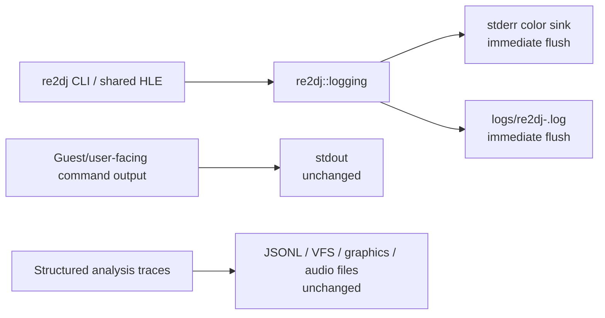

# 작업 345: spdlog 런타임 로깅 표준화 / Task 345: spdlog runtime logging standardization

## 목표 / Objective

re2DJ의 제품 CLI와 공용 HLE 경계가 같은 로그 형식과 심각도 정책을 사용하도록 `spdlog` 기반 로깅 계층을 도입합니다. 모든 제품 로그는 CLI의 stderr에 즉시 보이고 같은 내용을 실행별 파일에도 기록합니다. 미구현 HLE와 지원되지 않는 실행 경계는 반드시 `FATAL`로 분류합니다.

*Introduce an `spdlog`-based logging layer so the re2DJ product CLI and shared HLE boundaries use one format and severity policy. Every product log appears immediately on CLI stderr and is also written to a per-run file. Unimplemented HLE and unsupported execution boundaries are always classified as `FATAL`.*

## 참고 정책 / Reference policy

[rePIU](https://github.com/nworkers/rePIU)의 2026-09-19 `c770da45896b9519924cefc9debdc242ff1e5210` 상태를 참고했습니다. rePIU는 loader 진단에 stderr color sink와 `[%X.%e] [%8l] [%n] %v` pattern을 사용하고, guest가 의도적으로 만든 출력은 host 진단과 분리합니다. 미구현 Glide 함수·인자와 ABI reject는 spdlog `critical`에 메시지의 `FATAL` 표기를 더하고, ABI가 안전한 경우에는 실행 지속 여부와 로그 심각도를 분리합니다.

*The reference is [rePIU](https://github.com/nworkers/rePIU) at commit `c770da45896b9519924cefc9debdc242ff1e5210` dated 2026-09-19. rePIU uses a stderr color sink and the `[%X.%e] [%8l] [%n] %v` pattern for loader diagnostics while separating guest-produced output from host diagnostics. Unimplemented Glide functions/arguments and ABI rejects use spdlog `critical` plus an explicit `FATAL` marker, with execution-continuation policy kept separate from log severity when the ABI is safe.*

re2DJ는 이 정책을 그대로 복사하지 않고 멀티플랫폼 CLI와 현재 분석 파일 구조에 맞게 적용합니다. rePIU 소스는 구현에 복사하지 않으며 정책과 공개 사용 예만 참고합니다.

*re2DJ adapts rather than copies this policy for its multiplatform CLI and existing analysis-file structure. No rePIU source is copied into the implementation; only policy and public usage examples are referenced.*

## 출력 채널 / Output channels



- host의 상태·경고·오류·fatal은 `re2dj::logging`을 통합니다.
  *Host status, warning, error, and fatal messages use `re2dj::logging`.*
- help, `--version`, target 목록과 명시적으로 요청한 분석 표 같은 CLI 결과는 stdout에 유지합니다.
  *Help, `--version`, target listings, and explicitly requested analysis tables remain on stdout.*
- Windows launcher JSONL, VFS, graphics, audio trace는 구조화된 분석 산출물이므로 합치거나 제거하지 않습니다.
  *Windows launcher JSONL, VFS, graphics, and audio traces remain separate structured analysis artifacts.*
- logger 초기화 실패처럼 spdlog를 사용할 수 없는 bootstrap 오류에만 직접 stderr fallback을 허용합니다.
  *Direct-stderr fallback is allowed only for bootstrap failures where spdlog itself cannot be initialized.*

## 공용 API와 파일 정책 / Shared API and file policy

플랫폼 중립 `include/re2dj/logging/logging.h`와 `src/logging/logging.cpp`를 추가합니다. 초기화는 logger 이름과 선택적 파일 경로를 받고, 파일 경로가 비어 있으면 저장소 실행 작업 디렉터리의 `logs/re2dj-YYYYMMDD-HHMMSS-mmm.log`를 생성합니다. 기존 `/logs/` Git ignore 정책을 유지합니다.

*Add platform-neutral `include/re2dj/logging/logging.h` and `src/logging/logging.cpp`. Initialization accepts a logger name and optional file path; an empty path creates `logs/re2dj-YYYYMMDD-HHMMSS-mmm.log` under the process working directory. The existing `/logs/` Git-ignore policy remains.*

logger는 stderr color sink와 basic file sink를 함께 가지며 두 sink에 같은 다음 pattern을 적용합니다.

*The logger owns both a stderr color sink and a basic file sink, with the same pattern on both:*

```text
[%X.%e] [%8l] [%n] %v
```

모든 레벨을 매 메시지마다 flush하여 장시간 원본 실행, 비정상 종료와 강제 중단에서도 마지막 진단이 가능한 한 보존되게 합니다. 파일은 실행별로 새로 만들며 원본 HDD나 overlay 안에는 만들지 않습니다.

*Flush every level after every message so long-running original execution, abnormal termination, and forced interruption preserve the latest diagnostics whenever possible. Create a new file for each run and never place it inside the original HDD or guest overlay.*

## 심각도 계약 / Severity contract

| 레벨 | 용도 | 실행 종료와의 관계 |
| --- | --- | --- |
| `info` | 초기화, 선택 target/backend, 정상 경계와 종료 요약 | 계속 |
| `warning` | 호환 fallback, 성능·정확성에 영향을 줄 수 있으나 실행 가능한 상태 | 계속 |
| `error` | 구현된 경로의 host/backend 실패, 잘못된 사용자 입력 | 호출자 정책에 따름 |
| `critical` + `FATAL` | HLE 미구현, 지원하지 않는 backend/ABI 경계, 실행을 신뢰할 수 없는 상태 | 현재 경계의 안전 정책에 따라 stop 또는 ABI-safe continuation |

*Severity contract: `info` covers initialization and normal boundaries; `warning` covers executable compatibility fallbacks; `error` covers failures in implemented paths and invalid user input; and `critical` with an explicit `FATAL` marker covers unimplemented HLE, unsupported backend/ABI boundaries, and states where execution cannot be trusted. Fatal severity does not by itself override a separately verified ABI-safe continuation policy.*

fatal 메시지는 안정된 분류 코드를 포함합니다.

*Fatal messages include a stable classification code:*

```text
FATAL HLE_UNIMPLEMENTED module=kernel32.dll export=CreateFileA
FATAL EXECUTION_UNSUPPORTED reason=...
```

공용 `ImportDispatcher`가 등록되지 않은 import를 만나면 반환 오류와 별도로 즉시 `HLE_UNIMPLEMENTED` fatal을 기록합니다. CLI가 first-unimplemented-import 또는 지원되지 않는 실행 경계를 보고할 때도 fatal helper를 사용합니다. 중복 억제나 summary tracker는 호출 빈도가 실제 문제가 될 때 별도 작업으로 추가하며, 이번 단계에서는 fatal을 숨기는 first-N 제한을 두지 않습니다.

*When the shared `ImportDispatcher` encounters an unregistered import, it immediately records `HLE_UNIMPLEMENTED` fatal in addition to returning an error. The CLI also uses the fatal helper for first-unimplemented-import and unsupported-execution boundaries. Deduplication or summary tracking is deferred until observed call volume requires it; this stage has no first-N cap that could hide a fatal.*

## 의존성과 라이선스 / Dependency and license

먼저 `find_package(spdlog 1.14.1 EXACT CONFIG QUIET)`를 시도하고, 없으면 CMake `FetchContent`로 `v1.14.1`을 shallow fetch하여 `spdlog::spdlog` 정적 라이브러리 타깃을 사용합니다. `spdlog`는 MIT License이며 프로젝트의 BSD-3-Clause 정책과 호환됩니다. 버전과 upstream/license 링크를 `THIRD_PARTY_NOTICES.md`에 기록합니다.

*Try `find_package(spdlog 1.14.1 EXACT CONFIG QUIET)` first; otherwise shallow-fetch `v1.14.1` through CMake `FetchContent` and use the `spdlog::spdlog` static-library target. `spdlog` uses the MIT License and is compatible with the project's BSD-3-Clause policy. Record the version and upstream/license links in `THIRD_PARTY_NOTICES.md`.*

## 이번 작업 범위 / Scope of this task

1. 공용 logger 초기화, immediate flush, per-run file, fatal helper와 단위 테스트를 구현합니다.
   *Implement shared logger initialization, immediate flush, per-run files, the fatal helper, and unit tests.*
2. 제품 CLI의 직접 stderr 진단을 logger로 이관하고 시작·로그 파일·실행 결과를 기록합니다.
   *Migrate direct-stderr diagnostics in the product CLI to the logger and record startup, log-file, and execution outcomes.*
3. `ImportDispatcher`의 미등록 import를 fatal로 기록합니다.
   *Record unregistered `ImportDispatcher` imports as fatal.*
4. Windows injected runtime의 미구현 graphics HLE 기록에도 `FATAL HLE_UNIMPLEMENTED` marker를 적용하되 전용 trace 파일은 유지합니다.
   *Apply a `FATAL HLE_UNIMPLEMENTED` marker to unimplemented graphics HLE records in the Windows injected runtime while retaining its dedicated trace file.*
5. 기존 stdout 명령 결과와 별도 분석 trace 파일은 유지합니다.
   *Preserve existing stdout command results and separate analysis trace files.*

모든 도구와 Windows injected runtime의 전용 trace 함수를 spdlog로 한 번에 교체하는 것은 범위 밖입니다. 이들은 binary/JSONL 계약과 process 경계가 달라 제품 CLI 정책이 검증된 뒤 별도 작업으로 이관합니다. 다만 기존 전용 trace에 남는 미구현 HLE는 이번 작업에서 Fatal marker를 갖게 하여 심각도 불변식을 지킵니다.

*Replacing every tool and the Windows injected runtime's dedicated trace functions with spdlog at once is out of scope. Their binary/JSONL contracts and process boundaries differ, so migrate them separately after the product-CLI policy is verified. Existing dedicated-trace records for unimplemented HLE nevertheless gain a Fatal marker in this task to preserve the severity invariant.*

## 검증 / Validation

- 단위 테스트에서 임시 파일 logger를 초기화해 info와 fatal이 파일에 즉시 보이고, pattern에 logger name·`critical`·`FATAL`이 포함되는지 확인합니다.
  *Initialize a temporary-file logger in a unit test and verify that info and fatal are immediately visible in the file and that the pattern contains the logger name, `critical`, and `FATAL`.*
- `re2dj --version` 또는 `--help` 실행에서 stderr에 초기화 로그와 파일 경로가 즉시 보이고 stdout 결과가 유지되는지 확인합니다.
  *Run `re2dj --version` or `--help` and verify immediate initialization/log-path output on stderr while stdout output remains intact.*
- 지원되지 않는 Linux 실행 옵션 또는 first unimplemented import가 `critical`과 `FATAL`을 출력하고 같은 줄이 파일에 남는지 확인합니다.
  *Verify that an unsupported Linux option or first unimplemented import prints `critical` plus `FATAL` and writes the same line to the file.*
- Linux x64·x86 제품과 단위 테스트, Windows 지원 build를 영향 범위에 맞게 검증합니다.
  *Validate Linux x64/x86 products and unit tests plus supported Windows builds in proportion to the affected scope.*
